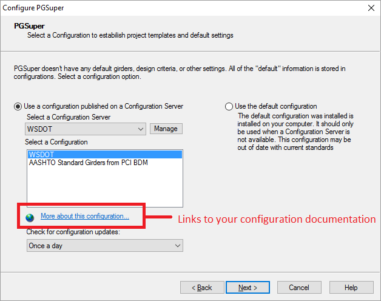

Configuration Servers {#configuration_server_files}
============
Configuration Servers are more of a concept than what we traditionally think of as a server. Examples of the servers we traditionally think of are FTP, HTTP, PHP, SQL, and the like. All of these servers use dedicated hardware running specialized software. The Configuration Servers we are talking about are basically locations where some files can be stored and accessed by users. 

Our Configuration Servers can use a local disk on your computer, a network file system, an FTP server or an HTTP server to store and provide access to Configurations.

In this topic we will describe how to setup configuration servers.

Local and Network File System based Configuration Servers
----------------------------------------------------------
Configuration Servers based on a file system are the easiest to setup, however the accessibility is limited. Generally, you do not have your file system shared on the Internet for everyone to use. File system based configuration servers are useful when developing configurations or when working with specialized non-standard information that must be shared to a limited group.

To set up the server:
1. Determine the location on your file system where you would like the server to reside. Let's say G:\\PGSuper\\.
2. Copy your Master Library to G:\\PGSuper\\. The Master Library is a file you create with the PGSLibrary Editor application. The file has a .LBR extension.
3. Copy your Project Templates, including the folder structure, to G:\\PGSuper\\. See @ref project_templates to learn how to create and organize project templates.
4. Let everyone know how to access your configuration.

> NOTE: Local and Network File System based servers do not use publishing instructions or configuration documentation.

See @ref ug_configurations in the @ref user_guide to learn how to configure PGSuper and PGSplice to use a file system based configuration. You will want to provide your users with the following information that is to be entered in the Configuration Server Definition window.

Item | Value
-----|----------
Name | This can be any name. Specify one or let your users decide
Server Type | Local or Network File System
Master Library File | The full path to your Master Library file. (e.g. G:\\PGSuper\\MasterLibrary.lbr)
Path to Template Files | The full path to root folder for your Project Templates. (e.g. G:\\PGSuper\\)

FTP and HTTP based Configuration Servers
----------------------------------------
We have a little more work to do before setting up an FTP or HTTP based configuration server. 

### Configuration Documentation ###
Let's start by writing the configuration documentation. This is simply an HTML page that contains information about your configuration. The documentation often contains the following information:
* Description
* Publishing Date
* Warnings and Limitations
* Support contact information
* Revision log

The configuration documentation must be placed on an HTTP server so users can read it. The location of the configuration documentation is recorded in the publishing instructions as described below. The @ref ug_dialogs_configure window has a hyperlink that, when pressed, will display your configuration documentation.

### Building the Configuration Package ###
The Master Library and Project Templates must be placed into a Configuration Package that will be stored on the configuration server. The configuration package allows the software to download a single file when installing a configuration rather than downloading the Master Library file and one additional file for each Project Template.

The MakePGZ.exe utility program was installed with PGSuper and PGSplice. It can be found in the BridgeLink application folder. MakePGZ creates the Configuration Package.

To make a configuration package use the command
   
     MakePGZ.exe pgz_file master_library_file project_template_folder template_extension

where

Parameter | Description
----------|------------
pgz_file | The name of the Configuration Package (PGZ file) that will be created
master_library_file | The name of your Master Library file
project_template_folder | The name of the root folder for your project templates. This folder is searched recursively for all project templates
template_extension | The file extension for your templates (PGT for PGSuper and SPT for PGSplice)

Example:

    C:\Program Files\WSDOT\BridgeLink\MakePGZ.exe C:\PGSuper\MyState.pgz C:\PGSuper\MyState.lbr C:\PGSuper\MyTemplates PGT

### Publishing Instructions ###
Next we have to create the publishing instructions. Publishing instructions are provided in a specially named text file called PGSuperPackages.ini (or PGSplicePackages.ini for PGSplice). The content of this file provides information about the configurations you are publishing. 

Here is an example of publishing instructions.

    [WSDOT]
    WebLink="http://www.wsdot.wa.gov/eesc/bridge/software/PGSuper/LibraryInfo.html"
    Format="pgz"
    Version_2.9.1_PgzFiles="ftp://ftp.wsdot.wa.gov/public/bridge/Software/PGSuper/Version_2.9.1/WSDOT.pgz"
    Version_3.0.0_PgzFiles="ftp://ftp.wsdot.wa.gov/public/bridge/Software/PGSuper/Version_3.0.0/WSDOT.pgz"

    [AASHTO]
    WebLink="http://www.wsdot.wa.gov/eesc/bridge/software/PGSuper/LibraryInfo.html"
    Format="pgz"
    Version_2.9.1_PgzFiles="ftp://ftp.wsdot.wa.gov/public/bridge/Software/PGSuper/Version_2.9.1/AASHTO.pgz"
    Version_3.0.0_PgzFiles="ftp://ftp.wsdot.wa.gov/public/bridge/Software/PGSuper/Version_3.0.0/AASHTO.pgz"

Instructions for a configuration begin with the configuration name in square brackets. These publishing instructions are for two configurations; WSDOT and AASHTO.

Following the configuration name are the publishing instructions for the configuration. The instructions are a keyword-value pair.

Keyword | Description
--------|-----------
WebLink | URL of the configuration documentation. Omit if configuration documentation is not used.
Format  | Format of the configuration package. "pgz" is the only valid value at this time
Version_x.y.z_PgzFiles | Location of the configuration package. Substitute the application version number for x.y.z. In the example above, configuration packages are available for PGSuper version 2.9.1 and 3.0.0.

When installing a configuration, PGSuper will look for the configuration package with the highest version number that is not greater than its own version number. If you are use PGSuper Version 2.9.5, the configuration package for version 2.9.1 will be installed.

> NOTE: All configuration packages must be on either an FTP or an HTTP server. The server type must match the type defined in the @ref ug_dialogs_configuration_server_definition.

Use NOTEPAD.EXE or any other plain text editor to create your publishing instructions. Be sure to save your publishing instructions with the name PGSuperPackages.ini (or PGSplicePackages.ini).

### Publishing your Configuration ###
Your configuration is now ready to be published on the configuration server and used by engineers all around the world.

To publish your configuration:
1. Open Windows Explorer to the location on your HTTP server where the configuration documentation will be stored. Copy the documentation onto the server
2. Open Windows Explorer to the location on the server where you will be storing the publishing instructions and configuration packages. Copy the publishing instructions (PGSuperPackages.ini or PGSplicePackages.ini) and the configuration packages (the .PGZ files).
3. Let everyone know how to access your configuration.

See @ref ug_configurations in the @ref user_guide to learn how to configure PGSuper and PGSplice to use an FTP or HTTP based configuration. You will want to provide your users with the following information that is to be entered in the PGSuper Configuration Server Definition window.

Item | Value
-----|----------
Name | This can be any name. Specify one or let your users decide
Server Type | The server type you are using, either Internet FTP Server or Internet HTTP Server.
Server Address (URL) | The fully qualified URL for your server. This is the location where the INI file is stored. (e.g. http://www.mycompany.com/PGSuper/ConfigurationServer/)
