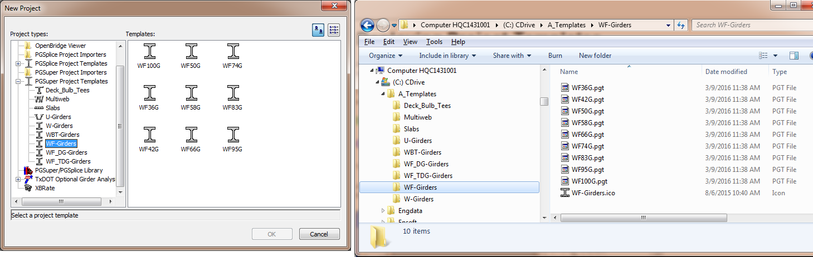

Project Templates {#project_templates}
============
New projects are created using the information stored in templates. This has several useful benefits, the most notable is establishing defaults that reflect the standard of practice for your engineering organization.

PGSuper and PGSplice do not have any default values per se. New projects are always created by opening a Project Template and loading the supplied information. The information in the Project Template becomes the default settings.

Creating Project Templates
---------------------------
Creating project templates is an easy task. The hard part is coming up with good templates. You will probably want to consult appropriate bridge design manuals, specifications, and standard plans before you begin. It is also a good idea seek input from senior bridge designers when creating project templates that will be used throughout your engineering organization, as these templates should reflect your standard of practice.

### Preliminary Steps ###
Before you begin creating project templates, figure out what information you want to reference into the template from the Master Library and what information belongs in a Project Library.
Use the [PGS Library Editor](http:\\www.wsdot.wa.gov\eesc\bridge\software\documentation\PGSLibrary\1.0\) application to create a Master Library with the information you want to share between projects.

Configure PGSuper (or PGSplice, as the case may be) to use your Master Library and your templates on the local file system. If you do not yet have a template, copy one of the templates from the program installation directly. See @ref ug_configurations in the @ref user_guide for the configuration procedure.

> NOTE: You will be using PGSuper or PGSplice to create your templates. In order to create new templates, you have to first create a new project, which requires a template. Using a local file system configuration allows you to do your development work without impacting other users.

### Creating a Project Template ###
To create a project template:

1. Start BridgeLink and open or create a PGSuper or PGSplice project file.
2. Edit the project data including the bridge model, materials, loads, project criteria, etc. using the editing techniques described in the @ref user_guide. This project data will be the default when new projects are created using this template.
3. Select *File > Save as Template...* to save the project as a template. Where you save your templates is important. Refer to the discussion below for details.

That's all there is to it.

Organizing Your Templates
--------------------------
Templates are organized by storing them in a folder structure in your computer's file system. You can organize templates any way you like. The Configurations provided by WSDOT and TxDOT organize the project templates by girder type. Other organizational schemes might include geographical region, span lengths, or state standards.

The folder structure defines the Project Template Groups in the New Project window. In the figure below, notice that the folder tree in Windows Explorer matches the Project Template Groups in the New Project window. Also notice that the template files match the templates in the New Project window.

Customizing the New Project window
----------------------------------
We've already discuss the first method of customizing the New Projects window; organizing your templates. The icons can be customized by providing icon files in the Project Templates folders.

To customize the icon for a specific template, put an icon file in the same folder as the template. The icon file must have the same name as the template file.

To customize the icon for all templates in a group, put an icon file in the group folder. The icon file must have the same name as the group folder. This icon will not be applied to any templates that have their own icon.

A default icon will be used if icon files are not provided.

In the image above, the WF-Girders folder contains a file named WF-Girders.ico. This file supplies the icon for WF-Girders group on the left side of the New Project window as well the icon for all of the templates shown on the right side of the window.
