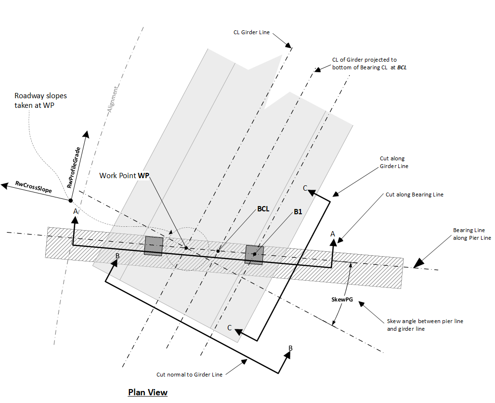
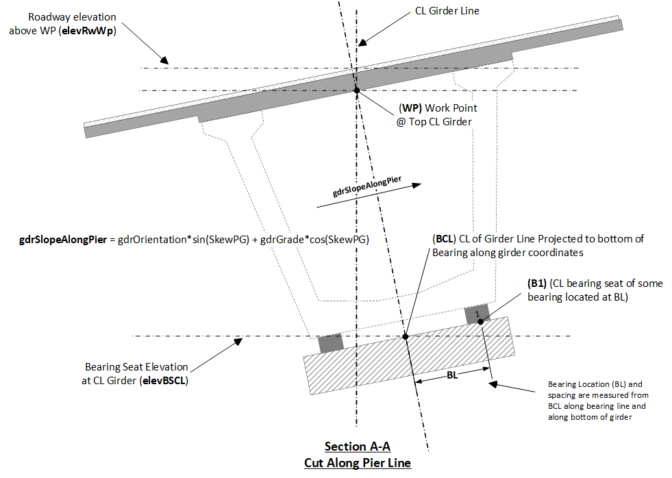
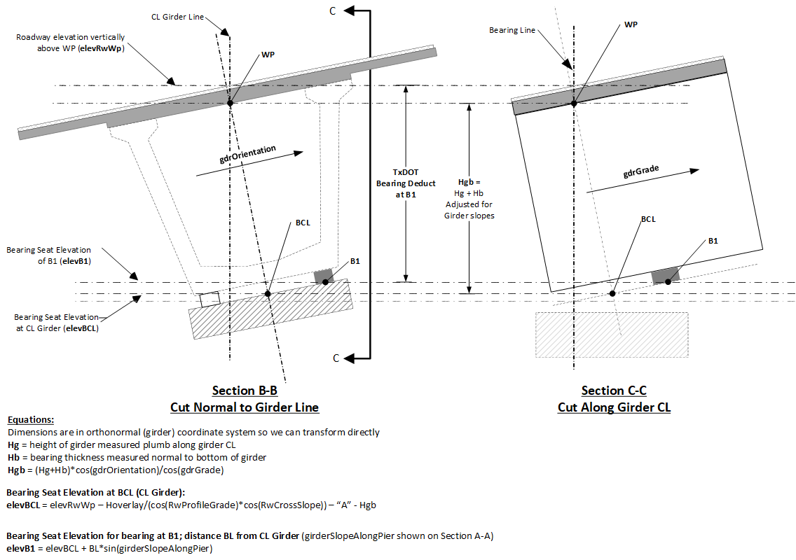
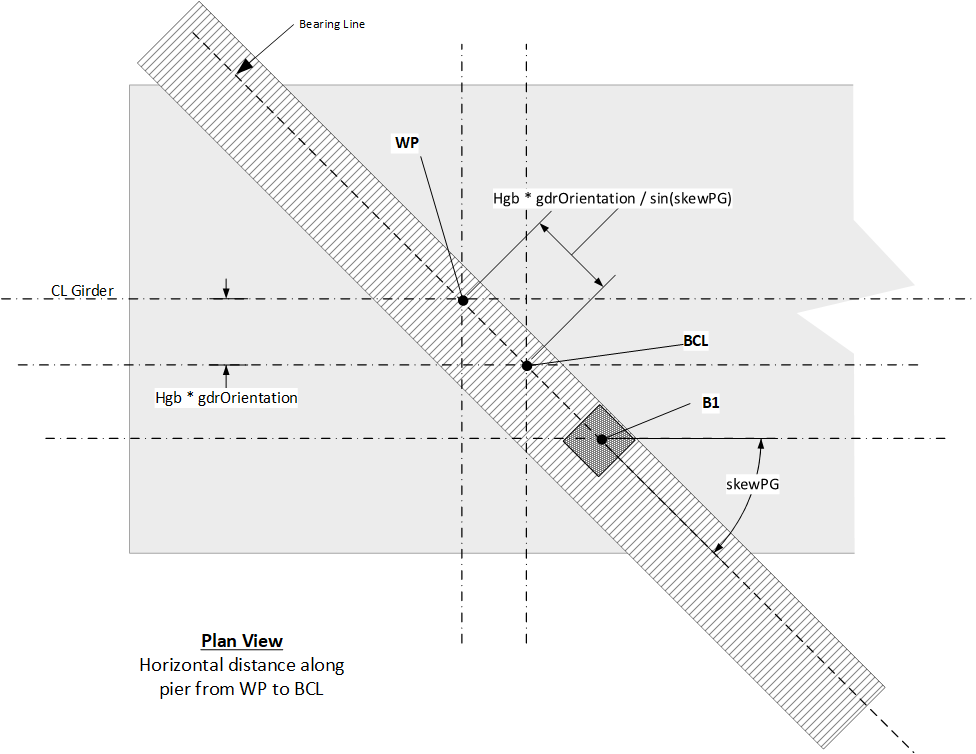

Bearing Seat Elevations and Locations - Geometric Assumptions {#tg_bearing_seat_geometry}
======================================

PGSuper and PGSplice can provide an accurate computation of bearing seat elevations and other bearing geometry information based on input bridge geometry. The figures in the section describe how bearing locations are computed.

> NOTE: Three dimensional girder locations are based on the "Work Point" (or WP) location which is at the top centerline of the girder section as shown in the figures below. This convention is different that some other software programs and may be different than your agency's definition. If this is the case you may need to adjust girder spacing to meet your requirements.

The following figure shows a plan view at a generic girder/pier intersection.

The figure below shows a section view cut along the bearing line. Note that bearing spacing is laid out along the bearing line from the BCL location as shown in the figure. From this, there are a couple of observations that should be noted:
  1. Girder spacing is measured at the top centerline of the girder (i.e., the WP). Hence CL bearing spacing may not be the same as girder spacing.
  2. The BCL is the center of the bearing layout and is generally not directly below the work point. Effects from profile slope, superelevation, differences in "A" dimensions along girder, and pier skew will change the BCL location when viewed in plan. However, the BCL always lies along the bearing line.
  3. Spacing between multiple bearings at the end of a girder are measured and oriented along the bearing line as shown and is not measured along a level plane.

The figure below shows section cuts normal to and along the girderline. Equations are shown for computing the elevation of the BCL and for a bearing B1 located a distance BL from the BCL.

PGSuper and PGSplice also report the station, offset, and roadway elevation of each bearing and of the BCL. The software uses the equations shown in the figure below to determine the BCL location relative to the work point.

