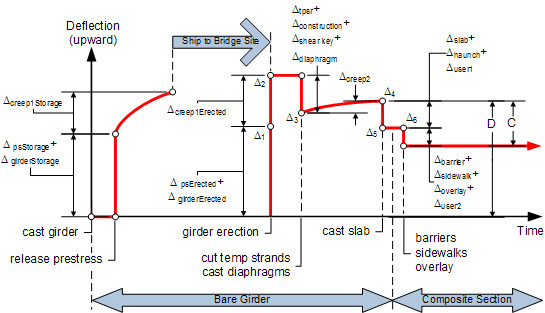

Camber {#tg_camber}
======================================
Several elements make up the camber calculations. Each one is detailed in this section. Refer to Chapter 5 of the WSDOT Bridge Design Manual for a further discussion of camber. The following schematic shows the camber history for a point in a girder with a cast in place deck and temporary strands.

Initial Camber
----------------
Initial camber occurs when the prestressing strands are released in the casting yard and the eccentric prestress force is imposed on the section. The beam has material properties associated with the release strength of the concrete and the span length is equal to the length of the girder. Immediately after release, the girders are removed from the casting bed and placed in storage. During storage the girder is supported at specified support locations. Typically these are the final bearing points but could be different. Thus, during storage, the span length is less than the span length at prestress release. The reduced span length during storage is taken this into account.

Camber at Time of Deck Casting
------------------------------
The camber at time of deck casting is typically refered to as the "D" Camber on WSDOT plans.

Screed Camber 
---------------
Screed camber is equal to the amount the girder will deflect when the wet slab, traffic barriers, overlay, and other superimposed dead loads are placed. This is the amount the screeds must be cambered in order to achieve the correct finished roadway surface. The screed camber is refered to as "C" on WSDOT plans.

Excess Camber
-------------------
The excess camber is the amount of camber that remains in the girder after the diaphragms and roadway slab are placed. The excess camber is computed as D - C.  

Camber Variability
----------------------
Camber is notoriously difficult to predict, so a practical approach is to use a statistical range to bound upper and lower values as recommended in Reference 1 (cited below). We make two camber predictions: one for a normal (maximum timing) construction scenario, and another for a fast (minimum timing) construction scenario. However, for each case there is variability in camber due to a number of factors including curing time (girders cured over a weekend camber less then those with a 24 hour turn around). This natural variation in camber is accomodated by predicting a lower bound value. In most cases the actual camber will be somewhere between the predicted upper and lower bounds. 

To compute the lower bound camber, a Camber Variability (Cv) factor is applied to the upper bound camber. Cv is entered in percentage reduction of the upper bound camber.

> TIP: A warning will be issued if the computed lower bound camber is less than the screed camber to alarm users that the girder has the potential to sag if camber ends up at the lower estimate. Note that this is not an absolute predication that sag will occur: It's just a warning that a worst case scenario may end up with sag, and engineers should take steps to mitigate problems.

The lower bound camber is an attempt to reflect natural variations in camber. When WSDOT reviewed camber data, they found most all measured cambers were enveloped between the upper bound value and 50% of the upper bound camber. This is consistent with the findings in Reference 1, and use of the 50% value is WSDOT's standard practice.

WSDOT does not allow contractors to cast the deck prior to the minimum timing and takes extra measures to control unrestrained camber if deck casting occurs after the maximum timing. (i.e. they have to cast the deck between 40 and 120 days). WSDOT reports to contractors, cambers at time of slab casting as Upper Bound D120 and Lower Bound D40, for deck casting at 120 days and 40 days. This envelopes the full range of cambers contractors can expect and provides guidance when bidding the amount of haunch concrete to be placed.

> TIP: Camber range values are reported in the Camber table near the end of the Spec Check report.

References
-----------
1. [A Probabilistic Comparison of Prestress Loss Methods in Prestressed Concrete Beams, PCI Journal, September-October, 2004, Volume: 49, Issue: 5 Page number: 52-69 Author(s): Christopher G. Gilbertson, Theresa M. (Tess) Ahlborn] (http://www.pci.org/uploadedFiles/Siteroot/Publications/PCI_Journal/2004/DOI_Articles/JL-04-SEPTEMBER-OCTOBER-6.pdf)

