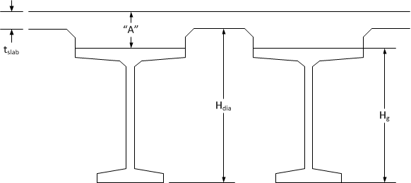
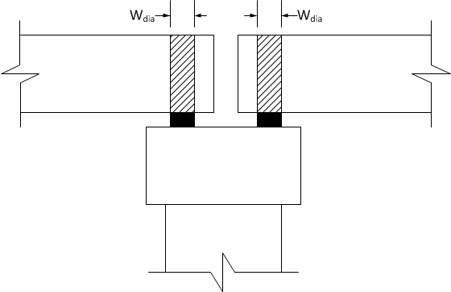
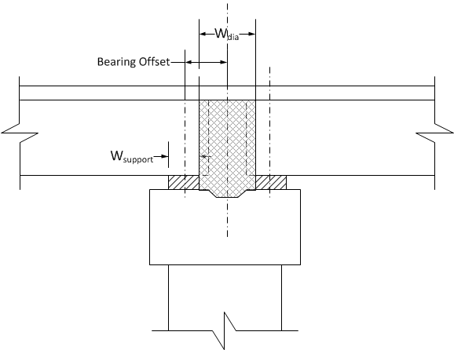
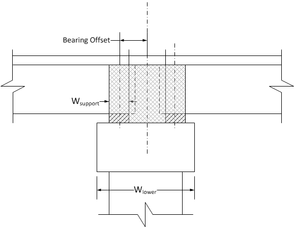

Computing Pier Diaphragm Dimensions {#tg_computing_pier_diaphragm_dimensions}
======================================
The dimensions of diaphragms at abutments and pier can be entered explicitly or the keyword "Compute" can be used to indicate that the height and width of the diaphragm be computed using the bridge geometry. This topic illustrates how the diaphragm dimensions are computed.

Diaphragm Height
------------------
The height of the diaphragm is computed as:

Hdia = Hg + "A" + Hgo - tslab

Diaphragm Width
----------------
The width of the diaphragm depends on the connection type at the pier or abutment. At the first abutment the diaphragm width is compute from only the ahead side parameters. At the last abutment the diaphragm width is computed only from the back side parameters. For interior piers that are integral on one side and hinged on the other, the diaphragm width is computed for each side individually.

### Expansion Pier ###
Roller or hinge boundary condition.

Wdia = Width of support.

### Continuous Pier ###

Wdia = Back Side Bearing Offset - Back Side Bearing Length/2 + Ahead Side Bearing Offset - Ahead Side Bearing Length/2

### Integral Pier ###

Wdia = Back Side Bearing Offset + Back Side Bearing Length/2 + Ahead Side Bearing Offset + Ahead Side Bearing Length/2

If a physical pier model is used, Wdia is the greater of the value computed with the above equation and Wlower.

Diaphragm Length
----------------
The length of the diaphragm, Ldia, is taken to be the tributary width of the deck for the girder in question.

Diaphragm Weight
----------------
The weight of the diaphragm is computed as (Unit Weight)(Hdia)(Wdia)(Ldia).

The unit weight is taken to be that of the cast in place deck. For bridges without a deck, the unit weight of the girder is used.

