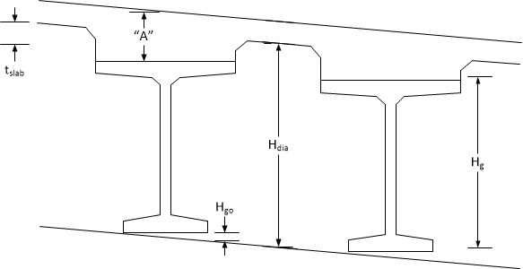

Computing Pier Diaphragm Dimensions {#tg_computing_pier_diaphragm_dimensions}
======================================
The dimensions of diaphragms at abutments and pier can be entered explicitly or the keyword "Compute" can be used to indicate that the height and width of the diaphragm be computed using the bridge geometry. This topic illustrates how the diaphragm dimensions are computed.

Diaphragm Height
------------------
The height of the diaphragm is computed as:

Hdia = Hg + "A" + Hgo - tslab

Diaphragm Width
----------------
The width of the diaphragm depends on the connection type at the pier.

### Expansion Pier ###
Roller or hinge boundary condition

Wdia = Width of support.

### Continuous Pier ###

Wdia = Back Side Bearing Offset - Back Side Support Width/2 + Ahead Side Bearing Offset - Ahead Side Support Width/2

### Integral Pier ###

Wdia = Back Side Bearing Offset + Back Side Support Width/2 + Ahead Side Bearing Offset + Ahead Side Support Width/2

If a physical pier model is used, Wdia is the greater of the value computed with the above equation and Wlower.

