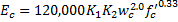
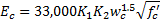
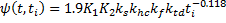
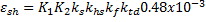

Concrete Properties {#concrete_properties}
======================================
Concrete material properties,namely Modulus of Elasticity, Creep, and Shrinkage, are highly dependent on mix designs and the properties of local aggregates. PGSuper uses a flexible model for predicting concrete material properties. This model is based on NCHRP Report 496, Prestress Losses in Pretensioned High-Strength Concrete Bridge Girders. NCHRP Report 496 is the basis for the modulus of elasticity, creep, shrinkage, and prestress loss requires in the AASHTO LRFD Bridge Design Specifications since 2005.

## Modulus of Elasticity
The modulus of elasticity is computed as

> NOTE: Prior to the AASHTO LRFD 7th Edition 2014 with 2016 Interims the modulus of elasticity was computed as 

## Creep
The creep coefficient is computed as

## Shrinkage
The shrinkage strain is computed as

## Aggregate Correction Factors
The modulus of elasticity, creep, and shrinkage equations all include two aggregate correction factors, K1 and K2. The modulus of elasticity, creep, and shrinkage equations are developed for a national averaged based on samples from Nebraska, New Hampshire, Texas, and Washington. The aggregate correction factors account for the effects of local aggregates. The values of K1 and K2 are determined by research. 

A correction factor K1 = 1.0 corresponds to an equal average of all predicted values and all measured values. The correction factor K2 is based on the 90th percentile upper-bound and the 10th percentile lower-bound of a set of measured data.

NCHRP Report 496 provides modulus of elasticity aggregate correction factors for Nebraska, New Hampshire, Texas, and Washington.
