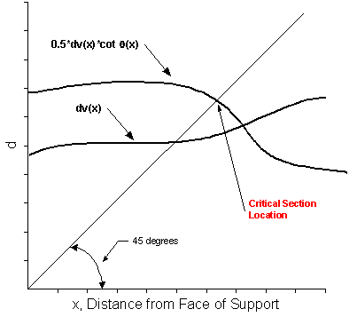

Critical Section for Shear {#tg_critical_section_for_shear}
======================================
> NOTE: Beginning with LRFD 3rd Edition, 2004, the critical section for shear is based only on dv. The critical section is found using a similar procedure as described below. The critical section is at the location where the dv(x) curve intersects the 45 degree line.

The LRFD Specification has made the determination of the critical section for shear a daunting calculation. This Section provides a discussion of the requirements, and assumptions for the algorithm to determine this location.

Article 5.7.3.2 (*pre-2017: 5.8.3.2*) states that the critical section for shear may be taken as the larger of dv or 0.5dvcot(q). The LRFD Specification does not provide any information as to where dv and q are to be taken. Common practice is to take it  at the location of the critical section. This makes the determination of the critical section for shear an iterative process since dv and q vary based on location and limit state.

The algorithm used to locate the critical section is as follows:

1. Guess the location of the critical section X.
2. Find dv at X from the face of the support. Call this value X1
3. Find q at X from the face of the support.
4. Using q from Step 3 and dv from Step 2, compute 0.5dvcot(q). Call this value X2.

If X is not equal to the maximum of X1 and X2, go to Step 1 and repeat. Otherwise, X is the location of the critical section for shear.

Repeat for each limit state used for shear design.

A graphical solution would look as follows:

Although accurate and true to the Specifications, this method is impractical because of the large computational cost of calculating force envelopes at each guessed location in order to determine q(X) (a complete live load analysis would have to be run for every point). However, examination of many dv and q graphs reveals that their shape is well-behaved. Hence, it is practical to approximate the dv and q near the support. A piecewise linear interpolation is used. The control points used to create the curves will be at the 0.00, 0.05, and 0.10 points along the girder. It is believed that the critical section for shear should always fall within this range.  

