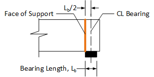
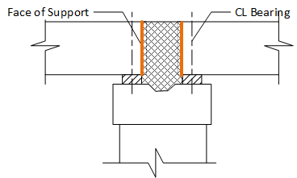
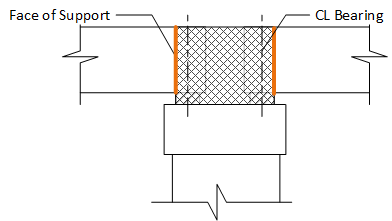

Face of Support {#tg_face_of_support}
======================================
Face of support is an important location when computing shear capacity of a precast, prestressed girder. Evaluation of LRFD 5.7.3.4.2 and 5.7.3.5 are depedent on the location of the face of support.

The face of support is used in Strength Limit State evaluations so its location is derived from the final configuration of the bridge.

# Simple Support Conditions #
At abutments and piers with simple support conditions, such as hinge or roller, the face of support is located one half the length of the bearing from the centerline of bearing.

# Continuous Support Conditions #
At piers with continuous support conditions, such as continuous or integral piers, the face of support is located at the face of the pier diaphragm. 

