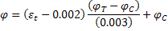
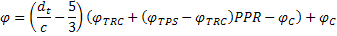

Flexural Resistance Factor {#flexural_resistance_factor}
======================================
A generalized version of the flexure resistance factor defined in AASHTO LRFD 5.5.4.2.1 is used in this software. The resistance factor is a linear interpolation between the resistance factors for compression controlled and tension controlled sections. A linear interpolation is also made for partial prestress ratio between reinforced concrete and prestressed sections.

This article illustrates the derivation of the generalized resistance factor for flexure equation.

Given:
<table>
<tr><td></td><td>= Net tensile strain in extreme tension steel at nominal resistance</td></tr>
<tr><td></td><td>= Distance from extreme compression fiber to the centroid of extreme tension steel</td></tr>
<tr><td></td><td>= Resistance factor for a reinforced concrete tension controlled section</td></tr>
<tr><td></td><td>= Resistance factor for a prestressed tension controlled section</td></tr>
<tr><td></td><td>= Resistance factor for a compression controlled section</td></tr>
<tr><td></td><td>= Resistance factor for a partial prestressed tension controlled section</td></tr>
<tr><td>PPR</td><td>= Partial prestress ratio</td></tr>
</table>
 

The net tensile strain is

(Eq. 1)

The resistance factor for a partially prestressed tension controlled section is

(Eq. 2)

From the graph above, the resistance factor can be computed as

(Eq. 3)

Substituting Eq. 1 into Eq. 3 we get

(Eq. 4)

Simplify

(Eq. 5)

Substituting Eq. 2 into Eq. 5 gives

(Eq. 6)

