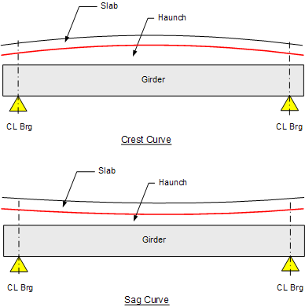

Haunch and Vertical Design Concepts {#tg_vertical_geometry_basics}
======================================
The purpose of the slab haunch is to provide a structural spacer between the bottom of the constant thickness slab and the top of the girder such that the roadway riding surface meets specified geometric requirements at the time of the Geometry Control Event. In addition, the top of the girder must not encroach into to the deck slab and interfere with deck reinforcement. As shown below, the slab haunch varies in depth along the length of the girder accommodating the girder camber and geometric effects of the roadway surface including superelevations, vertical curves and horizontal curves.

The **fillet** dimension specifies a buffer to prevent deck encroachment if actual girder camber exceeds the calculated value. Another definition of the fillet is the minimum allowable haunch depth along a girder. Therefore, an optimal haunch design provides the shallowist possible haunch along the girder such that the top of girder elevation is always lower than the fillet depth below the bottom of the slab. 

> In general, it is desirable to have points of horizontal and vertical curvature and superelevation transitions off the bridge structure as this greatly simplifies the geometric requirements on the slab haunch. However, as new bridges are squeezed into the existing infrastructure it is becoming more common to have geometric transitions on the bridge structure. Therefore, the inclusion of all geometric effects must be considered in a rigorous analysis. 

Haunch Characteristics
---------------------------
Well-designed slab haunches have the following characteristics:
* The haunch depth is adequate at its minimum location along the girder to satisfy the fillet depth defined by the user.
* Ideally, to save on concrete, the fillet will coincide with the Standard Minimum Fillet. If the input fillet is smaller than Standard Minimum Fillet, a spec check failure will occur.
  + For spread-spaced girders, the Standard Minimum Fillet is defined in the Girder library. 
  + For adjacently-spaced girders, the Standard Minimum Fillet is assumed to be zero.
* The fillet should also consider tolerances plus physical concerns such as: horizontal interface shear stirrups, spacers, forms (bedding strips), and reinforcement in the slab bottom region.
* The haunch has adequate minimum depth at the C.L. bearing locations to satisfy the Standard Minimum Haunch Depth at CL Bearings defined in the Girder library.
* The haunch is kept as shallow as possible to minimize weight and material costs.

A rigorous analysis of the slab haunch considers the following effects:
* Profile geometry of the roadway surface along the girder (vertical and horizontal curves).
* Transverse roadway geometry along the girder and girder orientation (superelevations)
* Girder camber measured just before deck placement
* Camber imposed into the shape of the girder (precamber)
* Deflection due to placement of SIP deck panels
* Deflection due to permanent construction loads
* Deflection due to placement of diaphragms
* Deflection due to placement of deck slab (cast or full-depth SIP)
* Deflection due to the haunch concrete itself. In PGSuper, there are two ways to model the haunch load as selected in the Project Criteria library:
  + Model the haunch load by assuming zero excess girder camber
  + Model the haunch load using the deformed (cambered) girder shape. This option is different depending on whether haunch depth is defined by the slab offset or by explicit input (more on this later)
* Deflection due to removal of forms and falsework (generally ignored)
* Deflection due to placement of superimposed dead loads on composite section
* Loss of camber due to long-term prestressed losses (ignored in non time-step analyses)

> NOTE: Precamber can also be used to reduce the dead load of a haunch (PGSuper only)

If all cambers and deflections occur as predicted during design, the haunch depth at the point of least haunch depth will be exactly equal to the fillet dimension. However, in practice the only effects that can be computed with reliable accuracy are the roadway geometry effects. Camber, deflections, and long-term losses are more difficult to predict with a high degree of accuracy. Each of these effects can be considered independently and combined to compute final haunch requirements. Individual effects are treated in detail in the following sections.

Notation
-------------
xi = Station at section <i>i</i>.  
zi = Normal offset from the alignment to the centerline of girder at section <i>i</i>.  
ya(xi,zi) = Elevation of the roadway surface at station xi and normal offset zi.

Deck Effect
------------
Per our definition; the distance between the top of the girder and the top of the roadway surface must be at least the thickness of the slab plus the fillet depth.

The Fillet is the least allowable haunch depth along a girder. This value is input as part of the physical bridge description. 

>NOTE: The input fillet is used in the calculation of minimum and required slab offset during a specification check. During design, the fillet can be left at its input value or it can be modified by the design algorithm if requested. If the value is modified by the design algorithm, it is set equal to the Standard Minimum Fillet Depth as specified in the Girder library. 

Excess Camber Effect
--------------------
The slab haunch must be thickened to accommodate any camber that remains in the girder at service. The excess camber effect is computed as the camber at the time of slab casting (D) less the screed camber (C). Excess camber effect = D - C.

The screed camber (C) is the sum of the deflections that occur from deck casting until service. This includes deflections due to the slab and haunch, traffic barriers, sidewalks, overlays, and other superimposed loads.

Temporary support elevation adjustments in spliced girders are treated as "rigid body" displacements of the precast segment. These displacements are applied to the segment at erection, prior to slab casting, and are therefore incorporated into the deflection at the time of slab casting (D).

Profile Effect
----------------
The profile effect accounts for changes in the roadway profile along the length of the girder (the GPGL). Profile changes include grade changes, vertical curve effects, and offset deviations between the centerline of girder and the alignment caused by flared girders and/or curvature in the alignment.

The figure above is obviously highly exaggerated. It illustrates that the profile effect is the greatest distance between the finished grade and a straight line.

  

where

is the difference between the roadway surface directly above the centerline of the girder and the profile chord line.

The profile chord line is given by 

> NOTE: For PGSuper profile chords lines are defined for girder spans, and for PGSplice chords are defined for each segment.

Haunch depth demand is different depending on the type of vertical curve over the girder. Effects on haunches from Sag and Crest curve are shown below. For a typical crest curve, there is more haunch at mid-span than at the ends. A sag curve creates a minimum haunch at mid-span with a larger haunch at the ends. Stated another way: in the case of a sag vertical curve, the slab haunch must be thickened at the ends of the girder; in the case of a crown vertical curve, the slab haunch depth may be reduced. The figures below illustrate these effects.

Girder Orientation Effect
----------------------------
The girder orientation effect accounts for the difference in slope between the roadway surface and the top of the girder. Girders such as I-beams are typically oriented with their main axis plumb. Other girders such as U-beams, box beams, and slabs may be oriented with their main axis normal to the roadway surface. Some pre-decked girders, such as deck bulb tees, have the roadway cross slope cast into the top flange. The orientation of the girder with respect to the roadway surface, and changes in the roadway surface along the length of the girder (superelevation transitions) define the Girder Orientation Effect.

where
zileft = offset to left exterior mating surface and ziright = offset to right exterior mating surface.

> NOTE: The mating surface is the girder surface that mates with the bottom of the slab haunch. This is commonly the top of the top flange, but not all girders have top flanges.

The width of the slab haunch is the width of the top flange of the girder for single top flange sections. However, tub girders have two haunches – one for each of the two top flanges, and may be non-prismatic if end blocks are present.

Required Slab Offset - Simplified Input (PGSuper-Only)
---------------------
The Required Slab Offset (haunch depth at bearing lines) can be determined once all of the Effects above have been computed. This will be discussed in depth in @ref tg_slab_offset.

Computation of Vertical Elevations of the Deformed Structure
------------------------------------
Elevations along deformed girderlines are reported in the Details report and can be viewed in the Finished Elevations graph. These computations are different depending on the type of input used to define the haunch. Computational details for Slab Offset input can be found in @ref tg_vertical_geometry_slaboffset_elevations. Computational details for explicit direct haunch inut can be found in @ref tg_vertical_geometry_elevations
