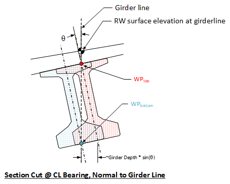
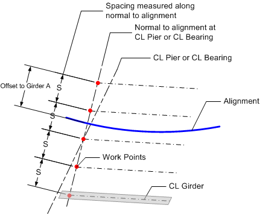
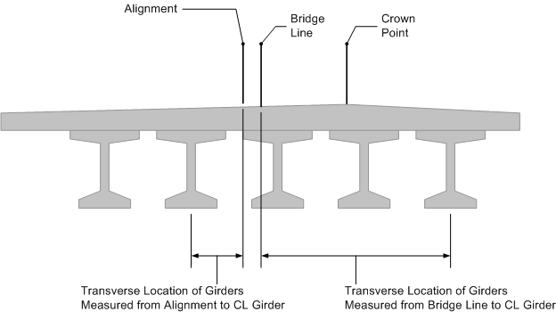
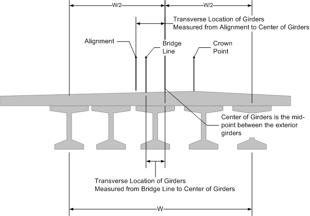

Girder Spacing {#tg_girder_spacing}
======================================
Several methods for defining girder spacing are available. This section will detail the methods of defining girder spacing and their implications on the bridge geometry.

To properly position the girders in the bridge, the spacing between girders, transverse location of the girders, and work point location must be defined.

## Girder Spacing
Girder spacing can be measured at the Abutment/Pier Line or at the CL Bearing. At these locations the girder spacing is measured either normal to the alignment or along the specified line. The methods for defining the girder spacing are:

* Measured at and along the Abutment/Pier Line
* Measured normal to the alignment at the Abutment/Pier Line
* Measured at and along the centerline bearing
* Measured normal to the alignment at the centerline bearing

> NOTE: Girderlines are working geometric lines that define the location of the centerline (CL) girder along the girder. Girder spacing defines the location of girderlines which are layed out in plan, and measured at the work point location of the girders. The work point location defines the vertical location on the girder centerline where spacing is measured.

## Transverse Location of Girders
The girderlines must be located transversely as well. The transverse location is described by an offset from either the Bridge Line or the Alignment. This offset is measured in the same direction as the girder spacing. The offset can be measured to a specific girder or to the center of the girder spacing.

## Effect of Work Point Location
Working points are points in three dimensional space used to locate each end of a girder on a framing plan. Working points always lie in the longitudinal centerline plane of a girder, and are specified at a vertical location on the girder (typically top or bottom). The choice of vertical location of a working point is often based on its convenience for layout in the field using available measurement tools (e.g., a measuring tape).

The working point location defines the vertical location where the CL of the girder is measured from. If the girder is not plumb, this will affect the physical location of the girder. For example, see the the image below. The red and blue girders are located with the same spacing (along the same girderline), but with different working point locations. The red girder has its working point at top CL girder, while the blue girder's working line is at the bottom CL girder. Note that the change in work point location effectively shifts the girder laterally parellel to the girderline.

> NOTE: BridgeLink's default working point location is at top CL girder. You will find that many of the geometry reports show the top CL girder location.

### Girder Spacing Examples
The following examples illustrate how girder spacing is defined.

Here the girder spacing is measured along the CL Pier/CL Bearing. The girders are located transversely by defining the offset from the alignment to the left exterior girder.

Here the girder spacing is measured Normal to the alignment at the CL Pier/CL Bearing. The girders are located transversely by defining the offset from the alignment to the left exterior girder.

Transverse location of girders by defining location of a specific girder

Transverse location of girders by defining the location of the center of girders

