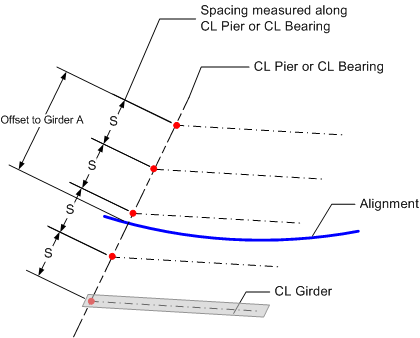

Girder Spacing {#tg_girder_spacing}
======================================
Several methods for defining girder spacing are available. This section will detail the methods of defining girder spacing and their implications on the bridge geometry.

To properly position the girders in the bridge, the spacing between girders and the transverse location of the girders must be input.

## Girder Spacing
Girder spacing can be measured at the Abutment/Pier Line or at the CL Bearing. At these locations the girder spacing is measured either normal to the alignment or along the specified line. The methods for defining the girder spacing are:

> NOTE: Girder spacing is measured at the top of the girders.

* Measured at and along the Abutment/Pier Line
* Measured normal to the alignment at the Abutment/Pier Line
* Measured at and along the centerline bearing
* Measured normal to the alignment at the centerline bearing

## Transverse Location of Girders
The girders must be located transversely as well. The transverse location is described by an offset from either the Bridge Line or the Alignment. This offset is measured in the same direction as the girder spacing. The offset can be measured to a specific girder or to the center of the girder spacing.

### Girder Spacing Examples
The following examples illustrate how girder spacing is defined.

Here the girder spacing is measured along the CL Pier/CL Bearing. The girders are located transversely by defining the offset from the alignment to the left exterior girder.

Here the girder spacing is measured Normal to the alignment at the CL Pier/CL Bearing. The girders are located transversely by defining the offset from the alignment to the left exterior girder.

Transverse location of girders by defining location of a specific girder

Transverse location of girders by defining the location of the center of girders

