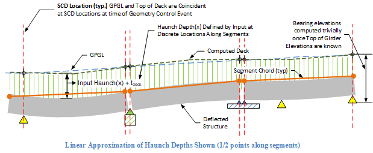

Haunch Depth Input: Explicit Direct Method {#tg_haunch_explicit}
======================================
Explicit haunch depth input provides a simple way to provide a robust haunch description by defining haunch depths at discrete locations along segments or spans. Locations are laid out evenly along members. Haunch depths are connected in a piecewise-linear fashion or parabolically creating Haunch(x) as shown in the figure below. Note that curve fitting accuracy improves as more haunch depth locations are input.

> See @subpage tg_vertical_geometry_elevations for a details of vertical bridge geometry computation for this method.  

Computation of Haunch Loads and Composite Section Properties
-----------------------------------------------------------
Since Haunch(x) is explicitly defined by user input along the structure; haunch loads, and haunch effects to girder stiffness and strength, are easily computed for use in the structural analyses. Elevations of the deflected roadway are computed by simply adding haunch depths to deflected top of girder elevations. A similar observation can be made for determination of bearing elevations. 

> Note: This method also allows simplified computation of haunch load and section properties via settings on the **Creep, Camber, and Haunch** in the Project Criteria library. Users must be aware of these settings to insure accuracy of results.

Automated Haunch Design for Explicit Input
----------------------------------------
The **Fill Input Data with Computed Haunch Depths** tool located on the **Finished Elevations Graph** window can be used to find an optimal haunch layout.

> Tip: Haunch design is an iterative process, so you may need to run the design tool more than once in order to find a satisfactory solution.

