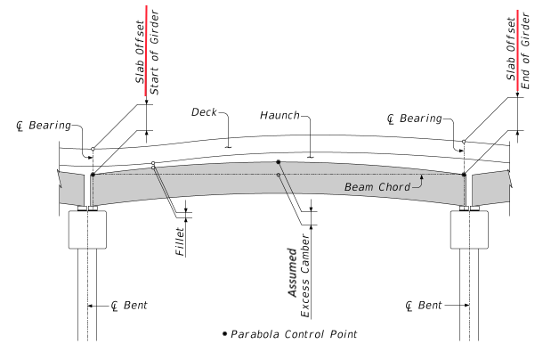
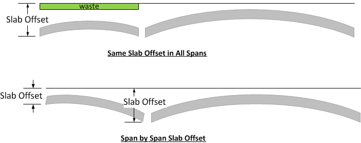

Haunch Depth Input: Simplified Slab Offset (PGSuper Only) {#tg_slab_offset_simplified}
======================================
A definition of the Slab Offset is given in @ref tg_slab_offset. This section demonstrates that the entire haunch depth distribution along a girder can be described by only specifying the slab offset's at girder ends. This is the traditional method used in PGSuper and by WSDOT. However, the method requires simplifying assumptions about distribution of haunch weight and haunch effects to composite section properties. These assumptions may or may not be conservative depending on the structure layout.

A schematic showing assumptions of the haunch depth along a span as described by the Slab Offset is shown below.
  

Deck Elevations and deformed girder elevations are computed as described in @subpage tg_vertical_geometry_slaboffset_elevations.

> Tip: Haunch depths are reported in the Haunch Details chapter in the Details report and can be viewed in the Finished Elevations graph using the "Elevation differential" graph type.

Assumptions
------------
Note that the excess camber shown in the image above is the user-input *Assumed Excess Camber*, not the computed excess camber determined by the structural analysis. Haunch depths defined by assumed excess camber are used to compute haunch dead load and structural stiffness properties of the composite section. For this option it is the responsibility of the user to ensure the haunch depth parabola defined by the slab offset and assumed excess camber dimensions closely matches the deflected shape of the excess camber computed by the structural analysis. If the shapes do not match within tolerance, a specification check failure will occur indicating the haunch dead load was either over or under estimated. 
>     As mentioned, haunch dead load is dependent on excess camber, which in turn is dependent on haunch dead load. Hence, an iterative approach is required to determine assumed excess camber.

>     For complex bridge geometries it may be necessary to define a unique assumed excess camber and/or slab offset for each girder in the bridge.

Limitations
------------
A parabolic description of excess camber may not be accurate for continuous structures and beams with cantilevers. In this case users should consider the explicit method to define the haunch described in @ref tg_haunch_explicit.

For pretensioned girder bridges these computations are limited to a single span. A different slab offset may be needed at each end of a span. For example, if there is a long span adjacent to a short span, the long span may have considerably more camber and will require a larger slab offset. There is no need to have the shorter spans carry all the extra concrete needed to match the longer span haunch requirements. With the wide flange girders, the volume of concrete in the haunches can add up quickly. The shorter span could have a different haunch at each end as illustrated below.

