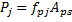

Maximum Allowable Jacking Force {#pjack}
======================================
This section describes how the maximum jacking forces for prestressing strands is computed.

The jacking force is computed as  where  is the jacking stress and  is the total area of prestressing strand.

Jacking Stress - 1st Edition
------------------------------
The jacking stress is prescribed in Article 5.9.3 of the 1st Edition of the LRFD specification. The jacking stresses are  for Stress Relieved Strands and  for Low Relaxation Strands.

Jacking Stress - 1st Edition with 1996 and 1997 Interim Provisions to 3rd Edition 2004
------------------------------------------------------------------------------
The 1st Edition with 1996 and 1997 interim provisions change the method by which the allowable jacking stress is to be computed. Article 5.9.3 specifics the strand stress immediately prior to prestress transfer as  for Stress Relieved Strands  for Low Relaxation Strands.

The jacking stress is .

Substituting, we get .

> NOTE: From now on, we will only deal with the stress relieved strands. The formulation for low relaxation strands is similar.

From LRFD Equation 5.9.5.4.4b-1, 

Substituting and re-arranging, we get

 
This equation is solved for .

Jacking Stress - 3st Edition 2004 with 2005 Interim Provisions and Later
------------------------------------------------------------------------------
AASHTO removed the computation of relaxation loss prior to prestress transfer with the 2005 interim provisions. The jacking stresses are  for Stress Relieved Strands and  for Low Relaxation Strands.

WSDOT retained the computation of relaxation loss prior to prestress transfer. The method for compute the maximum jacking stress is the same as described above however WSDOT uses the term  in the equations.