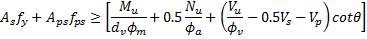

Longitudinal Reinforcement {#tg_longitudinal_reinforcement}
======================================
Longitudinal reinforcement is used in the analysis of several limit state conditions including:
* Ultimate moment capacity
* Longitudinal Reinforcement for Shear Capacity
* Allowable tensile stress for temporary conditions

Each of these conditions is described in more detail in the sections below.

Ultimate Moment Capacity
------------------------
@ref tg_moment_capacity is computing using a strain compatibility method. If longitudinal rebar exists in a section, and the option to use girder longitudinal rebar for moment capacity is enabled, this reinforcement will be utilized when computing the ultimate positive moment capacity only. The effectiveness of partially developed reinforcement will be reduced according to LRFD 5.11.2.1.

> NOTE: The value of shear depth, dv, which is used extensively in shear capacity computations, is computed as part of the ultimate moment capacity analysis. Hence, shear capacity can be affected indirectly by the existence of longitudinal reinforcement. We have noted several cases where longitudinal steel reduces dv, which will result in a reduction of vertical shear capacity and may reduce longitudinal reinforcement for shear capacity. This behavior can be quite unexpected.

> TIP: The option to use longitudinal reinforcement must be enabled on the Project Criteria - @ref ug_library_dialogs_project_criteria_moment_capacity tab.

Longitudinal Reinforcement for Shear
--------------------------------------
Provision 5.8.3.5 of the AASHTO LRFD Specifications states that, for sections not subject to torsion, longitudinal reinforcement shall be proportioned so that at each section the following equation (5.8.3.5-1) is satisfied:

Where:

As = Area of non-prestressed tension reinforcement 
fy = Specified minimum yield strength of reinforcing bars 
Aps = Area of prestressing steel on the tension side of the member, reduced for any lack of full development 
fps = Average stress in prestressing steel at the time for which the nominal resistance of member is required 
Mu = Factored moment at the section 
dv = Effective shear depth 
fm = Resistance factor for moment 
Nu = Factored axial force at the section 
fa = Resistance factor for axial force 
Vu = Factored shear force at section 
fv = Resistance factor for shear force 
Vs = Shear resistance provided by shear reinforcement 
Vp = Shear resistance provided by vertical component of prestressing 
q = Angle of inclination of diagonal compressive stresses 
 
> Tip: The option to use longitudinal reinforcement must be enabled on the Project Criteria library - @ref ug_library_dialogs_project_criteria_shear_capacity tab

Allowable Tensile Stress for Temporary Conditions
----------------------------------------------------
LRFD 5.9.4.1.2-1, "Temporary Tensile Stress Limits in Prestressed Concrete before Losses, Fully Prestressed Components", allows tensile stress limits for temporary conditions to be increased if sufficient bonded reinforcing bars and/or prestressing steel are provided to resist the tensile force in the concrete computed assuming an uncracked section. The higher allowable limits may be specified for the following cases: 
* release in the casting yard (See Project Criteria - @ref ug_library_dialogs_project_criteria_design_and_spec_checking tab).
* during lifting (See Project Criterial - @ref ug_library_dialogs_project_criteria_lifting tab);
* during hauling (See Project Criterial - @ref ug_library_dialogs_project_criteria_hauling tab);

AASHTO suggests that the required tensile steel can be computed per the figure below:

In addition to the basic approach descrbed in LRFD 5.9.4.1.2, the following assumptions are made:
1. The actual area of the tension zone is computed based on the location of the neutral (bending) axis and the geometry of the girder cross section.
2. Longitudinal reinforcement will only be utilized if it lies on the tension side of the neutral axis. 
3. Reinforcement is only considered at sections where it is fully developed.
4. The area of prestressing strands will not be considered. It is assumed that the stress capacity of prestressing steel is already fully utilized after jacking and losses at release. Hence, only mild steel reinforcement is considered when computing As for this requirement.

> TIP: A common source of confusion is adding reinforcement to your model and finding that the allowable tension did not increase. The most common reason for this is that the reinforcement is on the compression side of the beam. Use the stress diagram shown above to compute "x". If your reinforcement is below "x" it is on the compression side and does not contribute to the tensile resistance and therefore does not constitute _bonded reinforcement sufficient to resist the tensile force in the concrete computed assuming an uncracked section_ .

