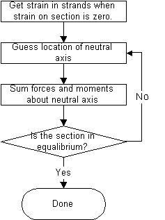
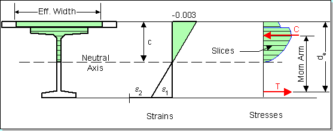
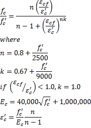

Moment Capacity {#tg_moment_capacity}
======================================
Moment capacity is computed using a non-linear strain-compatibility methodology. Non-linear material models are used for concrete materials and reinforcing strands.

A non linear approach is used in lieu of the AASHTO or PCI approaches because the research done in Reference 1 (below) has shown that for T-beams with different concrete strengths in the flange and web, the traditional equivalent rectangular concrete compressive stress distribution does not provide a reliable estimate of flexural strength.

Theory
----------
The basic theory and assumptions for the non-linear analysis are:
1. The strength design of flexural members is based on satisfaction of applicable conditions of equilibrium and compatibility of strains.
2. Strain in the reinforcement and concrete is assumed to be directly proportional to the distance from the neutral axis.
3. The maximum useable strain at the extreme concrete compression fiber is assumed to be 0.003.
4. For positive moment analysis; the effects of non-prestressed (mild steel) reinforcement are included in the analysis at the user's option. The area of girder rebar is adjusted for lack of development. Deck rebar is ignored
5. For negative moment analysis; the effects of non-prestressed (mild steel) Deck reinforcement are included in the analysis. Rebar in the girder is included at the user's option
6. The tensile strength of concrete is neglected.
7. The non-linear concrete stress-strain relationship is taken from Reference 2.
8. The material model of stress-strain behavior for low relaxation and stress relieved prestressing strands utilizes the "power formula" taken from the PCI Bridge Design Manual.
9. The distance c from the fiber of maximum strain to the neutral axis is measured in a direction perpendicular to that axis.

> NOTE: The maximum allowable prestressing requirements are still checked for this method per LRFD 5.7.3.3.1. Sections that do not pass this criteria will fail the moment capacity specification check.

Solution Method
----------------
The non-linear compressive behavior of prestressed beam sections is modelled by slicing the compression area of the section into horizontal strips. Strains are computed at the midpoint of each strip and then stresses are computed using the concrete material model. The moment contribution by each strip is then determined by multiplying the stress in the strip by the strip area to get the force and then multiplying this force by the distance from the strip's geometrical centroid to the neutral axis. First 30 strips are used. If the program cannot converge on a solution, then 50 and 100 strips are used. The strips are re-generated each time the neutral axis location is changed.

Ultimate moment capacity is computed relative to the condition of zero strain in the non-prestressed materials in the cross section. The following flow chart illustrates the high level procedure for this method:

The figure below shows the equilibrium state from which the nominal moment capacity is obtained:

 

The strain e2 is the strain in the prestressing steel at the effective level of prestress. The strain e1 is the strain associated with the flexure of the cross section. The resultant compressive force, C, acts at the centroid of the compression region. The tensile force T, acts at the location of the resultant of the strand forces.

> NOTE: <i>de</i> is the "effective depth from the extreme compression fiber to the centroid of the tensile force in the tensile reinforcement". Strands that are further away from the extreme compression fibers are strained more that those strands that are closer. This results in the centroid of the resultant tensile force being lower in the cross section than the geometric centroid of the prestressing strands..

Cross Section Geometry and Materials Used for Calculating Capacities
---------------------------------------------------------------------
The cross sectional geometry used for calculating the moment capacity of a girder is the same as that used for calculating section properties. Mild steel longitudinal reinforcement in the girder and in the slab is not considered in the capacity calculation.

Strain in the Prestressing Steel
--------------------------------
The initial strain in the prestressing steel, e2, is computed as <i>fpe/Eps</i>.

Stress in the Prestressing Steel
--------------------------------
As mentioned above, the stress/strain material model for the prestressing steel is computed using the "power method" where  eps =  e1 + e2. The equation, and a graph, for grade 270 steel are given below.

Stress in the Concrete
-------------------------------
The stress in the concrete, f'c, is determined from the formulas shown below (see Reference 2):

Maximum Reinforcement Limits
----------------------------
> NOTE: The information in this section is only applicable to PGSuper projects with the Design Criteria based on the AASHTO LRFD Bridge Design Specifications, 3rd Edition with 2005 interim provisions and earlier.

The maximum amount of reinforcement is limited such that c/de <= 0.42. When this ratio is exceeded, the maximum design moment capacity is computed in accordance with LRFD C5.7.3.3.1.

There is a sudden drop in usable capacity when c/de transitions from just below 0.42 to just over 0.42. Furthermore, the equations in LRFD C5.7.3.3.1 do not adequately account for the different concrete materials in the slab and girder. WSDOT uses a variable capacity reduction factor method for dealing with this situation.

If the design criteria in this program is set to use the WSDOT BDM method of computing the capacity of over-reinforced sections, the nominal capacity will be computed using the strain compatibility analysis as described above. Then a reduced capacity reduction factor will be computed by

References
------------
1. [Stephen J. Seguirant P.E. Richard Brice P.E, Bijan Khaleghi, Ph.D., P.E., "FLEXURAL STRENGTH OF REINFORCED AND PRESTRESSED CONCRETE T-BEAMS", PCI Journal Jan/Feb 2005.](http://www.pci.org/pci_journal-2005-january-february-2/)
2. Collins, M.P., and Mitchell, D., Prestressed Concrete Structures, Prentice-Hall, Inc., A Division of Simon & Schuster, Englewood Cliffs, New Jersey, 07632, 1991, pp. 61-65. 
