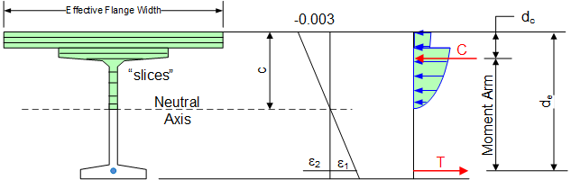
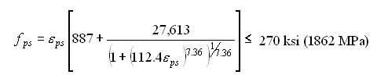

Moment Capacity {#tg_moment_capacity}
======================================
Moment capacity is computed using the strain compatibility approach specifed in AASHTO LRFD 5.6.3.2.5. Non-linear material models are used for concrete materials, prestressing strands, and mild reinforcement.

The strain compatibility approach is used in lieu of the simplified rectangular stress block approach defined by AASHTO LRFD 5.6.3 because the equations provided in Section 5.6.3.1.1 are not applicable to all situations (see C5.6.3.1.1), the AASHTO equations neglect the contribution of the top flange of I-Beams, and the research done in Reference 1 (below) has shown that for T-beams with different concrete strengths in the flange and web, the traditional equivalent rectangular concrete compressive stress distribution does not provide a reliable estimate of flexural strength.

Theory
----------
The basic theory and assumptions for the strain compatibility analysis are:
1. The strength design of flexural members is based on satisfaction of applicable conditions of equilibrium and compatibility of strains.
2. Strain in the reinforcement and concrete is assumed to be directly proportional to the distance from the neutral axis.
3. The maximum useable strain at the extreme concrete compression fiber is 0.003.
4. For positive moment analysis, the effects of non-prestressed (mild steel) reinforcement are included in the analysis at the user's option. The area of girder rebar is adjusted for lack of development. Deck rebar is not considered in the analysis.
5. For negative moment analysis, the effects of non-prestressed (mild steel) deck reinforcement is included in the analysis. Rebar in the girder is included at the user's option.
6. The tensile strength of concrete is neglected, except for UHPC-class materials.
7. The stress-strain relationship for unconfined concrete is taken from Reference 2. The stress-strain relationship for UHPC-class concrete is taken from the relevant literature.
8. The material model of stress-strain behavior for low relaxation and stress relieved prestressing strands utilizes the "power formula" taken from the PCI Bridge Design Manual.
9. The distance c from the fiber of maximum strain to the neutral axis is measured in a direction perpendicular to that axis.
10. When reinforcement strain limits are considered at the user's option, the maximum usable strain in prestress strand is 0.035 as defined in ASTM A416 and the maximum usable strain in non-prestressed reinforcement ranges between 0.06 and 0.012, depending upon material grade and bar designation.

> NOTE: Mild steel reinforcement is only used in the capacity analysis if permitted by the Project Criteria. For bridge systems without a cast in place deck or overlay, the mild reinforcement in the girder is used in the negative moment capacity analysis, regardless of the settings in the Project Criteria.

Solution Method
----------------
A common definition of strain compatibility analysis is to fix the compression strain at 0.003 at the extreme compression fiber of the beam, guess the location of the neutral axis, compute the resulting compression and tension forces, and revise the location of the neutral axis until the compression and tension forces are equal.

A more general solution method is used to account for cases when maximum reinforcement strain limits the capacity of the section. The strain compatibility analysis is carried out by setting the controlling strain, assuming a section curvature and integrating the resulting stress field over the cross section. The section curvature is varied until the internal and external section forces are in equilibrium.

To integrate the stress field, i.e. compute the resultant tension and compression forces, the composite girder section is divided into the number of "slices" defined in the Project Criteria, the strain is computed at the geometric centroid of each slice, stress is computed from the stress-strain curve assigned to the slice, and the force on the slice is computed as the product of the stress and the slice area.

At the conclusion of the analysis, if specifed in the Project Criteria, the strain in the reinforcement is compared to the minimum required elongation specified in the applicable ASTM material specification. If the strain in the reinforcement exceeds the minimum required elogation the moment capacity is over predicted. The strain at the level of the reinforcement is fixed at the minimum elongation and the capacity analysis is repeated. The resulting strain in the concrete will be less than 0.003 and the rectangular stress distribution approximation from the AASHTO specifications cannot be used. This provides further justification for the strain-compatibility solution.

The figure below shows the equilibrium state from which the nominal moment capacity is obtained when concrete crushing controls:

 
The strain e2 is the strain in the prestressing steel at the effective level of prestress, commonly refered to as the decompression strain. The strain e1 is the strain associated with the flexure of the cross section. The total strain in the prestressing steel (e1 + e2) is used to compute the prestress. The resultant compressive force, C, acts at the centroid of the compression region. The tensile force T, acts at the location of the resultant of the strand forces.

> NOTE: <i>de</i> is the "effective depth from the extreme compression fiber to the centroid of the tensile force in the tensile reinforcement". Strands that are further away from the extreme compression fibers are strained more that those strands that are closer. This results in the centroid of the resultant tensile force being lower in the cross section than the geometric centroid of the prestressing strands.

Composite Girder Section
---------------------------------------------------------------------
The composite girder section used in the strain compatibiilty analysis is the same as that used for calculating section properties (Refer to @ref tg_section_properties ).

Material Models (Stress-Strain Curves)
---------------------------------------------------------------------
The strain compatibility analysis uses the following representitive stress-strain curves.

### Prestressing Strand
As mentioned above, the stress/strain material model for the prestressing steel is computed using the "power method" where  eps =  e1 + e2. The equation, and a graph, for Grade 270 steel are given below.

For sections where strand are not fully developed, the stress determined by the power formula is reduced as specified in AASHTO LRFD 5.9.4.3.2.

### Mild Steel Reinforcement (Rebar)
The stress/strain material model for mild reinforcement is the traditional elastic-perfectly plastic model.

> NOTE: mild reinforcement is only used in the capacity analysis if permitted by the Project Criteria.
> NOTE: for bridge systems without a cast in place deck or overlay, the mild reinforcement in the girder is used in the negative moment capacity analysis, regardless of the settings in the Project Criteria.

### Unconfined Concrete
The stress in the concrete, f'c, is determined from the formulas shown below (see Reference 2):

Maximum Reinforcement Limits
----------------------------
> NOTE: The information in this section is only applicable to PGSuper projects with the Design Criteria based on the AASHTO LRFD Bridge Design Specifications, 3rd Edition with 2005 interim provisions and earlier.

The maximum amount of reinforcement is limited such that c/de <= 0.42. When this ratio is exceeded, the maximum design moment capacity is computed in accordance with LRFD C5.7.3.3.1.

There is a sudden drop in usable capacity when c/de transitions from just below 0.42 to just over 0.42. Furthermore, the equations in LRFD C5.7.3.3.1 do not adequately account for the different concrete materials in the deck and girder. WSDOT uses a variable capacity reduction factor method for dealing with this situation.

If the design criteria in this program is set to use the WSDOT BDM method of computing the capacity of over-reinforced sections, the nominal capacity will be computed using the strain compatibility analysis as described above. Then a reduced capacity reduction factor will be computed by

Concrete Strength at Continuity Diaphragms
------------------------------------------
LRFD 5.12.3.3.10 (*pre-2017: 5.14.1.4.10*) allows the moment capacity of continuity diaphragms to be based on the strength of the concrete in the precast girders. The reason for this is explained in C5.12.3.3.10. The use of the increased concrete strength is permitted because the continuity diaphragm concrete between girder ends is confined by the girder and the continuity diaphragm extends beyond the girders. 

The girder concrete strength is used in the computation of moment capacity at continity diaphragms when the width of the diaphragm exceeds the distance between the ends of girders on either side of the pier by 5% and when girders on both sides of the pier are essentially aligned. 
The girders are considered to be essentially aligned when the distance between the points where the centerline of the girder, projected, intersects the centerline pier is less than 5% of the bottom flange width.

References
------------
1. [Stephen J. Seguirant P.E. Richard Brice P.E, Bijan Khaleghi, Ph.D., P.E., "FLEXURAL STRENGTH OF REINFORCED AND PRESTRESSED CONCRETE T-BEAMS", PCI Journal Jan/Feb 2005.](https://www.pci.org/PCI/Publications/PCI_Journal/Issues/2005/January-February/Flexural_Strength_of_Reinforced_and_Prestressed_Concrete_T-Beams.aspx)
2. Collins, M.P., and Mitchell, D., Prestressed Concrete Structures, Prentice-Hall, Inc., A Division of Simon & Schuster, Englewood Cliffs, New Jersey, 07632, 1991, pp. 61-65. 
