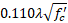
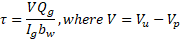
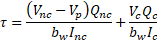
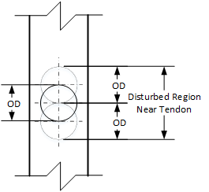
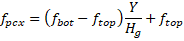
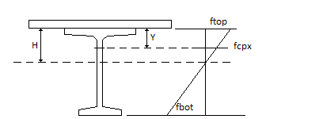
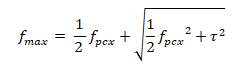

Principal Tensile Stress in Webs {#tg_principal_tensile_stress}
======================================

Begining with the 8th Edition of the AASHTO LRFD Bridge Design Specifications, Article 5.9.2.3.3 requires the principal tensile stresses in webs not exceed 

for all types of post-tensioned superstructures and pretensioned girders with a specified compression strength greater than 10 ksi.

The basis for this provision is NCHRP Report 849, ["Strand Debonding for Pretensioned Girders"](https://apps.trb.org/cmsfeed/TRBNetProjectDisplay.asp?ProjectID=3171), Shahrooz, et.al., 2017.

Shear Stress
------------
Shear stress can be computed using LRFD Equation 5.9.2.3.3-1

or by NCHRP Report 849 Equation 3.8

The LRFD shear stress equation applies the total Service III shear force to the composite girder section. The NCHRP equation sums the shear stress due to loads applied to the non-composite section with the shear stress due to loads applied to the composite section. The sum of non-composite and composite section shear stresses is consistent with the computation of the axial stress at the web elevation being evaluated.

The Service III load factors are applied to the load components used in the NCHRP equation.

At sections where internal tendons cross near the depth at which the maximum principal tension is being checked, the provisions of LRFD 5.7.2.1 are applied to adjust the web width for the precense of a grouted tendon. "Near the depth at which the maximum principal tension is being checked" is defined by as multiple of outside duct diameters, k(OD), from the center of the duct.

Axial Stress
-------------
Axial stress at the elevation of the web where principal stress is being evaluated is computed as

Axial stress is computed using the bending moment causing the maximum stress on the side of the girder (above or below the centroidal axis) where the principal tensile stress is being evaluated. The shear stress is computed for maximum shear force at a section. These maximum force effects may not occur concurrently.

Principal Tensile Stress
------------------------
The principal tensile stress is computed using

Note that this equation is different than LRFD Equation 5.9.2.3.3-4. Vertical prestressing is not used so fpcy is taken to be zero. The LRFD equation assumes that tension is negative and compression is positive. Tension and compression have opposite signs in the @ref tg_sign_convention used in this software. This necessitaties a minor revision to the principal tensile stress equation.

