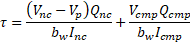
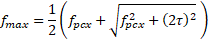

Principal Tensile Stress in Webs {#tg_principal_tensile_stress}
======================================

Begining with the 8th Edition of the AASHTO LRFD Bridge Design Specifications, Article 5.9.2.3.3 requires the principal tensile stresses in webs not exceed 

for all types of post-tensioned superstructures and pretensioned girders with a specified compression strength greater than 10 ksi.

The basis for this provision is NCHRP Report 849, ["Strand Debonding for Pretensioned Girders"](https://apps.trb.org/cmsfeed/TRBNetProjectDisplay.asp?ProjectID=3171), Shahrooz, et.al., 2017.

Available Options
-----------------
The software provides three possible options for the computation of web stresses: For simplified loss methods, stresses can be computed using the method defined by AASHTO LRFD section 5.9.2.3.3, or by using the alternate method described in NCHRP Report 849. When time-step losses are used, principal stresses can be computed by directly using LRFD 5.9.2.3.3, or by using a time-step method inspired by the NCHRP 849 document.

Shear Stress
------------
Shear stress can be computed using LRFD Equation 5.9.2.3.3-1. The LRFD shear stress equation applies the total Service III shear force to the composite girder section.

Or, by NCHRP Report 849 Equation 3.8. The NCHRP equation sums the shear stress due to loads applied to the non-composite section with the shear stress due to loads applied to the composite section. The sum of non-composite and composite section shear stresses is consistent with the computation of the axial stress at the web elevation being evaluated.

Or, if time-step losses are used, the NHCHRP method uses the following equation where incremental shear stresses at each interval for each loading are summed though time. Summed stress values are then combined using Service III load factors at the final condition with live load response.

The Service III load factors are applied to the load components used in the NCHRP method.

At sections where internal tendons cross near the depth at which the maximum principal tension is being checked, the provisions of LRFD 5.7.2.1 are applied to adjust the web width for the precense of a grouted tendon. "Near the depth at which the maximum principal tension is being checked" is defined by as multiple of outside duct diameters, k(OD), from the center of the duct.

Axial Stress
-------------
Axial stress at the elevation of the web where principal stress is being evaluated is computed for simplified loss methods as

For the NCHRP time-step analysis, incremental values are computed at each interval (i) for each loading, and then summed over time:

Axial stress is computed using the bending moment causing the maximum stress on the side of the girder (above or below the centroidal axis) where the principal tensile stress is being evaluated. The shear stress is computed for the absolute value of maximum shear force at a section. This is a conservative approach, these maximum force effects may not occur concurrently in reality.

Time-Dependent Analyses
-------------
The simplified stress calculation methods described above were developed with pretensioned prestress structures and typical construction scenerios in mind. More complex structures analyzed using time-step losses require a higher level of accuracy. Hence, when time-step losses, and the NCHRP 849 method is selected, the program computes both shear stresses and axial stresses using an incremental time-step approach. Stresses for each loading are computed from the incremental load response using transformed section properties at each time interval, and then summed to give a cummulative stress response at each interval. For intervals at and after the application of live load, cummulateive load responses are summed and factored appropriately, and then used to compute the maximum principal tensile stress. 

Principal Tensile Stress
------------------------
The principal tensile stress is computed using

Note that this equation is different than LRFD Equation 5.9.2.3.3-4. Vertical prestressing is not used so fpcy is taken to be zero. The LRFD equation assumes that tension is negative and compression is positive. Tension and compression have opposite signs in the @ref tg_sign_convention used in this software. This necessitaties a minor revision to the principal tensile stress equation.