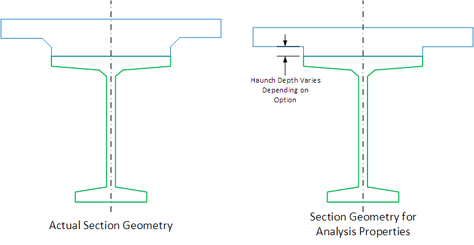

Section Properties {#tg_section_properties}
======================================
PGSuper provides the following options for treatment of the slab haunch when calculating composite section properties and section-based capacities.

Option | Description
-------|------------
Zero haunch depth | The slab lies directly on the top of the girder. This provides the least-stiff section so it is conservative for computing stresses and deflections, and it makes structural modeling easy because we have a prismatic section.
Constant haunch depth equal to the Fillet value | The haunch depth is constant along the girder and equal to the Fillet dimension. This method provides a mid-ground for conservatism and simplicity.
Variable haunch depth... (Slab Offset Input) | (PGSuper only) Haunch depth varies along the girder, and is defined by a parabola fitting the Slab Offset, Roadway Geometry, and Assumed Excess Camber dimensions. The top of the girder is assumed to follow a parabolic curve fitting the Assumed Excess Camber value. This is the most accurate , least conservative, and least computationally efficient method; and is primarily intended for load rating and evaluation.
Variable haunch depth... (Explicit Haunch Input) | Haunch depth varies along the girder as defined by @ref tg_haunch_explicit.

> NOTE: Material within the angular fillet shape of the haunch is ignored for analysis purposes.

> NOTE: A specification check is performed for the variable haunch depth case to insure that the assumed excess camber is within tolerance of the computed excess camber. 

 

