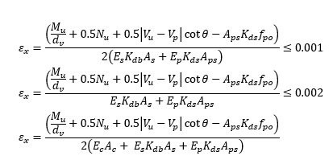
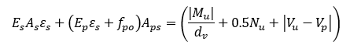
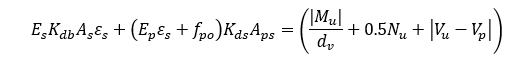
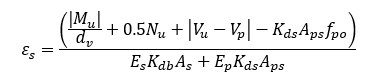

Shear Capacity {#tg_shear_capacity}
======================================

## Adjustment Factors for Net Longitudinal Tensile Strain

LRFD 5.7.3.4.2 provides guidance for estimating the beta and theta parameters for shear capacity. The net longitudinal strain is a key parameter and it is computed by LRFD Equation 5.7.3.4.2-4. Within this software, they equation has been modified as described herein.

The net longitudinal strain is computed as:

where the following adjustment factors:

Kdb = factor accounting for lack of full bar development.

Kds = factor accounting for lack of full strand development.

Previously, the provided As and Aps were scaled by factors accounting for lack of full development making it difficult to verify their values. In the revised equation, the true values of As and Aps are provided and multiplied by Kdb and Kds, respectively. 

Kdb is determined by linearly interpolating the distance from the end of the reinforcement to the section underconsider along the development length computer per LRFD 5.10.8.

Kds is determined by interpolating the distance from the end of the strand to the section under consideration along the development length per LRFD 5.9.4.3.2-1 and Figure C5.9.4.3.2-1

LRFD 5.7.3.4.2 states that "Within the transfer length, fpo shall be increased linearly from zero at the location where the bond between the strands and concrete commences to its full value at the end of the transfer length". Additionally, LRFD 5.7.3.4.2 states that "In calculating As and Aps the area of bars or tendons terminated less than their development length from the section under consideration should be reduced in proportion to their lack of full development." Applying both reductions in the numerator of Equation 5.7.3.4.2-4 amounts reducing Apsfpo twice.

Equation 5.7.3.4.2-4 is essentially a statement of force equilibrium of the internal force provided by the section reinforcement and the external force from the applied loads. The equation, rearranged into the form of equal forces is

Applying the Kdb and Kds reductions for a lack of full development leads to

Solving for the net longitudinal strain

From the corrected net longitudinal strain equation, it is clear that fpo should not be reduced in perportion to its transfer length. For this reason, fpo is not reduced in these calculations.

## Load Rating
One of the unique features of the MCFT is that ultimate shear capacity is a function of loading. Even though load ratings are computed for individual vehicles the shear capacity is computed based on the live load envelope of which the vehicle belongs. For example, the shear rating for the legal load rating for routine commercial traffic may be controlled by the Type 3-3 vehicle, the shear capacity will be based on the envelope of all the AASHTO Legal Load vehicles. In most all cases, the vehicle causing the maximum shear in the live load envelope will be the same vehicle governing the load rating.
