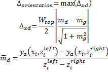

Slab Offset {#tg_slab_offset}
======================================
The slab offset is the vertical distance from the top of slab to the top of girder measured at the intersection of the girder and bearing centerlines. The a slab offset is input by the user and during the specification compliance check it is compared to a computed value. If the input slab offset is too large, then slab haunch load will be over estimated and indicated a possible waste of materials. If the input slab offset is too small, the slab haunch load will be under estimated and the girders will be under designed.

> NOTE: The slab offset is known in WSDOT jargon as the "A" Dimension and in TxDOT jargon as the "X" Dimension.

The slab haunch varies in depth along the length of the girder accommodating the girder camber and geometric effects of the roadway surface including superelevations, vertical curves and horizontal curves. 

The basic concept in determining the required slab offset is to provide a slab haunch over the girder such that the top of the girder is not more than the fillet depth below the bottom of the slab at the center of the span. This provides that the actual girder camber could exceed the calculated value by the fillet depth plus the bottom slab reinforcing cover before the top of the girder would interfere with the bottom mat of slab reinforcement.

It is desirable to have points of horizontal and vertical curvature and superelevation transitions off the bridge structure as this greatly simplifies the geometric requirements on the slab haunch. However, as new bridges are squeezed into the existing infrastructure it is becoming more common to have geometric transitions on the bridge structure.

Each geometric effect is considered independently of the others. The total geometric effect is the algebraic sum of each individual effect.

> TIP: The Girder Designer can find an optimal Slab Offset for you.

Notation
-------------
xi = Station at section <i>i</i>
zi = Normal offset from the alignment to the centerline of girder at section <i>i</i>.
ya(xi,zi) = Elevation of the roadway surface at station xi and normal offset zi.

Deck Effect
------------
The distance between the top of the girder and the top of the roadway surface, most obviously be at least the thickness of the slab plus the fillet depth.

Excess Camber Effect
--------------------
The slab haunch must be thickened to accommodate any camber that remains in the girder after slab casting.

When the slab offset is computed to match the roadway profile, the camber that remains in the girder after all deflections occur must be accounted for. The slab haunch is thickened by the ![]excess camber.

Profile Effect
----------------
The profile effect accounts for changes in the roadway profile along the length of the girder. Profile changes include grade changes, vertical curve effects, and offset deviations between the centerline of girder and the alignment caused by flared girders and/or curvature in the alignment.

The figure above is obviously highly exaggerated. It illustrates that the profile effect component is equal to the distance the girder must be placed below the profile grade line such that the lowest point on the profile just touches the top of the girder. In the case of a sag vertical curve, the slab haunch must be thickened at the ends of the girder. In the case of a crown vertical curve, the slab haunch depth may be reduced.

  

Where

is the difference between the roadway surface directly above the centerline of the girder and a chord line, parallel to the top of the girder (ignoring camber effects), connecting the points defined by the intersection of the centerline of bearing and the roadway surface.

The chord line is given by 

Girder orientation Effect
----------------------------
The girder orientation effect accounts for the difference in slope between the roadway surface and the top of the girder. Girders such as I-beams are oriented with their main axis plumb. Other girders such as U-beams, box beams, and slabs can be oriented with their main axis normal to the roadway surface. The orientation of the girder with respect to the roadway surface, and changes in the roadway surface along the length of the girder (superelevation transitions) define the Girder Orientation Effect.

where
zileft = offset to left exterior mating surface and ziright = offset to right exterior mating surface.

> NOTE: The mating surface is the girder surface that mates with the bottom of the slab haunch. This is commonly the top of the top flange, but not all girders have top flanges.

Required Slab Offset
---------------------
The required slab offset is the sum of the effects described above.

The slab offset is rounded to the tolerance specified in the Project Criteria.

The minimum value of the slab offset is

Limitations
------------
These computations are for a single girder. The required slab haunch should be determined for each girder in the structure. You will typically specify the greatest required slab offset in your plans.

These computations are also limited to a single span. A different slab haunches may be needed at each end of a span. For example, if there is a long span adjacent to a short span, the long span may have considerably more camber and will require a larger slab haunch. There is no need to have the shorter spans carry all the extra concrete needed to match the longer span haunch requirements. With the wide flange girders, the volume of concrete in the haunches can add up quickly. The shorter span could have a different haunch at each end as illustrated below.

Stirrup Length and Precast Deck Panel Leveling Bolt Considerations
--------------------------------------------------------------------
For bridges on sharp crown vertical curves, the slab haunch depth at the centerline of span can become excessive to the point where projecting girder stirrups are too short to properly engage the deck reinforcement to form a composite section. Similarly the length of leveling bolts in precast deck panels may need adjustment. A warning will be added to the slab haunch specification check when the required build-up at mid-span exceeds the slab offset by 2".

