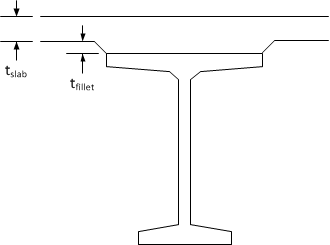
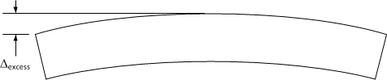
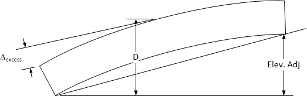
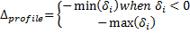
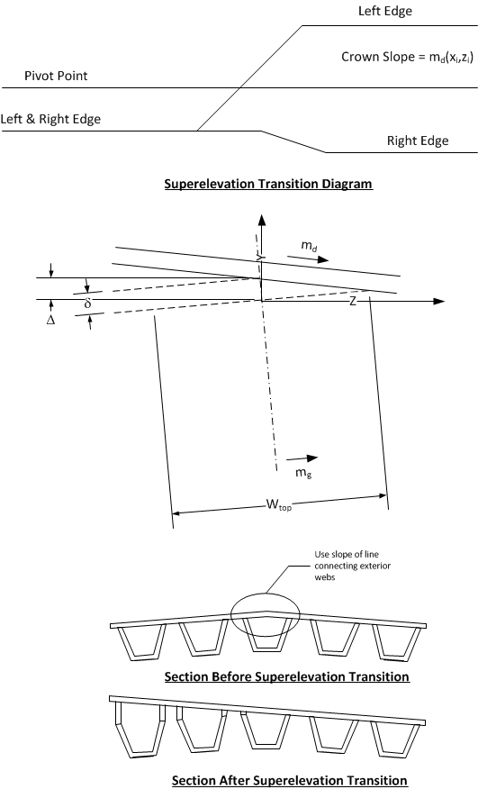
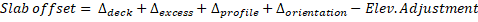

Slab Offset ("A" Dimension, "X" Dimension) {#tg_slab_offset}
======================================
The slab offset is the vertical distance from the top of slab to the top of girder measured at the intersection of the girder and bearing centerlines. The slab offset defines the depth of the haunch at those locations as shown in figure below for an I-Beam. The slab offset also defines the top of girder elevation at erection. 

> The bearing seat elevation is defined using the top of girder elevation at erection and other geometric information including the bearing height and recess.

> NOTE: The slab offset is known in WSDOT jargon as the "A" Dimension and in TxDOT jargon as the "X" Dimension.

> NOTE: The following dicussion applies to spliced girders, however, the slab offset is determined on a segment by segment basis rather than span by span as is done for pretensioned girder bridges. The slab offset defines the depth of the slab and haunch at the ends of each segment.

The slab haunch varies in depth along the length of the girder accommodating the girder camber and geometric effects of the roadway surface including superelevations, vertical curves and horizontal curves. 

The purpose of the slab haunch is to provide a structural spacer between the bottom of the constant thickness slab and the top of the girder such that the roadway riding surface meets specified geometric requirements at the time when the bridge is put into service, and that the top of the girder does not encroach into to the deck slab. Therefore, the basic concept in determining the required slab offset is to provide a slab haunch over the girder such that the top of the girder is not more than the fillet depth below the bottom of the slab. This provides that the actual girder camber could exceed the calculated value by the fillet depth plus the bottom slab reinforcing cover before the top of the girder would interfere with the bottom mat of slab reinforcement.

In general, it is desirable to have points of horizontal and vertical curvature and superelevation transitions off the bridge structure as this greatly simplifies the geometric requirements on the slab haunch. However, as new bridges are squeezed into the existing infrastructure it is becoming more common to have geometric transitions on the bridge structure. Therefore, the inclusion of all geometric effects must be considered in a rigorous analysis. The total geometric effect is the algebraic sum of each individual effect.

The width of the slab haunch is the width of the top flange of the girder for single top flange sections. However, tub girders have two haunches – one for each of the two top flanges, and may be non-prismatic if end blocks are present.

> TIP: PGSuper's Girder Designer can find an optimal Slab Offset for you.

Slab Offset for Spliced Girder Bridges
----------------------------------------
The slab offset defines the top of girder elevation at erection for pretensioned girder bridges (PGSuper) because it is always measured at permanent supports (abutments and piers). The top of girder elevation for spliced girder bridges is a bit more complex. The slab offset defines the casting depth of the slab and haunch at the centerline bearing at the ends of each precast segment. Like pretensioned girder bridges, the slab offset locates the top of the precast segment relative to the finished profile. However, unlike pretensioned girder bridges, you may want the top of the cast slab to be at a different elevation than the finished profile because deflections from post-tensioning, temporary support removal, time dependent effects, and application of external loads will cause the segments to deflect.

The segment elevation at erection can be adjusted at temporary supports with elevation adjustments. The temporary support elevation adjustments raise (or lower) the elevation of the segment at erection. These adjustments are rigid body displacements and must be accounted for in the determination of the required slab offset.

Slab Offset Characteristics
---------------------------
Well-designed slab haunches have the following characteristics:
* The haunch depth is adequate at its minimum location along the girder to satisfy the fillet depth defined by the user.
* Ideally, to save on concrete, the fillet will coincide with the Standard Minimum Fillet. If the input fillet is smaller than Standard Minimum Fillet, a spec check failure will occur.
  + For spread-spaced girders, the Standard Minimum Fillet is defined in the Girder library. 
  + For adjacently-spaced girders, the Standard Minimum Fillet is assumed to be zero.
* The fillet should also consider tolerances plus physical concerns such as: horizontal interface shear stirrups, spacers, forms (bedding strips), and reinforcement in the slab bottom region.
* The haunch has adequate minimum depth at the C.L. bearing locations to satisfy the Standard Minimum Haunch Depth at CL Bearings defined in the Girder library.
* The haunch is kept as shallow as possible to minimize weight and material costs.

A rigorous analysis of the slab haunch considers the following effects:
* Profile geometry of the roadway surface along the girder (vertical and horizontal curves).
* Transverse roadway geometry along the girder and girder orientation (superelevations)
* Girder camber measured just before deck placement
* Camber imposed into the shape of the girder (precamber)
* Deflection due to placement of SIP deck panels
* Deflection due to permanent construction loads
* Deflection due to placement of diaphragms
* Deflection due to placement of deck slab (cast or full-depth SIP)
* Deflection due to the haunch concrete itself. In PGSuper, there are two ways to model the haunch load as selected in the Project Criteria library:
  + Model the haunch load by assuming zero excess girder camber
  + Model the haunch load assuming that the girder camber shape is a parabola with its vertex at mid-span defined by the user-input assumed excess camber.
* Deflection due to removal of forms and falsework (generally ignored)
* Deflection due to placement of superimposed dead loads on composite section
* Loss of camber due to long-term prestressed losses (ignored currently in PGSuper)

If all cambers and deflections occur as predicted during design, the haunch depth at the point of least haunch depth will be exactly equal to the fillet dimension. However, in practice the only effects that can be computed with reliable accuracy are the roadway geometry effects. Camber, deflections, and long-term losses are more difficult to predict with a high degree of accuracy. Each of these effects can be considered independently and combined to compute final haunch requirements. Individual effects are treated in detail in the following sections.

Notation
-------------
xi = Station at section <i>i</i>.  
zi = Normal offset from the alignment to the centerline of girder at section <i>i</i>.  
ya(xi,zi) = Elevation of the roadway surface at station xi and normal offset zi.

Deck Effect
------------
Per our definition; the distance between the top of the girder and the top of the roadway surface must be at least the thickness of the slab plus the fillet depth.

The Fillet is the least allowable haunch depth along a girder. This value is input by the user as part of the physical bridge description. 

>NOTE: The input fillet is used in the calculation of minimum and required slab offset during a specification check. During design, the fillet can be left at its input value or it can be modified by the design algorithm if requested. If the value is modified by the design algorithm, it is set equal to the Standard Minimum Fillet Depth as specified in the Girder library. 

Excess Camber Effect
--------------------
The slab haunch must be thickened to accommodate any camber that remains in the girder at service. The excess camber effect is computed as the camber at the time of slab casting (D) less the screed camber (C). Excess camber effect = D - C.

The screed camber (C) is the sum of the deflections that occur from deck casting until service. This includes deflections due to the slab and haunch, traffic barriers, sidewalks, overlays, and other superimposed loads.

Temporary support elevation adjustments in spliced girders are treated as "rigid body" displacements of the precast segment. These displacements are applied to the segment at erection, prior to slab casting, and are therefore incorporated into the deflection at the time of slab casting (D). After the individual effects are summed, the rigid body displacement is removed, yielding the slab offset.

Profile Effect
----------------
The profile effect accounts for changes in the roadway profile along the length of the girder. Profile changes include grade changes, vertical curve effects, and offset deviations between the centerline of girder and the alignment caused by flared girders and/or curvature in the alignment.

The figure above is obviously highly exaggerated. It illustrates that the profile effect is the greatest distance between the finished grade and a straight line.

  

where

is the difference between the roadway surface directly above the centerline of the girder and the profile chord line.

The profile chord line is given by 

> NOTE: For PGSuper the profile grade line is for the entire girder and for PGSplice it is defined for each segment.

Haunch depth demand is different depending on the type of vertical curve over the girder. Effects on haunches from Sag and Crest curve are shown below. For a typical crest curve, there is more haunch at mid-span than at the ends. A sag curve creates a minimum haunch at mid-span with a larger haunch at the ends. Stated another way: in the case of a sag vertical curve, the slab haunch must be thickened at the ends of the girder; in the case of a crown vertical curve, the slab haunch depth may be reduced. The figures below illustrate these effects.

Girder Orientation Effect
----------------------------
The girder orientation effect accounts for the difference in slope between the roadway surface and the top of the girder. Girders such as I-beams are typically oriented with their main axis plumb. Other girders such as U-beams, box beams, and slabs may be oriented with their main axis normal to the roadway surface. Some pre-decked girders, such as deck bulb tees, have the roadway cross slope cast into the top flange. The orientation of the girder with respect to the roadway surface, and changes in the roadway surface along the length of the girder (superelevation transitions) define the Girder Orientation Effect.

where
zileft = offset to left exterior mating surface and ziright = offset to right exterior mating surface.

> NOTE: The mating surface is the girder surface that mates with the bottom of the slab haunch. This is commonly the top of the top flange, but not all girders have top flanges.

Required Slab Offset
---------------------
The required slab offset is the sum of the effects described above.

When temporary support elevation adjustments are used in spliced girder bridges, the elevation adjustments are incorporated into the deflection at slab casting (D) and contribute to the excess camber effect. Since these adjustments are rigid body displacement of the segments, and not actual deflections, their contribution must be removed from the sum of the individual effects to get the actual slab offset. The slab offset is the casting depth of the slab and haunch at the centerline bearing at the ends of the segments. This depth does not include elevation adjustments.

The required slab offset is **rounded up to the nearest 1/4 inch (or 5 mm)** before reporting and comparison with the user-input slab offset.

The minimum value of the slab offset is

Optional Required Slab Offset Based on Minimum Haunch Depth at Bearing Centerlines (PGSuper Only)
---------------------------------------
The optional minimum haunch depth at bearing centerlines check puts another requirement on the controlling slab offset. This is defined in the girder library and the value is checked at both bearings as follows:

where:  
is the library-specified minimum allowable haunch depth at bearing centerlines.

Limitations
------------
These computations are for a single precast element (a single girder for PGSuper or a single segment for PGSplice). The required slab haunch should be determined for each element in the structure. You will typically specify the greatest required slab offset in your plans.

For pretensioned girder bridges, these computations are also limited to a single span. A different slab offset may be needed at each end of a span. For example, if there is a long span adjacent to a short span, the long span may have considerably more camber and will require a larger slab offset. There is no need to have the shorter spans carry all the extra concrete needed to match the longer span haunch requirements. With the wide flange girders, the volume of concrete in the haunches can add up quickly. The shorter span could have a different haunch at each end as illustrated below.

> NOTE: Precamber can also be used to reduce the dead load of a haunch

Stirrup Length and Precast Deck Panel Leveling Bolt Considerations
--------------------------------------------------------------------
For bridges on sharp crown vertical curves, the slab haunch depth can become excessive to the point where projecting stirrups are too short to properly engage the deck reinforcement to form a composite section. Similarly the length of leveling bolts in precast deck panels may need adjustment. A warning will be added to the slab haunch specification check when the variation in haunch depth along the precast element exceeds 2".

TxDOT Conventions
------------
Many agencies have their own nomenclature for slab offset dimensions and TxDOT is no exception. The figure below illustrates TxDOT's "X", "Y" and "Z" dimensions. These are reported in the TxDOT Summary and Girder Schedule reports. **Note that reported values for  "X", "Y" and "Z" are rounded up to the nearest 1/8".**

