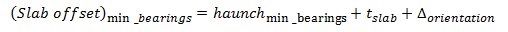

Slab Offset ("A" Dimension, "X" Dimension) {#tg_slab_offset}
======================================
The slab offset is the vertical distance from the roadway surface to the top of girder measured at the intersection of the girder centerline and bearing centerlines at exterior permanent supports. The slab offset defines the depth of the haunch at those locations as shown in figure below for an I-Beam.  

> Bearing seat elevations can be computed at slab offset locations, and are defined using the top of girder elevation at erection and other geometric information including the bearing height and recess. See @ref tg_bearing_seat_geometry for details.

> NOTE: The slab offset is known in WSDOT jargon as the "A" Dimension and in TxDOT jargon as the "X" Dimension.

> TIP: In PGSuper, the haunch can be defined using input of Slab Offsets only. See @ref tg_slab_offset_simplified for more information.

> TIP: PGSuper's Girder Designer can find an optimal Slab Offset for you.

Required Slab Offset (PGSuper using Slab Offset input only)
---------------------
The required slab offset is the sum of the effects described in the previous chapter @ref tg_vertical_geometry_basics.

The reported required slab offset is **rounded up to the nearest 1/4 inch (or 5 mm)** before reporting and comparison with the user-input slab offset.

The minimum value of the slab offset is

Optional Check for Required Slab Offset Based on Minimum Haunch Depth at Bearing Centerlines
---------------------------------------
Minimum haunch depths at bearing centerlines can be optionally checked placing another requirement on the controlling slab offset. This value is defined in the girder library and is checked at both bearings as follows:

where:  
is the specified minimum allowable haunch depth at bearing centerlines.

Stirrup Length and Precast Deck Panel Leveling Bolt Considerations
--------------------------------------------------------------------
For bridges on sharp crown vertical curves, the slab haunch depth can become excessive to the point where projecting stirrups are too short to properly engage the deck reinforcement to form a composite section. Similarly the length of leveling bolts in precast deck panels may need adjustment. A warning will be added to the slab haunch specification check report when the variation in haunch depth along the precast element exceeds 2 inches.

TxDOT Conventions
------------------
Many agencies have their own nomenclature for slab offset dimensions and TxDOT is no exception. The figure below illustrates TxDOT's "X", "Y" and "Z" dimensions. These are reported in the TxDOT Summary and Girder Schedule reports.

> NOTE: that reported values for  "X", "Y" and "Z" are rounded up to the nearest 1/8"

