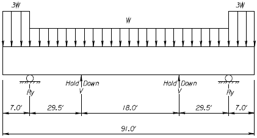
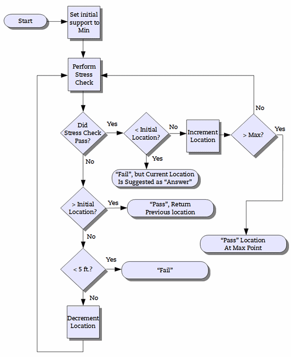

Stability {#stability}
======================================
As girders become longer, lifting and hauling them becomes more and more challenging. In fact, stresses and stability during lifting and handling often become controlling conditions. This section gives a brief overview of the methods used to analyze lifting and hauling of long girders. For a full treatment on these topics, we urge you to read the references sited below.

In-depth analyses is performed to check criteria for lifting and hauling based on methods cited in the PCI Journal and elsewhere. Two methods are provided for the analysis of hauling (shipping) the girder to the bridge site. These are designated as the Washington State DOT and Kansas State DOT methods.

### Lifting Analysis and WSDOT Method for Hauling Analysis ###

Analysis of stresses and stability during lifting and hauling is described in the following papers:
* ["Lateral Stability of Long Prestressed Concrete Beams - Part 1", Robert F. Mast, P.E., PCI Journal, January-February 1989 Edition](http://www.pci.org/uploadedFiles/Siteroot/Publications/PCI_Journal/1989/DOI_Articles/jl-89-january-february-3.pdf) 
* ["Lateral Stability of Long Prestressed Concrete Beams - Part 2", Robert F. Mast, P.E., PCI Journal, January-February 1993 Edition](http://www.pci.org/uploadedFiles/Siteroot/Publications/PCI_Journal/1993/DOI_Articles/jl-93-january-february-6.pdf)
* ["Handling and Shipping of Long Span Bridge Beams", George Laszlo, P.E. and Richard R. Imper, P.E., PCI Journal, November-December 1987 Edition](http://www.pci.org/uploadedFiles/Siteroot/Publications/PCI_Journal/1987/DOI_Articles/jl-87-november-december-6.pdf)

In-depth examples are given in:
* ["New Deep WSDOT Standard Sections Extend Spans of Prestressed Concrete Girders", Stephen J. Seguirant, P.E., PCI Journal, July-August 1998 Edition](http://www.pci.org/uploadedFiles/Siteroot/Publications/PCI_Journal/1998/DOI_Articles/jl-98-july-august-7.pdf)
* ["Design optimization for fabrication of pretensioned concrete bridge girders: An example problem", Brice, Richard, B. Khaleghi, and S. J. Seguirant, 2009, . PCI Journal, V. 54, No. 4 (Fall 2009): pp. 73-111](http://www.pci.org/uploadedFiles/Siteroot/Publications/PCI_Journal/2009/DOI_Articles/JL-09-FALL-8.pdf).

### KDOT Method for Hauling Analysis ###
Hauling from the casting yard to the bridge site is a critical stage in the life of a prestressed girder. Dynamic load effects and support locations can create stress conditions that control overall girder design. The Kansas DOT utilizes their own unique approach to the hauling analysis. Section 3.5.2.13 of the KDOT Bridge Design Manual describes the method as follows:

_During transportation, prestressed beams may be subjected to dynamic forces. This "bouncing" of the beam can reduce the dead load on the member which could result in critical tension stresses in the top of the beam. The designer should check these stresses by assuming support points for beam transportation at 5.0 ft. from the end of the beam or to the first tenth point of the span, whichever is greater. If the controlling support distance is somewhere between 5 ft. and the first tenth point, be sure to enter this maximum support length on the beam "Details Sheet". Verify that the maximum support length dimension is shown on the shop drawings. Check tension in the top of the beam over the temporary support due to the cantilevered moment. To approximate the dynamic load effects, assume a beam dead load of "3g" on the cantilevered portion (PCI Design Handbook, 1985, p. 5-17)._

_Also check the tension in the top of the beam at the harp point of the strands using the reduced span length due to the temporary supports. Again, use "3g" for the overhang force, but use the normal beam dead load ("g") when computing forces between the supports. Allow a maximum temporary tension stress of 0.24*sqrt(f'cavg ksi) or 7.5*sqrt(f'cavg psi). This upper limit is allowed only if the stresses in the mild reinforcement at the top of the member meet the requirements of the commentary for Article C5.9.4.1.2._

The figure below shows the basic analysis model and loading condition:

Stresses along the top and bottom of the girder are checked at all locations normally reported in PGSuper. This includes: 1/10th points, support locations, hold down locations, section changes, prestress development lengths, bar development length and debonding termination/development locations. A global specification check failure will occur if any stresses are beyond allowable limits.

> NOTE: The example hauling analysis computations provided in the KDOT Bridge Design Manual, use approximate prestress forces near the girder ends to compute the girder stresses due to prestressing, and assuming zero effects due to losses along the girder. However, in PGSuper girder stresses due to prestress will to be computed as they are in all other parts of the program: using loss-adjusted strand forces, and actual girder section properties and strand locations at the section in question.

#### Design Algorithm ####
During automated design the algorithm will attempt to determine the largest allowable overhang based on the current concrete strength determined by other force criteria. A basic flowchart of the process is shown below. 

For the KDOT method, a design for hauling failure will not cause the entire girder design to fail, and it will not change parameters and restart the flexural design. In case of a hauling design failure, a warning note will be presented in the Design Outcome dialog stating that the designer was unable to find a sufficient hauling location. At this point users must find an adequate hauling design manually.

