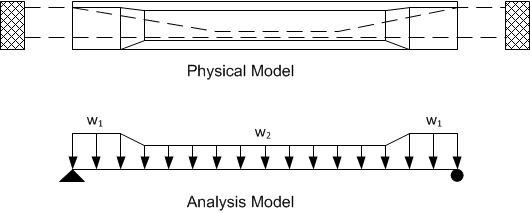
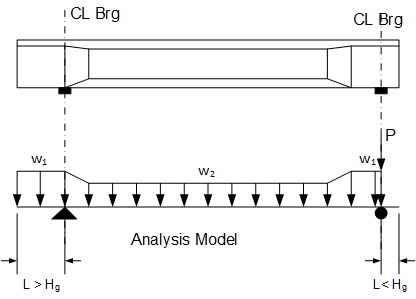
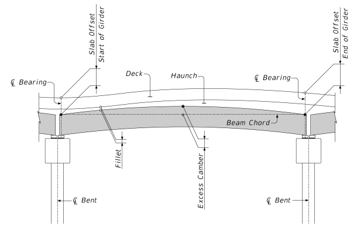
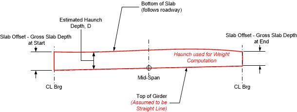

Structural Analysis Models {#tg_structural_analysis_models}
======================================
This section describes the analytical models used to calculate structural analysis results.

Model Geometry
------------------
Plane frame line models are used for structural analysis. The length of the spans in the analysis model are equal to the Centerline Bearing to Centerline Bearing length before continuity and Centerline Bearing to Centerline Pier after continuity. The centerlines of bearing are located using the connection dimensions.

### Boundary Conditions ###
Boundary conditions are defined with the connection defintion for abutments, piers, and temporary supports. Abutments and piers can be modeled as idealized supports or with substructure elements described by their physical attributes. When modeled with physical attributes, a fixed based column is included in the analysis model. The top of the column is either fixed or pinned to the superstructure elements, for integral or continuous connection types, respectively.

In the figure below, the first analysis model shows an intermediate pier modeled with an integral connection. The intermediate pier is modeled by fully restraining rotation thereby transferring all moments directly into the support. The second analysis model shows the intermediate pier modeled as an integral pier. The base of the column is fixed and the top of the column has a moment connection with the superstructure. The column stiffness and sidesway effects are taking into account in this model.

The modeled column height is the average clear span height of all the columns in the pier plus one-half the superstructure depth. The cross sectional area and moment of inertia of the column is the total area and moment of inertia for the pier divided by the average number of girders framing into the pier.

> NOTE: Integral connection types for idealized supports are modeled with a fully fixed boundary condition. Vertical and horizontal translation is restrained. Rotation is restrained.

#### Abutments ####
Abutments are located at either end of the bridge.

Boundary Condition | Analysis Model
-------------------|---------------
Hinge | Modeled as an idealized knife-edge support. Supported in the global X and Y direction with no rotational restraint
Roller | Modeled as an idealized roller support. Supported in the global X direction with no transverse (Y) or rotational restraints.
Integral before deck placement | Modeled as a fully fixed connection or integral with a fixed base column.
Integral after deck placement | Modeled as a fully fixed connection or integral with a fixed base column.

#### Boundary Piers ####
Interior piers located at the boundary of girder groups are known as boundary piers. For PGSuper models, all piers are boundary piers.

Boundary Condition | Analysis Model
-------------------|---------------
Hinge | Modeled as an idealized knife-edge support. Supported in the global X and Y direction with no rotational restraint
Roller | Modeled as an idealized roller support. Supported in the global X direction with no transverse (Y) or rotational restraints.
Integral before deck placement | Modeled as a fully fixed connection or integral with a fixed base column.
Integral after deck placement | Modeled as a fully fixed connection or integral with a fixed base column.
Continuous before deck placement | Modeled as a continuous member over the support. No rotational restraint by the support.
Continuous after deck placement | Modeled as a continuous member over the support. No rotational restraint by the support.
Hinged on back side; Integral on ahead side after deck placement | Similar to Integral after deck placement, except there is a hinge (no moment transfer) on the back side of the pier
Hinged on back side; Integral on ahead side before deck placement |  Similar to Integral before deck placement, except there is a hinge (no moment transfer) on the back side of the pier
Integral on back side after deck placement; Hinged on ahead side |  Similar to Integral after deck placement, except there is a hinge (no moment transfer) on the ahead side of the pier
Integral on back side before deck placement; Hinged on ahead side |  Similar to Integral before deck placement, except there is a hinge (no moment transfer) on the ahead side of the pier

#### Interior Piers ####
Interior piers are intermediate piers located within a girder group. Interior piers are only found in spliced girder models.

Boundary Condition | Analysis Model
-------------------|---------------
Continous Closure Joint | Segments are joined at the pier with a cast-in-place closure joint. The girder is continuous over the pier.
Integral Closure Joint | Segments are joined at the pier with a cast-in-place closure joint. The girder is integral with the pier.
Continuous Segment | A single segment spanning over the pier. The girder is continuous over the pier after the pier diaphragm is cast.
Integral Segment | A single segment spanning over the pier. The girder is integral with the pier after the pier diaphragm is cast.

#### Temporary Supports ####
Temporary supports are erection towers and strongbacks and are only found in spliced girder models.

Idealized roller supports are used for erection tower temporary supports.

Girder Lines
--------------
The structural analysis models use the same girder in each span (e.g. Girder B from every span is used to create the model for the first interior girder line). When the number of girders per span is not equal the right exterior girder is used when a span has fewer girders then the girder line for which the model is being constructed. This is illustrated below.

In the illustration above, Spans 1 and 2 have 4 girders and Span 3 has 5 girders. Girder D from spans 1 and 2 are used in the line model for analyzing Girder E.

> NOTE: The accuracy of such girder line models relies on 100 percent transfer of moment through the pier cap (i.e., the pier cap is torsionally rigid, and the beam-cap connection is rigid). If this assumption is questionable, users should construct a 3D finite element model or other means for confirmation. 

> NOTE: See @ref tg_reactions for guidance on intrepreting bearing and pier reactions from girder line models.

Loading
---------
The sections that follow describe loads are developed for the various analysis intervals.

### Interval 2: Prestress Release (Casting Yard) ###

At prestress release, the precast element is supported at the locations defined in the girder description. For PGSuper models, the support location is always at the ends of the cast girder.

The self-weight load varies linearly between changes in cross sectional area. The image above is representitive of a precast element with end blocks.

w = Ag gc  
where  
Ag = Gross cross sectional area  
gc = Unit weight of concrete, including reinforcement

Some girder types, such as U-beams, may be defined with diaphragms that are cast with the girder. The dead load of these diaphragms are modeled as concentrated loads.

### Intervals 3 - 6 ###
Intervals 3 - 6 model the non-composite precast elements during Lifting, Storage, and Hauling. The loading conditions for this analysis intervals are the same as for Interval 2. However, the support location is that for lifting, storage, and hauling, respectively.

### Interval 7: Erect Girders ###
The precast elements have been erected onto the supporting elements of the bridge. They are supported at their specified bearing locations. The loading condition is similar to that in Interval 2; however if the length of the cantilever in the analysis model is less than the depth of the non-composite girder section at the centerline bearing (Hg), the cantilever is assumed to be a deep beam. This is constent with LRFD 5.5.1.2.1 and the definition of B-Region and D-Region. The dead load of the cantilever is applied directly over the centerline of bearing as a concentrated load.

In the figure below, the cantilever on the left is greater than Hg in length and it is treated as a flexural element. The cantilever on the right is less that Hg and is treated as a deep beam where forces are transfered directly to the support through an internal compression strut.

The self-weight of cast-in-place intermediate diaphragms are applied during this interval.
  
#### Intermediate Diaphragm Dead Load ####
Diaphragm loads are modeled as concentrated forces. The force for exterior girders is P = HWgc(wtrib - tweb) and for interior girders P = 0.5HWgc(S - tweb)

where 
H = Height of the diaphragm  
W = Width of the diaphragm 
gc = Unit weight of deck concrete including reinforcement 
wtrib = tributary width of deck 
tweb = total width of all webs in the section 
S = spacing between girders are the location of the diaphragm, measured along the centerline of the diaphragm 

### Interval 9: Cast Deck (Bridge Site 1) ###
The self-weight of cast-in-place deck, precast deck panels, and slab haunch are analyzed. The analysis model is the same as described for Interval 7.

#### Cast Deck Dead Load ####
The dead load of the deck is modeled as a series of linearly varying load segments. The magnitude of the load is taken to be w = Ad gc

where 
w = deck load at a specific location 
Ad = cross sectional area of the deck
gc = unit weight of deck concrete including reinforcement

For interior girders, Ad = tslab wtrib

where 
tslab = cast depth of the slab (gross depth for cast-in-place decks and cast decks for decks with stay-in-place deck panels) 
wtrib = tributary width of the deck

For exterior girders, Ad depends on the shape of the cross section of the deck overhang

For bridges with parallel girders, the cast deck load is uniform for interior girders. The load is uniform for exterior girders if the edges of the deck are parallel to the girders and the girders are also parallel to each other.

#### Precast Deck Panel ####
The dead load of the precast deck panel is modeled as linearly load segments taken to be w = tpanel wpanel gc 

where 
tpanel = thickness of the deck panel 
wpanel = width of the deck panel 
gc = unit weight of deck concrete including reinforcement

When girder are parallel, the deck panel load is uniform.

#### Slab Haunch ####
A generalized description of the haunch depth along a span is described by the image below.
  
For our purposes, the slab haunch load is modeled as a sequence of linear load segments. The basic load is taken to be w = D wtf gc

where 
D = depth of the slab haunch 
wtf = total width of the all the top flanges for a girder. Note that this value will be reduced appropriately if stay-in-place deck forms are used. 
gc = unit weight of deck concrete including reinforcement 

The depth of the slab haunch is the distance from the bottom of the deck slab to the top of the girder. There are two methods for modeling the path of the top of the girder; straight and parabolic. The option is defined in the Project Criteria. The methods are as follows:

##### Option 1: Haunch Depth when Top of Girder is assumed to be a Straight Line  #####
The top of the girder is assumed to be straight (zero excess camber) for purposes of computing this dead load. The schematic below illustrates the depth of the haunch for load distribution for this case.

  

> NOTE: Modern girders have wide top flanges and as such the slab haunch load can be significant. This method of estimating the slab haunch load is conservative (unless the girder has negative excess camber) and it makes an allowance for the actual girder camber being less than predicted. With this approach, girders will not be under-designed if camber is less than predicted.

> NOTE: If the girder has precamber (PGSuper Only), the top of the girder is assumed to follow the precambered shape. The loading will be as described in Option 2.

> NOTE: If the girder has longitudinal top flange thickening, the top shape of the girder will be used for determining the haunch load. The loading will be as described in Option 2.

##### Option 2: Detailed Haunch Description #####
Haunch load determined using this option is dependent on the type of input used to describe the haunch.

###### Option 2a: Haunch Input using Slab Offset - Haunch Depth determined assuming Girder Deflection is defined by a Parabola (PGSuper Only) ######
The top of the deflected girder is assumed to follow a parabolic curve defined by the slab offsets at the ends of the girder, and the user-input **assumed excess camber** dimension. The schematic below illustrates the depth of the haunch for this case. Girder deflection defined by assumed excess camber follows a parabolic shape as shown in the schematic.

  

> NOTE: For this option it is the responsibility of the user to ensure that haunch dead load parabola defined by the slab offset and assumed excess camber dimensions closely matches the parabola defined by the excess camber as computed by the program. If the parabolas do not match within tolerance, a specification check failure will occur indicating the haunch dead load was either over or under estimated. 
>     For complex bridge geometries it may be necessary to define a unique assumed excess camber and/or slab offset for each girder in the bridge in order to meet this requirement.
>     The Loading Details chapter in the Details report tabulates the haunch load and depth along the girder.

> NOTE: The shape of the slab haunch is governed in part by the excess girder camber which is a function of the concrete properties, prestressing, and loading conditions. At the onset of design, the girder's excess camber is not known. As such, the slab haunch dead load can be estimated and refined manually. If the Slab Offset design is enabled in the Project Criteria library, the design algorithm will attempt to compute assumed excess camber automatically.

###### Option 2b: Explicit Haunch Depth Input ######
For this option the haunch depth along the girder used for dead load is the user-input depth. This depth may be parabolically distributed or piecewise linear depending on the input option. 

#### Shear Key Dead Load ####
Shear key loads can be automatically generated **only for adjacently-spaced TxDOT Box girders**. To activate the load, specify the ShearKeyDepth variable in the Girder Library entry. 

* The shear key will fill the gap between girders from the specified shear key depth to the tops of the beams and will have the same unit weight as the slab concrete.
* The load is applied in a load case called "Shear Key" applied in Interval 7: Cast Deck (Bridge Site 1) and added to the DC combination.
* Structural stiffness properties of the shear key are not considered in any analyses.
* The width of the shear key will be variable if the joint spacing between girders is variable.
* The shear key load is applied between bearings (no loading on the cantilever portion of the girder).
* Results will only be displayed if a shear key is present

### Interval 13: Install Railing System and Overlay (Bridge Site 2) ###
At this analysis interval, the girders can be continuous over intermediate piers. For continuous or intergral connections, the centerline bearing supports locations are replaced with a single  support location at the centerline of the pier.

#### Continuity Diaphragm ####
The dead load of continuity diaphragms are applied as concentrated loads at the centerline of the pier.

#### Railing System Loads ####
The dead load of the railing system is computed as the cross sectional area of the railing system times the unit weight of the material. Alternatively, a linear weight per length can be defined included in the railing definition.

Railing system loads consist of dead loads from the traffic barrier, sidewalk, and combination (interior) railing. These loads are distributed to a maximum of N "nearest" girders, mating surfaces, or webs of the bridge section.

A mating surface is the contact point between a girder and the bridge deck. Examples are:

Girder Type | Number of Webs | Number of Mating Surfaces
------------|----------------|--------------------------
I-Beam      |  1             | 1
U-Beam      |  2             | 2
Box Beam    |  2             | 1
Voided Slab |  0             | 1
Double Tee  |  2             | 1

<h5>Exterior and Interior Traffic Barriers</h5>
The dead load of exterior and interior barriers are distributed as follows:  

_Distribute the weight of the barrier evenly to the N nearest girders, mating surfaces, or webs (GMSW's). Nearest distance is measured from the C.G. of the barrier in a bridge cross section taken at mid-span. For cases when the weight of a barrier can be distributed to either of two GMSW's that are equal distance left and right of the barrier C.G., and these GMSW's are furthest from the barrier, the load will be distributed to the exterior-most GMSW. If the span contains 2N or fewer GMSW's, the railing load will be distributed evenly to all GMSW's._

<h5>Sidewalks</h5>
The dead load of sidewalks are distributed using a similar method and using the same N value as barriers. However, if the sidewalk is wider than N GMSW's; the load will be distributed to all GMSW's lying directly beneath the sidewalk. Hence, the definition is a follows:

_Distribute the sidewalk weight and pedestrian live load evenly to the greater of: all girders, mating surfaces, or webs (GMSW's) lying directly under the sidewalk; or the N nearest GMSW's measured from centerline sidewalk using a bridge cross section taken at mid-span. For cases when the sidewalk weight can be distributed to either of two GMSW's that are equal distance left and right of C.L. sidewalk, and these GMSW's are furthest from the C.L. sidewalk, the load will be distributed to the exterior-most GMSW. If the span contains 2N or fewer GMSW's, the load will be distributed evenly to all GMSW's._

<h5>Pedestrian Live Load on Sidewalk</h5>
Pedestrian live load on sidewalk is distributed to the same girders, and in the same proportions, as the sidewalk dead load.

<h5>Barrier Load Distribution Example</h5>
Consider for example a bridge section with three U-beams. If the railing system loads are distributed over the 3 nearest girders, the exterior barrier dead load per girder would be 0.33(Wleft + Wright).

Girder A |  Girder B |  Girder C
---------|-----------|----------
0.33Wleft + 0.33Wright |  0.33Wleft + 0.33Wright |  0.33Wleft + 0.33Wright
 
However, if the loads are distributed over the 3 exterior webs or mating surfaces, the exterior barrier dead load would be:

<table>
<tr><th colspan=2>Girder A</th><th colspan=2>Girder B</th><th colspan=2>Girder C</th></tr>
<tr><td colspan=2>0.67Wleft</td><td colspan=2>0.33Wleft+0.33Wright</td><td colspan=2>0.67Wright</td></tr>
<tr><th>Web 1</th><th>Web 2</th><th>Web 1</th><th>Web 2</th><th>Web 1</th><th>Web 2</th></tr>
<tr><td>0.33Wleft</td><td>0.33Wright</td><td>0.33Wleft</td><td>0.33Wright</td><td>0.33Wleft</td><td>0.33Wright</td></tr>
</table>

#### Overlay ####
The self weight of the overlay can be distibuted uniformly to all girders as permitted by LRFD 4.6.2.2.1 or distributed to each girder based on its tributary area.

### Interval 14: Open to Traffic (Bridge Site 2) ###
At this analysis interval the bridge is open to traffic and live load is applied.
