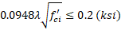
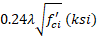
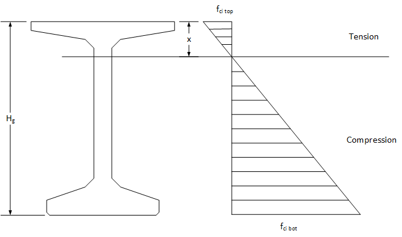
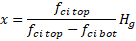
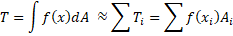
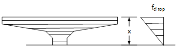
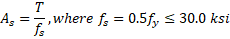

Tensile Stress Limits {#tg_tensile_stress_limits}
======================================

LRFD 5.9.2.3.1b specifies two limits for tensile stress:
* In areas other than the precompressed tensile zone and without bonded reinforcement 
* In areas with bonded reinforcement (reinforcing bars or prestressing steel) sufficient to resist the tensile force in the concrete computed assuming an uncracked section, where reinforcement is proportioned using a stress of 0.5fy, not to exceed 30.0 ksi 

LRFD Commentary C5.9.2.3.1b prescribes a method for computing the tensile force in the concrete when bonded reinforcement is provided to allow use of the increased tensile stress limit. However, this method is only applicable when the neutral axis is within the rectangular portion of the top flange. 

Modern girder shapes have wider and thinner top flanges compared to the older AASHTO Type I - IV sections. The neutral axis is often within the tapered portion of the top flange or in the web. 

PGSuper and PGSplice use a more precise method of computing the tensile force in the concrete. The depth of the tensile zone is computed as described in LRFD C5.9.2.3.1b

 
 
The tension force is then computed by integrating the tensile stress field over the area of the tensile stress zone. The tension force is 

Because a wide variety of cross sections, some with voids, need to be accomodated the integration is performed numerically. The tensile zone is discritized into "slices". The tension force contribution of each slice is taken to be the area of the slice, Ai, multiplied by the stress at its centroid, f(xi). The total tension force is the sum of the tension force on each slice.

The required area of bonded reinforcement is then computed as
