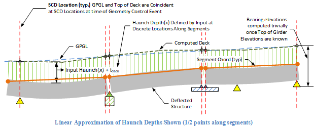
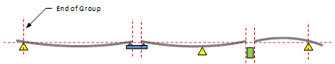
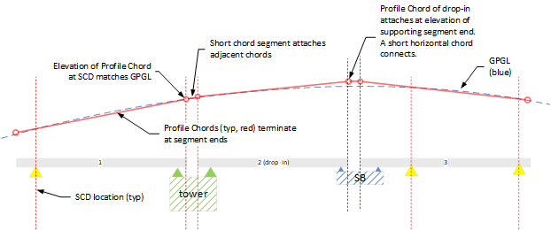
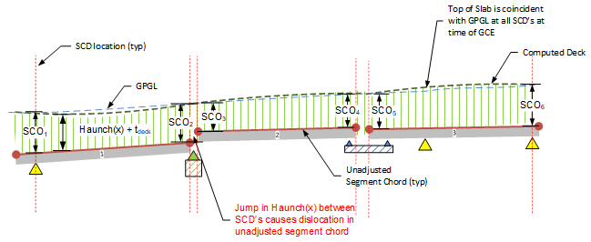
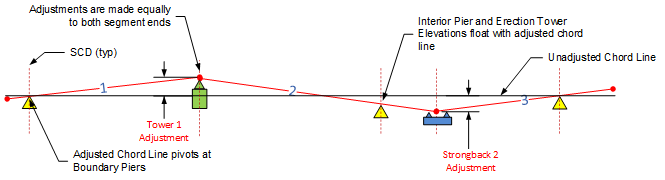

Computation of Bridge Elevations - Explicit Haunch Input {#tg_vertical_geometry_elevations}
======================================
As discussed in @ref tg_haunch_explicit, explicit input can be used to directly define haunch depths along segments or spans (i.e., generalized Haunch(x)) in a piecewise linear or parabolic manner. As the figure below demonstrates, computed deck elevations along a girderline can be easily determined once top of deflected girder elevations are known.

The remainder of this document describes how deflected girder top elevations are computed.

Technical Solution
=========================
The LBAM (Longitudinal Bridge Analysis Model) in PGSuper and PGSplice is based on a 1D flat beam model analysis that occurs from the time of first segment erection onward. Unrecoverable deformations prior to the time of erection are also included in the LBAM response. To determine elevations along CL girders in the deflected bridge model, deflections from the flat model must be mapped into curvilinear bridge elevations defined by roadway profile elevations, haunch depth input, and temporary support elevation adjustments. This mapping is performed by summing deflection results from the 1D LBAM model at the time of GCE with elevations of a segment chord line along the girder. 

The mapping from 1D LBAM deflections into deformed bridge elevations is briefly outlined as follows. Further details are presented later.

-# Determine top of girder segment chord line
    - Determine SCD locations. 
    - Establish layout of Profile Chord lines along CL segments based on roadway elevations at SCD locations
    - Establish Segment Chord elevations at SCD locations by subtracting haunch depths plus slab thicknesses from the adjusted Profile Chord elevations
    - Adjust profile chord with user-input elevation adjustments at temporary supports
-# Once Segment Chord Elevations are known, compute deflected top girder elevations by summing LBAM deflection results with chord elevations along segments as discussed in @ref  tg_vertical_geometry_deflection_mapping.

*The above mapping establishes deformed elevation results at the time of the GCE. Subsequent results are computed by adding incremental LBAM 1D deflections to the GCE elevations. Deformed elevations prior to the GCE are computed by subtracting prior incremental LBAM deflections from the established GCE elevations.*

Determination of the Segment Chord Line
-----------------------------------
### Determine Segment Chord Datum (SCD) Locations ###
Locations of SCD’s are not directly input but are computed based on bridge model geometry and boundary conditions present at the of the Geometry Control Event. 

*Rules to Determine SCD Locations:*

SCD locations are shown by vertical red lines in the sketches below. 

-# Two and only two SCD’s are located at all segments
-# Bearing locations at permanent abutments or piers at the ends of groups take precedent. In PGSuper, bearings at all ends of all segments are group ends.
-# Otherwise, SCD's are placed at the ends of segments

### Establishment of Unadjusted Profile Chord Line ###
The Profile Chord line lies along the GPGL with each chord terminating at SCD locations at GPGL elevations as shown in the figure below.

### Establishment of Segment Chord Elevations ###

The geometry of the segment chord is established at the time of the Geometry Control Event (GCE). Elevations along the unadjusted segment chord are established at Segment Chord Datums (SCD’s). Rules used to determine SCD locations were defined previously.

Chord elevations at SCD’s are computed by subtracting a Segment Chord Offset (SCO) from the roadway elevations on the GPGL as shown below.  Haunch(x) is defined by user input haunch depths along girders.

   **SCO = Haunch(x) + Deck Thickness**, at each SCD location.

The figure below illustrates an example unadjusted segment chord layout.

> Note in above example: When a jump occurs in Haunch(x) at an SCD at a closure, there is a corresponding dislocation in the unadjusted segment chord, which causes a dislocation in top of girder elevations. When this occurs, elevations in the closure between the segment ends will be linearly interpolated between the end elevations.

### Establishment of Adjusted Segment Chord Elevations (PGSplice Only) ###
The previous steps describe establishment of the unadjusted segment chord based on elevations and haunch depths and haunch depths at SCD locations. In PGSplice, segment chords can be further adjusted by user-input elevation adjustments at temporary supports at closure joints.

Elevation adjustments are applied directly to the ends of segment chords at closure joints. This will adjust the elevations computed at the Geometry Control Event (GCE). Note that any adjustments will cause the deck elevation to not match the profile grade (GPGL) at the GCE. However, adjustments may be desirable for "tweaking" final finished elevations to fit project-specific requirements.

- Adjustments are Available at any Temporary Support with a Closure Joint connection
- Adjustments are applied along the unadjusted chord line causing a rigid body rotation-translation along the entire chord
- Adjustments are equally applied directly to both adjacent segment ends.
- Elevations of any interior piers and interior erection towers are directly changed by adjustment
- Elevations at boundary piers (piers at ends of groups) are pinned to unadjusted chord line (i.e., they are not moved by any adjustments)
- Elevation adjustments do not affect haunch depths along girders. Haunch depths remain as explicitly input.

Computation of Deflected Top of Girder Elevations
---------------------------
Deflected top of girder elevations can be computed once adjusted segment elevations have been determined. The mapping process is detailed in @ref tg_vertical_geometry_deflection_mapping.

Final Computation of Finished Roadway Elevations
------------------------------------------
As discussed previously, roadway elevations are computed by simply adding haunch + deck depths to the deflected top of girder elevations.