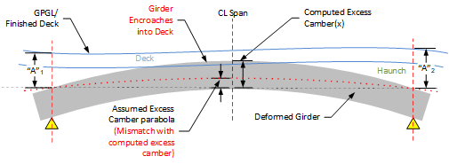
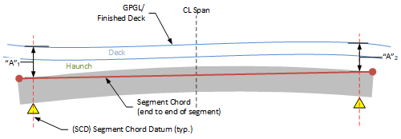

Computation of Bridge Elevations - Slab Offset Input (PGSuper-Only) {#tg_vertical_geometry_slaboffset_elevations}
======================================
**With Slab Offset input there is no need to compute finished deck elevations.** This is because for this input mode it is assumed that the finished deck always exactly matches the design roadway elevations (GPGL). 

Top of girder elevations are computed based on Slab Offset input, and girder model deflections computed using assumptions for dead load and section properties.

> This means that Slab Offset input can easily result in impossible or sub-optimal configurations. Examples are cases where finished elevations do not match those predicted by assumed excess camber (above), the top of girder encroaches deeply into the deck (also above), or haunch depths that are excessive. Fortunately, these descrepancies are caught by specification checks.

Deformed top of Girder and Segment Chord Elevations
------------------------
Deformed top of girder elevations are computed in the same manner described in @ref tg_vertical_geometry_elevations, except that the determination of segment chord elevations is much simpler. This is because segment chord elevations are determined directly from Slab Offset input, and there are no elevation adjustments since temporary supports do not exist in PGSuper models.

The segment chord extends the entire length of the girder segment and is anchored vertically by the Slab Offsets at CL bearing locations as shown in the figure below.

Once segment chords are established, the process to determine finished top of girder elevations can be found in @ref tg_vertical_geometry_deflection_mapping. 