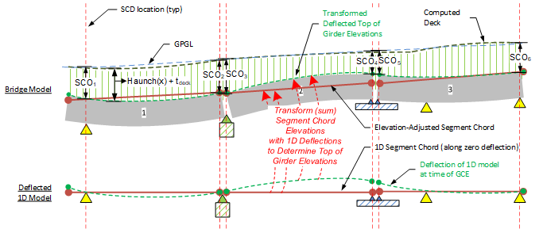

Mapping of 1D Deflections to Deformed Top of Girder Elevations {#tg_vertical_geometry_deflection_mapping}
======================================
Segment chord elevations relative to the curved roadway surface are defined at the time of the roadway Geometry Control Event as described in:

- @ref tg_vertical_geometry_slaboffset_elevations
- @ref tg_vertical_geometry_elevations.

Once Segment Chord elevations are established, results from the 1D LBAM analysis model at the time of the GCE are then mapped (summed) along the segment chords. The transformation generates deflected top of girder elevations along centerline girder at the time of GCE as shown in the figure below.

> Note: The figure above also shows how haunch+deck(x) is summed with top of girder elevations to compute finished deck elevations. (only when explicit haunch input is used).

> **Note for Time Step Analyses:**
> - *The above mapping establishes deformed elevation results at the time of the GCE. Subsequent results are computed by adding incremental LBAM deflections to the GCE deformed elevations. Deformed elevations prior to the GCE are computed by subtracting prior incremental LBAM deflections from the GCE deformed elevations.*

Effects from Unrecoverable Deflections at Erection
-----------------------------------------------
Note that elevations of support elements in the 1D LBAM model may not be zero. This may be surprising. The cause of this in addition to elastic deformations of piers, is the effect of Unrecoverable Deflections at the time of erection. 

This is discussed in @ref tg_deflections which demonstrates that girders are not flat when they are erected. Hence it may be necessary to adjust the elevations of supports when girders are erected into the 1D LBAM model in order to retain force equilibrium and stress-strain compatibility.
 
 
