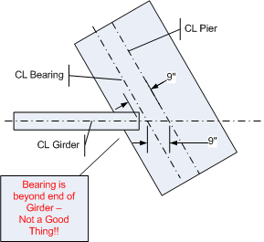

Connections {#appendix_b_connections}
==============================================
Connection entries allows you to define the description of common connection between the end of the girder and the substructure. Connection entries are never referenced into a PGSuper or PGSplice model, but rather act as seed data for the actual connection input. The information defined in this entry can be copied into a PGSuper or PGSplice model.

Item | Description
----|------
Entry Name | Each entry must have a unique name. The name may contain any characters and can be up to 32 characters in length. The name can be changed by selecting this entry in the Library Editor window and selecting *Edit > Rename Entry*

Connection Properties
=====================
Item | Description
----|------
Bearing Offset | The bearing offset is the distance from the pier or abutment reference line to the point of bearing on the girder (See schematic). The bearing offset may be measured normal to the pier or abutment reference line or along the centerline of the girder. The centerline of bearing is always parallel to the pier or abutment reference line.
End Distance | The girder end distance locates the end of the girder and can be measured by the following: <ul><li>From the Abutment/Pier Line, along the centerline of the girder</li><li>From the Abutment/Pier Line, normal to the Abutment/Pier Line</li><li>From the bearing, along the centerline of the girder</li><li>From, and normal to, the bearing centerline</li></ul>
Support Width | The width of the support, centered on the centerline of bearing. Half the support width defines the distance from the centerline of bearing to the face of support. Support width is measured along the centerline of girder.

> Note that at intermediate piers the value of End Distance can never be larger than the Bearing Offset. However, if there is a large skew, it is still possible to input valid library entry values, but have the bearings located off of the girder. For example: In the figure below, with a Bearing Offset = 9" measured along alignment; and End Distance = 9" measured from and normal to the Abutment/Pier Line. For this case a zero skew would place the bearing at the end of the girder, a valid condition. However, any non-zero skew would cause the bearing to be beyond the end of the girder - negative cantilever - Not Good:
> 
> PGSuper will issue an error message when this condition occurs. The issue can be fixed by increasing the end distance, or reducing the girder skew angle.

End Diaphragm Dimensions
========================
End diaphragm dimensions, along with the weight density for the currently-selected slab concrete type, and the girder spacing/overhang width are used for calculating end diaphragm loads. Diaphragms are assumed to be rectangular.

Item | Description
----|------
Diaphragm Height | Enter the height of end diaphragms. Enter the keyword Compute to have the diaphragm height computed based on the pier geometry.
Diaphragm Width | Enter the width of end diaphragms. Enter the keyword Compute to have the diaphragm height computed based on the pier geometry.

Application of Diaphragm Loads
================================
PGSuper gives three options for applying end diaphragm loads to girders.

Option | Description
----|------
Apply Weight of Diaphragm Directly Over C.L. Bearing | This option causes the weight of the diaphragm to be applied directly over the center of the girder bearing and does not induce moment into the girder. The effects of the load are included in the girder reaction.
Apply Weight of Diaphragm to Girder | Apply the weight of the diaphragm to the girder at the specified location. The location of the load (C.G. location) is measured from, and normal to, the centerline of the abutment/pier and must be a positive value. Moments due to offset of the load from the bearing are applied to the girder.
Do Not Use Weight of Diaphragm in Analysis | Ignore the effects of the diaphragm in the analysis. Diaphragm loads are not applied to the girder or the reactions.

