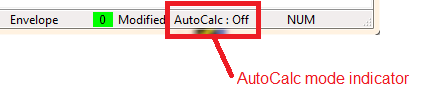
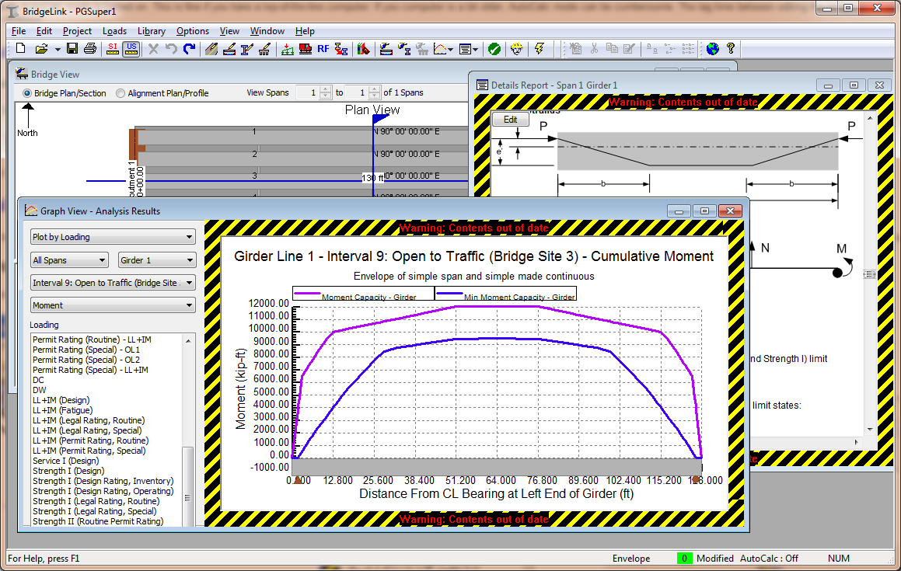

AutoCalc Mode {#ug_autocalc_mode}
==============================================
You probably noticed that reports and graphs are created without you having to tell the software to do an analysis. What you are experiencing is AutoCalc (automatic calculation) mode. You simply create graphs and reports and the software does whatever work is necessary to satisfy these requests. Analysis results are automatically updated when the bridge model changes. This is part of the _Bridge-centric_ user interface. When the AutoCalc mode is turned on, you can focus on the bridge and the analysis, not the commands needed to produce output.

Setting AutoCalc Mode
-----------------------
AutoCalc mode is enabled by default. This is fine if you have a top-of-the-line computer. If your computer is a bit older, AutoCalc mode can be cumbersome. The lag time between editing the bridge and refreshing reports may be too long. If AutoCalc mode is cumbersome for you, it can be disabled.

To Disable AutoCalc Mode:

1. Select *Project > Turn AutoCalc Off*.  

The current status of the AutoCalc mode is displayed on the status bar in the lower right corner of the application window as shown below.

Repeat this step to turn AutoCalc mode back on. You will notice that the menu selection will change to *Project > Turn AutoCalc On*.

> TIP: Double click on the AutoCalc mode indicator in the status bar to toggle the setting.

### Dealing with Outdated Results ###
When AutoCalc mode is off graphs and reports are not automatically updated. In this case, out of date analysis results are framed with a warning label indicating the information presented on the computer screen does not represent the current state of the bridge model.

It is easy to recognize out of date information. Analysis results views containing out of date information are framed with a warning label. As you can see, we've made it extremely difficult to ignore out-of-date data.

### Updating Analysis Results ###
After you have made a series of edits to your project, you will need to update the analysis results.

To update analysis results:
1. Select *Project > Update Now*

All of the analysis results views that are currently open will be updated and the warning labels will disappear.

> TIP: Quickly update analysis results by pressing the F5 key.

