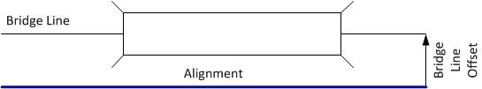
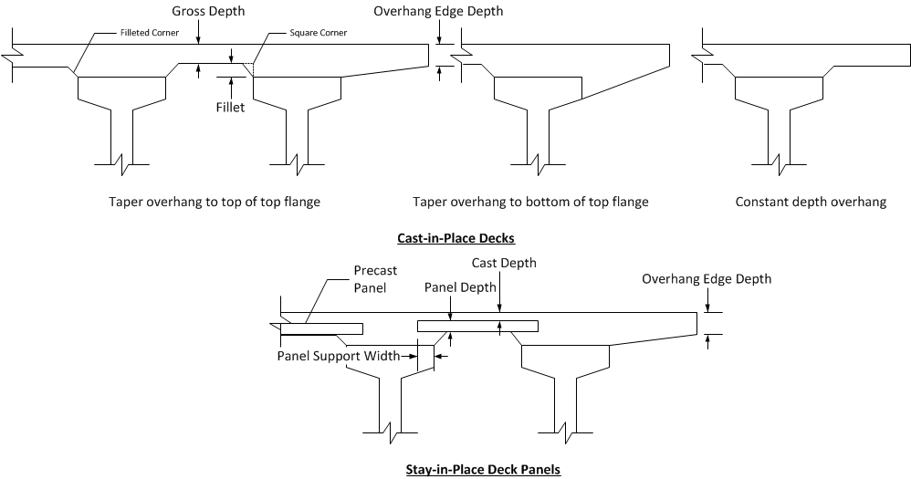
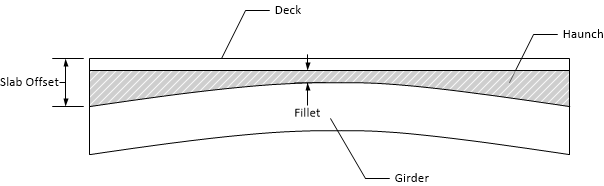
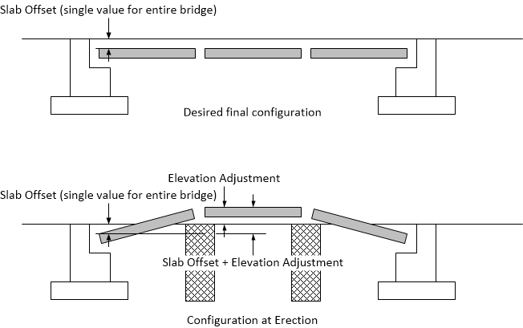
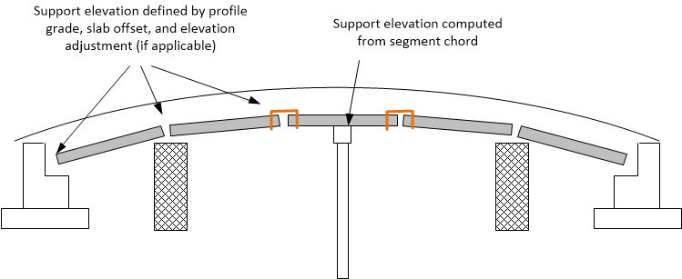
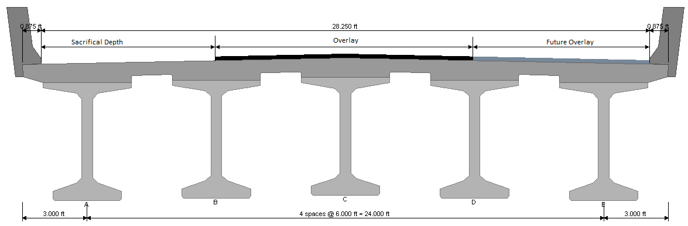
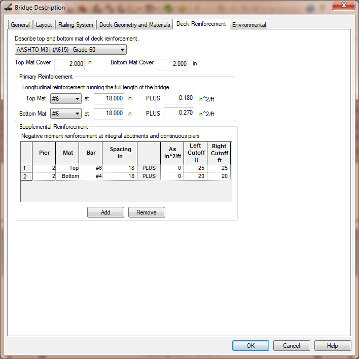

Defining the Bridge {#ug_bridge_modeling_defining_the_bridge}
==============================================
The overall bridge configuration is defined in the Bridge Description window. This description includes the girder type and arrangement, pier and span arrangement, railing systems, and the deck description. The description of regular bridges with the same number, type, and spacing of girders in all spans can be defined entirely within the Bridge Description window. More complex bridges can also be defined; however you will have to drill down into the bridge layout details.

To define your bridge:
1. Select *Edit > Bridge...*. This will open the Bridge Description window.
2. Define the overall bridge description on the General tab
3. Define the pier and span arrangement on the Layout tab
4. Define traffic barriers and sidewalks on the Railing System tab
5. Define the deck cross section on the Deck Geometry and Materials tab
6. Define the deck reinforcement on the Deck Reinforcement tab

> NOTE: Detailed information about all of the input parameters in the @ref ug_dialogs_bridge_description window can be found in @ref ug_dialogs.

> TIP: To quickly open the Bridge Description window, double click anywhere in the Bridge View.

> NOTE: The girder details are defined in the Girder Details window. This topic is discussed in @ref ug_girder_modeling.

Overall Bridge Description
-----------------------------
The overall bridge description is defined on the General tab. Begin the bridge description by defining the Bridge Line. The Bridge Line is an arbitrary reference line that can be used to locate elements of the bridge such as girders and the edge of the bridge deck. The Bridge Line is parallel and offset from the Alignment.

Next, define the girder arrangement. The girder arrangement consists of the girder family, type, spacing, and transverse location. The girder family represents a general type of girder such as an I-Beam or a Voided Slab. The girder type is a specific type of girder such as an AASHTO Type I or a WSDOT WF66G. The girders are located transversely by defining the offset of a specific girder from either the Alignment or the Bridge Line.

> TIP: Girders can also be located transversely by defining the offset of the "Center of Girders". Center of Girders is the mid-point between the left and right exterior girders.

The overall bridge description is completed by selecting a deck type.

Pier and Span Arrangement
------------------------
The arrangement of the piers and spans is defined on the Layout tab. Piers are explicitly defined in the layout grid and spans are implicitly defined between piers.

Abutments and Piers are defined by the location and orientation of their Abutment Line and Pier Line, respectively. The Abutment/Pier Line is an arbitrary reference line that intersects the alignment at a specified station and orientation. The Abutment/Pier Line can represent anything; however it is mostly commonly used for the back of pavement seat or centerline of bearing at abutments and the centerline of pier at intermediate piers. The orientation of the Abutment/Pier Line can be described with the keyword NORMAL to indicate the line is normal to the alignment, a bearing, or a skew angle. Skew angles are measured with respect to the alignment normal.

Barriers and Sidewalks
---------------------
Traffic barriers and sidewalks are defined on the Railing System tab. Railing systems consist of a traffic barrier, and optionally, a sidewalk and interior barrier. Railing systems are defined for the left and right sides of the bridge. The barriers are defined in the Traffic Barrier library.

Deck Cross Section
-------------------
The bridge deck cross section is defined on the Deck Geometry and Materials tab. The cross section depends on the deck type selected on the General tab. In general, the depth of the deck and the shape of the overhangs, if any, are described. The image below illustrates the deck cross section dimensions.

### Deck Plan View ###
The overall width of the deck, measured normal to the alignment, is defined in the Plan (Edge of Deck) grid. The plan view of the deck is defined by a series of offsets from the Alignment or Bridge Line to the left and right edges of the deck. These offsets can be defined anywhere along the alignment and can even be before and after the bridge. The plan shape of the deck is bounded at the ends of the bridge by the abutment diaphragms.

The edge of deck shape is defined by transition lines connecting the sections defined in the grid. The transitions can be:
* Parallel - the edge of deck is parallel to the alignment
* Linear - the transition is a straight line
* Spline - the transition is a third degree cubic spline.

Spline transitions can be used to make any type of curve as shown in this example

### Haunch Geometry ###
The haunch is the concrete build-up between the top of the girder and the bottom of the deck. The top surface of the haunch is defined by the bottom surface of the deck. The bottom surface of the haunch is defined by the top surface of the girder. The top surface of the girder is not flat because of natural and imposed camber. Since the girder camber is not generally known before design the shape of the haunch must be estimated and then refined.

Haunch depths in PGSuper can be defined by the Slab Offset (also known as the "A" Dimension in WSDOT jargon), or by Explicit direct haunch depth input. A full description of haunch geometry and vertical geometry calculations may be found at @ref tg_vertical_geometry.

The fillet is the least allowable distance between the bottom of the deck and the top of the girder (this is assumed to occur at mid-span).

### Girder Elevation at Erection ###
For typical precast girder bridges, the girder elevation at erection is defined by the slab offset. The slab offset defines the depth of slab and haunch at the centerline bearing and locates the top of the segment relative to the roadway surface. Depending on the haunch input method, the slab offset is either directly input, or can be computed from explicity haunch depth data along the span.  The top of girder elevation at erection, at the intersection of the centerline bearing and centerline girder, is equal to the profile grade elevation less the slab offset. Since girders span between permanent abutments and piers, the girder does not move from its installation location.

Elevations at erection for spliced girder segments is a bit more involved. Precast segments are erected onto permanent and temporary supports. Post-tensioning, temporary support removal, time-dependent effects, and application of external loads cause deflections in the structure and can change the final elevation of girder segments. The temporary support elevation adjustment modifies the elevation of the segment end(s) at erection and is typically used to modify the final elevation of the segments. A detailed discussion can be found at @ref tg_vertical_geometry. 

Consider at single span spliced girder bridge consisting of three precast segments. If the anticipated final deflection is downward, the segment ends at the erection towers can be elevated to compensate. 

Haunch depths can be defined with a single value for the entire bridge, a unique value at each bearing line, or a unique value at the end of every precast segment. Temporary support elevation adjustments can be defined at erection towers and strong backs that support the ends of a segment.

The elevation of all other permanent and temporary supports are defined by the chord line connecting the ends of precast segments.

### Wearing Surface ###
The wearing surface is the surface upon which the vehicular live load travels. Friction and abrasion from many years of traffic traveling on the wearing surface can cause wheel ruts and loss of section. The wearing surface makes accommodations for the loss of section. Three types of wearing surfaces are supported; Sacrificial, Overlay, and Future Overlay.

The Sacrificial wearing surface is defined as a depth of the deck that will be worn away over time. This depth is deducted from the overall depth of the deck for purposes of computing section properties and strength; however it is included in the bridge model as dead load.

The Overlay wearing surface is a toping that is intended to prevent wear of the concrete deck. An overlay is assumed to be added to the bridge before it is open to traffic.

The Future Overlay wearing surface is hybrid of the sacrificial wearing surface and the overlay. The bridge is first put into service without and overlay and wearing of the bridge deck occurs. When the wear of the riding surface warrants mitigation an overlay is installed.

The bridge section view provides a visual cue to indicate the type of wearing surface modeled.

Deck Reinforcement
------------------
The longitudinal bridge deck reinforcement is defined on the Deck Reinforcement tab. This reinforcement is defined for evaluation of negative moment capacity and shear capacity in continuous structures (the deck reinforcement provides the longitudinal reinforcement for shear).

Reinforcement is described by the combination of bar size and spacing and a lump sum area of reinforcement described an area of reinforcement per length of bridge width. The total reinforcement is the sum of both these quantities. For example, in the image below you will see that for the Top Mat there are #6 bars at 18 inches and 0.18 in2/ft. The total reinforcement in the top mat is 0.473 in2/ft.

> NOTE: Transverse deck reinforcement is not modeled.

To describe the deck reinforcement:
1. Select the material from the drop down list
2. Define the cover. Cover is taken to be the clear cover for reinforcement defined by bar size and cover to the center of reinforcement defined by a lump sum area. Top cover is measured from the top of the deck and the bottom cover is measured from the bottom of the deck.
3. Define the Primary Reinforcement for the top and bottom mats. This reinforcement runs the full length of the bridge.
4. Define the Supplemental Reinforcement for the top and bottom mats. This is the additional reinforcement over the piers for negative moment capacity. The reinforcement cutoff from the center of the pier is described in the last two fields.

> NOTE: For reinforcement described using a lump sum area the reinforcement is considered to be fully developed along the full bar length. However, for reinforcement described using a bar size and spacing, the area of the bar is reduced for partial development at the ends of the bar.

