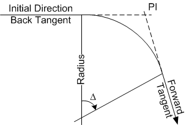

Defining the Roadway {#ug_bridge_modeling_defining_the_roadway}
==============================================
Highway bridge structures are associated with a roadway alignment. The structure geometry is dependent on geometry of the alignment. The span length of girders, live load distribution factors, slab offset dimensions, forces, stresses, and many other parameters depend on the overall geoemtry of the structure and the roadway.

The roadway is described in the Alignment Description window. Select *Edit > Alignment* to edit the roadway description.

Horizontal Alignment
------------------------
The horizontal alignment can be straight or a series of horizontal curves, including entry and/or exit spirals. For a straight alignment, simply enter the direction of the alignment in the Initial Direction fiend and remove all entries from the Curve table.

For curved alignments, enter the back tangent bearing of the first curve in the Initial Direction field. Enter the remaining curve parameters in the Curve table. The forward tangent of the previous curve is considered to be the back tangent of the current curve. Horizontal curve parameters include the PI Station, Forward Tangent Bearing or Delta Angle, Radius of the circular curve, and Entry and Exit Spiral lengths.

> TIP: A PI angle point can be modeled by defining a horizontal curve with the Radius, Entry Spiral Length, and Exit Spiral Length set to zero.

### Horizontal Alignment Control Point ###
The horizontal control point defines the global planar coordinate system used for the bridge model. The coordinate system is arbitrary and can represent anything you like. The two most common coordinate systems used are a state plane coordinate system or a localized bridge coordinate system. The bridge model is anchored to the coordinate system by specifying the coordinate of a point on the alignment.

#### Examples ####
State plane coordinate system - Station 3+90.43 is located at 1263636.2356 N by 945652.2553 E.
Local bridge coordinate system - The Abutment Line for Abutment 1 intersects the alignment at Station 1+25.23. This point is conveniently modeled as point (0,0).

Profile
-----------------
The profile can be described by a straight grade or a series of vertical curves and PVIs. For a straight grade, enter a station, elevation, and grade of the profile.

For a profile with vertical curves, describe the initial grade entering the first curve with a station, elevation and grade. Then, in the curve table, describe each vertical curve with a PVI Station, Exit Grade, and two half lengths of the curve (L1 and L2).

For profiles with multiple vertical curves, the exit grade of the previous curve becomes the entry grade of the next curve.

The total length of the vertical curve is L1 + L2. L1 is the distance from the beginning of the curve to the PVI and L2 is the length from PVI to the end of the curve. This allows for the modeling of non-symmetrical vertical curves.

> TIP: The reference point may be input as the PVI of the first vertical curve.

> TIP: If you have a symmetrical vertical curve, enter the total curve length in the L1 field and leave the L2 field blank.

> TIP: A PVI profile break point can be modeled by defining a vertical curve with the L1 and L2 fields blank.

Superelevations
------------------
The cross section of the roadway/bridge deck is defined by a series of superelevation descriptions. Each section is defined by a station, left slope, right slope, and crown point offset. Negative slopes are measured downwards from the crown point. The crown point offset is the distance that the crown point is offset from the profile line. Positive offsets are to the right.

Slopes and crown slope offsets are linearly interpolated between stations. A superelevation transition can be modeled by using a series of sections.

