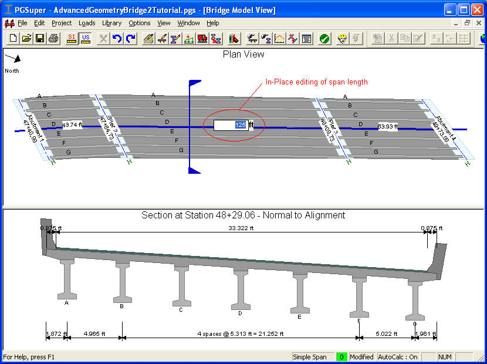

Inplace Editing {#chapter1_inplace_editing}
==============================================
PGSuper has a unique *Bridge-centric* user interface. The goal is to keep you focused on the engineering problem at hand. You needn't to be overly concerned with where to find commands or how to perform tasks.

Inplace editing allows you to edit input values directly in the various views of the bridge. If you want to change the overall length of a span, simply click on the span length in the Bridge Plan View and enter a new value.

