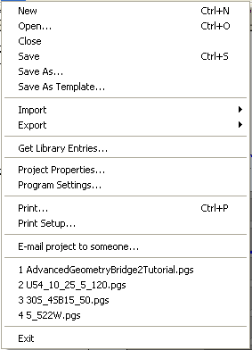
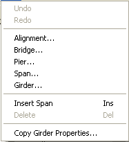
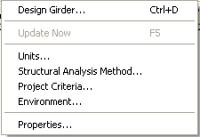
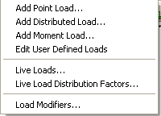
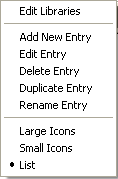
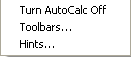
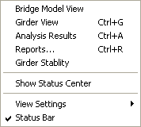
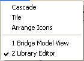

Menus {#chapter1_menus}
==============================================
All commands are available from the Main Menu. All the menus are shown in this section with a brief explanation and the associated icon from the toolbar.

File Menu
---------

<table x-use-null-cells wrapperparagraphselector="P" style="width:100%;" cellspacing="0" width="100%" border="1" class="hcp1">

<tr>
<td ROWSPAN="17" style="width:25%;" valign="top" width="25%" class="hcp2">

</td>
<td style="width:4%;" valign="top" width="4%" class="hcp2">

&nbsp;</td>
<td style="width:23%;" valign="top" width="23%" class="hcp2">

Command</td>
<td style="width:45%;" valign="top" width="45%" class="hcp2">

Description</td></tr>

<tr>
<td style="width:4%;" valign="top" width="4%" class="hcp2">

</td>
<td style="width:23%;" valign="top" width="23%" class="hcp2">

New</td>
<td style="width:45%;" valign="top" width="45%" class="hcp2">

Creates a new PGSuper Project</td></tr>

<tr>
<td style="width:4%;" valign="top" width="4%" class="hcp2">

</td>
<td style="width:23%;" valign="top" width="23%" class="hcp2">

Open</td>
<td style="width:45%;" valign="top" width="45%" class="hcp2">

Open an existing PGSuper Project</td></tr>

<tr>
<td style="width:4%;" valign="top" width="4%" class="hcp2">

&nbsp;</td>
<td style="width:23%;" valign="top" width="23%" class="hcp2">

Close</td>
<td style="width:45%;" valign="top" width="45%" class="hcp2">

Close the current project</td></tr>

<tr>
<td style="width:4%;" valign="top" width="4%" class="hcp2">

</td>
<td style="width:23%;" valign="top" width="23%" class="hcp2">

Save</td>
<td style="width:45%;" valign="top" width="45%" class="hcp2">

Save the current project</td></tr>

<tr>
<td style="width:4%;" valign="top" width="4%" class="hcp2">

&nbsp;</td>
<td style="width:23%;" valign="top" width="23%" class="hcp2">

Save As</td>
<td style="width:45%;" valign="top" width="45%" class="hcp2">

Save the current project with a new name</td></tr>

<tr>
<td style="width:4%;" valign="top" width="4%" class="hcp2">

&nbsp;</td>
<td style="width:23%;" valign="top" width="23%" class="hcp2">

Save As Template</td>
<td style="width:45%;" valign="top" width="45%" class="hcp2">

Create a project template using the current 
 project</td></tr>

<tr>
<td colspan="1" rowspan="1" style="width:4%;" valign="top" width="4%" class="hcp2">

&nbsp;</td>
<td colspan="1" rowspan="1" style="width:23%;" valign="top" width="23%" class="hcp2">

Import</td>
<td colspan="1" rowspan="1" style="width:45%;" valign="top" width="45%" class="hcp2">

Import project data from an external source 
 using a custom importer</td></tr>

<tr>
<td colspan="1" rowspan="1" style="width:4%;" valign="top" width="4%" class="hcp2">

&nbsp;</td>
<td colspan="1" rowspan="1" style="width:23%;" valign="top" width="23%" class="hcp2">

Export</td>
<td colspan="1" rowspan="1" style="width:45%;" valign="top" width="45%" class="hcp2">

Export project data using a custom exporter</td></tr>

<tr>
<td style="width:4%;" valign="top" width="4%" class="hcp2">

&nbsp;</td>
<td style="width:23%;" valign="top" width="23%" class="hcp2">

Get Library Entries</td>
<td style="width:45%;" valign="top" width="45%" class="hcp2">

Import library entries from another project 
 into the current project</td></tr>

<tr>
<td style="width:4%;" valign="top" width="4%" class="hcp2">

&nbsp;</td>
<td style="width:23%;" valign="top" width="23%" class="hcp2">

Project Properties</td>
<td style="width:45%;" valign="top" width="45%" class="hcp2">

Edit the project properties</td></tr>

<tr>
<td style="width:4%;" valign="top" width="4%" class="hcp2">

&nbsp;</td>
<td style="width:23%;" valign="top" width="23%" class="hcp2">

Program Settings</td>
<td style="width:45%;" valign="top" width="45%" class="hcp2">

Edit the program settings</td></tr>

<tr>
<td style="width:4%;" valign="top" width="4%" class="hcp2">

</td>
<td style="width:23%;" valign="top" width="23%" class="hcp2">

Print</td>
<td style="width:45%;" valign="top" width="45%" class="hcp2">

Print the current view</td></tr>

<tr>
<td style="width:4%;" valign="top" width="4%" class="hcp2">

&nbsp;</td>
<td style="width:23%;" valign="top" width="23%" class="hcp2">

Print Setup</td>
<td style="width:45%;" valign="top" width="45%" class="hcp2">

Setup the printer</td></tr>

<tr>
<td style="width:4%;" valign="top" width="4%" class="hcp2">

&nbsp;</td>
<td style="width:23%;" valign="top" width="23%" class="hcp2">

E-mail project to someone...</td>
<td style="width:45%;" valign="top" width="45%" class="hcp2">

Send this document to a colleague via E-mail</td></tr>

<tr>
<td style="width:4%;" valign="top" width="4%" class="hcp2">

&nbsp;</td>
<td style="width:23%;" valign="top" width="23%" class="hcp2">

Most Recent 
 Projects (1,2,3,4,...)</td>
<td style="width:45%;" valign="top" width="45%" class="hcp2">

Opens a recently used PGSuper Project</td></tr>

<tr>
<td style="width:4%;" valign="top" width="4%" class="hcp2">

&nbsp;</td>
<td style="width:23%;" valign="top" width="23%" class="hcp2">

Exit</td>
<td style="width:45%;" valign="top" width="45%" class="hcp2">

Exit PGSuper</td></tr>
</table>

Edit Menu
----------

<table x-use-null-cells wrapperparagraphselector="P" style="width:100%;" cellspacing="0" width="100%" border="1" class="hcp1">

<tr>
<td ROWSPAN="11" style="width:25%;" valign="top" width="25%" class="hcp2">

</td>
<td style="width:4%;" valign="top" width="4%" class="hcp2">

&nbsp;</td>
<td style="width:23%;" valign="top" width="23%" class="hcp2">

Command</td>
<td style="width:45%;" valign="top" width="45%" class="hcp2">

Description</td></tr>

<tr>
<td colspan="1" rowspan="1" style="width:4%;" valign="top" width="4%" class="hcp2">

</td>
<td colspan="1" rowspan="1" style="width:23%;" valign="top" width="23%" class="hcp2">

Undo</td>
<td colspan="1" rowspan="1" style="width:45%;" valign="top" width="45%" class="hcp2">

Undo the most recent edit</td></tr>

<tr>
<td colspan="1" rowspan="1" style="width:4%;" valign="top" width="4%" class="hcp2">

</td>
<td colspan="1" rowspan="1" style="width:23%;" valign="top" width="23%" class="hcp2">

Redo</td>
<td colspan="1" rowspan="1" style="width:45%;" valign="top" width="45%" class="hcp2">

Repeat the last edit that was undone</td></tr>

<tr>
<td colspan="1" rowspan="1" style="width:4%;" valign="top" width="4%" class="hcp2">

</td>
<td colspan="1" rowspan="1" style="width:23%;" valign="top" width="23%" class="hcp2">

Alignment</td>
<td colspan="1" rowspan="1" style="width:45%;" valign="top" width="45%" class="hcp2">

Edits the roadway alignment information</td></tr>

<tr>
<td style="width:4%;" valign="top" width="4%" class="hcp2">

</td>
<td style="width:23%;" valign="top" width="23%" class="hcp2">

Bridge</td>
<td style="width:45%;" valign="top" width="45%" class="hcp2">

Edits the overall bridge configuration</td></tr>

<tr>
<td colspan="1" rowspan="1" style="width:4%;" valign="top" width="4%" class="hcp2">

&nbsp;</td>
<td colspan="1" rowspan="1" style="width:23%;" valign="top" width="23%" class="hcp2">

Pier</td>
<td colspan="1" rowspan="1" style="width:45%;" valign="top" width="45%" class="hcp2">

Edits a pier</td></tr>

<tr>
<td colspan="1" rowspan="1" style="width:4%;" valign="top" width="4%" class="hcp2">

&nbsp;</td>
<td colspan="1" rowspan="1" style="width:23%;" valign="top" width="23%" class="hcp2">

Span</td>
<td colspan="1" rowspan="1" style="width:45%;" valign="top" width="45%" class="hcp2">

Edits a span</td></tr>

<tr>
<td style="width:4%;" valign="top" width="4%" class="hcp2">

</td>
<td style="width:23%;" valign="top" width="23%" class="hcp2">

Girder</td>
<td style="width:45%;" valign="top" width="45%" class="hcp2">

Edit one of the girders in the bridge</td></tr>

<tr>
<td style="width:4%;" valign="top" width="4%" class="hcp2">

&nbsp;</td>
<td style="width:23%;" valign="top" width="23%" class="hcp2">

Insert Span</td>
<td style="width:45%;" valign="top" width="45%" class="hcp2">

Inserts a span into the bridge</td></tr>

<tr>
<td style="width:4%;" valign="top" width="4%" class="hcp2">

</td>
<td style="width:23%;" valign="top" width="23%" class="hcp2">

Delete</td>
<td style="width:45%;" valign="top" width="45%" class="hcp2">

Deletes a span from the bridge</td></tr>

<tr>
<td style="width:4%;" valign="top" width="4%" class="hcp2">

</td>
<td style="width:23%;" valign="top" width="23%" class="hcp2">

Copy Girder Properties</td>
<td style="width:45%;" valign="top" width="45%" class="hcp2">

Copy the properties of one girder and applies 
 them to the other girders in the bridges</td></tr>
</table>

Project Menu
------------

<table x-use-null-cells wrapperparagraphselector="P" style="width:100%;" cellspacing="0" width="100%" border="1" class="hcp1">

<tr>
<td ROWSPAN="5" style="width:25%;" valign="top" width="25%" class="hcp2">

</td>
<td style="width:4%;" valign="top" width="4%" class="hcp2">

&nbsp;</td>
<td style="width:23%;" valign="top" width="23%" class="hcp2">

Command</td>
<td style="width:45%;" valign="top" width="45%" class="hcp2">

Description</td></tr>

<tr>
<td style="width:4%;" valign="top" width="4%" class="hcp2">

</td>
<td style="width:23%;" valign="top" width="23%" class="hcp2">

Design Girder</td>
<td style="width:45%;" valign="top" width="45%" class="hcp2">

Designs a girder</td></tr>

<tr>
<td style="width:4%;" valign="top" width="4%" class="hcp2">

</td>
<td style="width:23%;" valign="top" width="23%" class="hcp2">

Update Now</td>
<td style="width:45%;" valign="top" width="45%" class="hcp2">

Causes the output views to be updated if you 
 are not in AutoCalc mode. You can also press the F5 key to update.</td></tr>

<tr>
<td style="width:4%;" valign="top" width="4%" class="hcp2">

</td>
<td style="width:23%;" valign="top" width="23%" class="hcp2">

Units</td>
<td style="width:45%;" valign="top" width="45%" class="hcp2">

Toggles the units mode</td></tr>

<tr>
<td colspan="1" rowspan="1" style="width:4%;" valign="top" width="4%" class="hcp2">

&nbsp;</td>
<td colspan="1" rowspan="1" style="width:23%;" valign="top" width="23%" class="hcp2">

Structural Analysis Method</td>
<td colspan="1" rowspan="1" style="width:45%;" valign="top" width="45%" class="hcp2">

Select the structural analysis method to be 
 used for this project</td></tr>

<tr>
<td colspan=1
	rowspan=1>

&nbsp;</td>
<td colspan="1" rowspan="1" style="width:4%;" valign="top" width="4%" class="hcp2">

&nbsp;</td>
<td colspan="1" rowspan="1" style="width:23%;" valign="top" width="23%" class="hcp2">

Environment</td>
<td colspan="1" rowspan="1" style="width:45%;" valign="top" width="45%" class="hcp2">

Set the environmental conditions at the bridge 
 site</td></tr>

<tr>
<td colspan=1
	rowspan=1>

&nbsp;</td>
<td colspan="1" rowspan="1" style="width:4%;" valign="top" width="4%" class="hcp2">

&nbsp;</td>
<td colspan="1" rowspan="1" style="width:23%;" valign="top" width="23%" class="hcp2">

Effective Flange Width</td>
<td colspan="1" rowspan="1" style="width:45%;" valign="top" width="45%" class="hcp2">

Select effective flange width computation options</td></tr>

<tr>
<td>

&nbsp;</td>
<td style="width:4%;" valign="top" width="4%" class="hcp2">

&nbsp;</td>
<td style="width:23%;" valign="top" width="23%" class="hcp2">

Properties</td>
<td style="width:45%;" valign="top" width="45%" class="hcp2">

Edit the project properties (same as File | Project Properties)</td></tr>
</table>

Loads Menu
----------

<table x-use-null-cells wrapperparagraphselector="P" style="width:100%;" cellspacing="0" width="100%" border="1" class="hcp1">

<tr>
<td ROWSPAN="9" colspan="1" style="width:29%;" valign="top" width="29%" class="hcp2">

</td>
<td style="width:6%;" valign="top" width="6%" class="hcp2">

&nbsp;</td>
<td style="width:23%;" valign="top" width="23%" class="hcp2">

Command</td>
<td style="width:43%;" valign="top" width="43%" class="hcp2">

Description</td></tr>

<tr>
<td colspan="1" rowspan="1" style="width:6%;" valign="top" width="6%" class="hcp2">

&nbsp;</td>
<td colspan="1" rowspan="1" style="width:23%;" valign="top" width="23%" class="hcp2">

Add Point Load</td>
<td colspan="1" rowspan="1" style="width:43%;" valign="top" width="43%" class="hcp2">

Add a concentrated load to the bridge model</td></tr>

<tr>
<td colspan="1" rowspan="1" style="width:6%;" valign="top" width="6%" class="hcp2">

&nbsp;</td>
<td colspan="1" rowspan="1" style="width:23%;" valign="top" width="23%" class="hcp2">

Add Distributed Load</td>
<td colspan="1" rowspan="1" style="width:43%;" valign="top" width="43%" class="hcp2">

Add a distributed or uniform load to the bridge 
 model</td></tr>

<tr>
<td colspan="1" rowspan="1" style="width:6%;" valign="top" width="6%" class="hcp2">

&nbsp;</td>
<td colspan="1" rowspan="1" style="width:23%;" valign="top" width="23%" class="hcp2">

Add Moment Load</td>
<td colspan="1" rowspan="1" style="width:43%;" valign="top" width="43%" class="hcp2">

Add a moment load to the bridge model</td></tr>

<tr>
<td colspan="1" rowspan="1" style="width:6%;" valign="top" width="6%" class="hcp2">

&nbsp;</td>
<td colspan="1" rowspan="1" style="width:23%;" valign="top" width="23%" class="hcp2">

Edit User Defined Loads</td>
<td colspan="1" rowspan="1" style="width:43%;" valign="top" width="43%" class="hcp2">

Edit the loads you have added</td></tr>

<tr>
<td colspan="1" rowspan="1" style="width:6%;" valign="top" width="6%" class="hcp2">

&nbsp;</td>
<td colspan="1" rowspan="1" style="width:23%;" valign="top" width="23%" class="hcp2">

Live Loads</td>
<td colspan="1" rowspan="1" style="width:43%;" valign="top" width="43%" class="hcp2">

Input the live load for analysis and design</td></tr>

<tr>
<td colspan="1" rowspan="1" style="width:6%;" valign="top" width="6%" class="hcp2">

&nbsp;</td>
<td colspan="1" rowspan="1" style="width:23%;" valign="top" width="23%" class="hcp2">

Live Load Distribution Factors</td>
<td colspan="1" rowspan="1" style="width:43%;" valign="top" width="43%" class="hcp2">

Input alternative live load distribution factors</td></tr>

<tr>
<td style="width:6%;" valign="top" width="6%" class="hcp2">

&nbsp;</td>
<td style="width:23%;" valign="top" width="23%" class="hcp2">

Load Modifiers</td>
<td style="width:43%;" valign="top" width="43%" class="hcp2">

Edit the LRFD load modifiers</td></tr>

<tr>
<td style="width:6%;" valign="top" width="6%" class="hcp2">

&nbsp;</td>
<td style="width:23%;" valign="top" width="23%" class="hcp2">

Load Factors</td>
<td style="width:43%;" valign="top" width="43%" class="hcp2">

Edit the LRFD load factors</td></tr>
</table>

Library Menu
------------

<table x-use-null-cells wrapperparagraphselector="P" style="width:100%;" cellspacing="0" width="100%" border="1" class="hcp1">

<tr>
<td ROWSPAN="10" style="width:25%;" valign="top" width="25%" class="hcp2">

</td>
<td style="width:6%;" valign="top" width="6%" class="hcp2">

&nbsp;</td>
<td style="width:16%;" valign="top" width="16%" class="hcp2">

Command</td>
<td style="width:53%;" valign="top" width="53%" class="hcp2">

Description</td></tr>

<tr>
<td style="width:6%;" valign="top" width="6%" class="hcp2">

</td>
<td style="width:16%;" valign="top" width="16%" class="hcp2">

Edit Libraries</td>
<td style="width:53%;" valign="top" width="53%" class="hcp2">

Opens the Library View</td></tr>

<tr>
<td style="width:6%;" valign="top" width="6%" class="hcp2">

</td>
<td style="width:16%;" valign="top" width="16%" class="hcp2">

Add New Entry</td>
<td style="width:53%;" valign="top" width="53%" class="hcp2">

Adds a new entry to a library</td></tr>

<tr>
<td style="width:6%;" valign="top" width="6%" class="hcp2">

</td>
<td style="width:16%;" valign="top" width="16%" class="hcp2">

Edit Entry</td>
<td style="width:53%;" valign="top" width="53%" class="hcp2">

Edit the selected library entry</td></tr>

<tr>
<td style="width:6%;" valign="top" width="6%" class="hcp2">

</td>
<td style="width:16%;" valign="top" width="16%" class="hcp2">

Delete Entry</td>
<td style="width:53%;" valign="top" width="53%" class="hcp2">

Delete the selected library entry</td></tr>

<tr>
<td style="width:6%;" valign="top" width="6%" class="hcp2">

</td>
<td style="width:16%;" valign="top" width="16%" class="hcp2">

Duplicate Entry</td>
<td style="width:53%;" valign="top" width="53%" class="hcp2">

Copy the selected library entry</td></tr>

<tr>
<td style="width:6%;" valign="top" width="6%" class="hcp2">

&nbsp;</td>
<td style="width:16%;" valign="top" width="16%" class="hcp2">

Rename Entry</td>
<td style="width:53%;" valign="top" width="53%" class="hcp2">

Rename the selected library entry</td></tr>

<tr>
<td style="width:6%;" valign="top" width="6%" class="hcp2">

</td>
<td style="width:16%;" valign="top" width="16%" class="hcp2">

Large Icons</td>
<td style="width:53%;" valign="top" width="53%" class="hcp2">

Change the Library View to Large Icons mode</td></tr>

<tr>
<td style="width:6%;" valign="top" width="6%" class="hcp2">

</td>
<td style="width:16%;" valign="top" width="16%" class="hcp2">

Small Icons</td>
<td style="width:53%;" valign="top" width="53%" class="hcp2">

Change the Library View to Small Icons mode</td></tr>

<tr>
<td style="width:6%;" valign="top" width="6%" class="hcp2">

</td>
<td style="width:16%;" valign="top" width="16%" class="hcp2">

List</td>
<td style="width:53%;" valign="top" width="53%" class="hcp2">

Change the Library View to List mode</td></tr>
</table>

Options Menu
------------

<table x-use-null-cells wrapperparagraphselector="P" style="width:100%;" cellspacing="0" width="100%" border="1" class="hcp1">

<tr>
<td ROWSPAN="4" style="width:25%;" valign="top" width="25%" class="hcp2">

</td>
<td style="width:6%;" valign="top" width="6%" class="hcp2">

&nbsp;</td>
<td style="width:16%;" valign="top" width="16%" class="hcp2">

Command</td>
<td style="width:53%;" valign="top" width="53%" class="hcp2">

Description</td></tr>

<tr>
<td style="width:6%;" valign="top" width="6%" class="hcp2">

&nbsp;</td>
<td style="width:16%;" valign="top" width="16%" class="hcp2">

Turn AutoCalc On/Off</td>
<td style="width:53%;" valign="top" width="53%" class="hcp2">

Toggles AutoCalc mode</td></tr>

<tr>
<td style="width:6%;" valign="top" width="6%" class="hcp2">

&nbsp;</td>
<td style="width:16%;" valign="top" width="16%" class="hcp2">

Toolbars</td>
<td style="width:53%;" valign="top" width="53%" class="hcp2">

Edit the toolbar settings</td></tr>

<tr>
<td style="width:6%;" valign="top" width="6%" class="hcp2">

&nbsp;</td>
<td style="width:16%;" valign="top" width="16%" class="hcp2">

Hints</td>
<td style="width:53%;" valign="top" width="53%" class="hcp2">

Reset all hints</td></tr>
</table>

View Menu
-----------

<table x-use-null-cells wrapperparagraphselector="P" style="width:100%;" cellspacing="0" width="100%" border="1" class="hcp1">

<tr>
<td ROWSPAN="9" style="width:25%;" valign="top" width="25%" class="hcp2">

</td>
<td style="width:5%;" valign="top" width="5%" class="hcp2">

&nbsp;</td>
<td style="width:21%;" valign="top" width="21%" class="hcp2">

Command</td>
<td style="width:49%;" valign="top" width="49%" class="hcp2">

Description</td></tr>

<tr>
<td style="width:5%;" valign="top" width="5%" class="hcp2">

</td>
<td style="width:21%;" valign="top" width="21%" class="hcp2">

Bridge Model View</td>
<td style="width:49%;" valign="top" width="49%" class="hcp2">

Displays the Bridge Model View</td></tr>

<tr>
<td style="width:5%;" valign="top" width="5%" class="hcp2">

</td>
<td style="width:21%;" valign="top" width="21%" class="hcp2">

Girder View</td>
<td style="width:49%;" valign="top" width="49%" class="hcp2">

Displays the Girder View</td></tr>

<tr>
<td style="width:5%;" valign="top" width="5%" class="hcp2">

</td>
<td style="width:21%;" valign="top" width="21%" class="hcp2">

Analysis Results View</td>
<td style="width:49%;" valign="top" width="49%" class="hcp2">

Displays the Analysis Results View</td></tr>

<tr>
<td style="width:5%;" valign="top" width="5%" class="hcp2">

</td>
<td style="width:21%;" valign="top" width="21%" class="hcp2">

Reports</td>
<td style="width:49%;" valign="top" width="49%" class="hcp2">

Displays a Report</td></tr>

<tr>
<td style="width:5%;" valign="top" width="5%" class="hcp2">

</td>
<td style="width:21%;" valign="top" width="21%" class="hcp2">

Girder Stability</td>
<td style="width:49%;" valign="top" width="49%" class="hcp2">

Displays the Girder Stability View</td></tr>

<tr>
<td colspan="1" rowspan="1" style="width:5%;" valign="top" width="5%" class="hcp2">

&nbsp;</td>
<td colspan="1" rowspan="1" style="width:21%;" valign="top" width="21%" class="hcp2">

Show Status Center</td>
<td colspan="1" rowspan="1" style="width:49%;" valign="top" width="49%" class="hcp2">

Displays the Status Center window</td></tr>

<tr>
<td style="width:5%;" valign="top" width="5%" class="hcp2">

&nbsp;</td>
<td style="width:21%;" valign="top" width="21%" class="hcp2">

View Settings</td>
<td style="width:49%;" valign="top" width="49%" class="hcp2">

Displays editing commands for customizing 
 views</td></tr>

<tr>
<td style="width:5%;" valign="top" width="5%" class="hcp2">

&nbsp;</td>
<td style="width:21%;" valign="top" width="21%" class="hcp2">

Status Bar</td>
<td style="width:49%;" valign="top" width="49%" class="hcp2">

Toggles the status bar on and off</td></tr>
</table>

Window Menu
------------

<table x-use-null-cells wrapperparagraphselector="P" style="width:100%;" cellspacing="0" width="100%" border="1" class="hcp1">

<tr>
<td ROWSPAN="5" style="width:25%;" valign="top" width="25%" class="hcp2">

</td>
<td style="width:4%;" valign="top" width="4%" class="hcp2">

&nbsp;</td>
<td style="width:22%;" valign="top" width="22%" class="hcp2">

Command</td>
<td style="width:49%;" valign="top" width="49%" class="hcp2">

Description</td></tr>

<tr>
<td style="width:3%;" valign="top" width="3%" class="hcp2">

&nbsp;</td>
<td style="width:22%;" valign="top" width="22%" class="hcp2">

Cascade</td>
<td style="width:49%;" valign="top" width="49%" class="hcp2">

Resize and position all windows in an overlapping 
 pattern</td></tr>

<tr>
<td style="width:3%;" valign="top" width="3%" class="hcp2">

&nbsp;</td>
<td style="width:22%;" valign="top" width="22%" class="hcp2">

Tile</td>
<td style="width:49%;" valign="top" width="49%" class="hcp2">

Resize and position all windows in a non-overlapping 
 pattern</td></tr>

<tr>
<td style="width:3%;" valign="top" width="3%" class="hcp2">

&nbsp;</td>
<td style="width:22%;" valign="top" width="22%" class="hcp2">

Arrange Icons</td>
<td style="width:49%;" valign="top" width="49%" class="hcp2">

Arrange all iconized windows in a grid at 
 the bottom of the main window</td></tr>

<tr>
<td style="width:3%;" valign="top" width="3%" class="hcp2">

&nbsp;</td>
<td style="width:22%;" valign="top" width="22%" class="hcp2">

Open Window 
 List</td>
<td style="width:49%;" valign="top" width="49%" class="hcp2">

Brings an open window to the top</td></tr>
</table>

Help Menu
---------

<table x-use-null-cells wrapperparagraphselector="P" style="width:100%;" cellspacing="0" width="100%" border="1" class="hcp1">

<tr>
<td ROWSPAN="7" style="width:25%;" valign="top" width="25%" class="hcp2">

</td>
<td style="width:4%;" valign="top" width="4%" class="hcp2">

&nbsp;</td>
<td style="width:22%;" valign="top" width="22%" class="hcp2">

Command</td>
<td style="width:49%;" valign="top" width="49%" class="hcp2">

Description</td></tr>

<tr>
<td style="width:4%;" valign="top" width="4%" class="hcp2">

</td>
<td style="width:22%;" valign="top" width="22%" class="hcp2">

Help Topics</td>
<td style="width:49%;" valign="top" width="49%" class="hcp2">

Starts the on-line help system</td></tr>

<tr>
<td style="width:4%;" valign="top" width="4%" class="hcp2">

&nbsp;</td>
<td style="width:22%;" valign="top" width="22%" class="hcp2">

Join the Alternate Route mailing list...</td>
<td style="width:49%;" valign="top" width="49%" class="hcp2">

Creates an email to join-arp-l@lists.wsdot.wa.gov .

Simply send this email with a blank subject line, and you will quickly 
 receive a return email that provides further instructions to finish the 
 process of joining the list. Once you have joined, you can tap into a 
 large community of other engineers who are using PGSuper and other AR 
 software. Join Today!</td></tr>

<tr>
<td style="width:4%;" valign="top" width="4%" class="hcp2">

</td>
<td style="width:22%;" valign="top" width="22%" class="hcp2">

Online Resources</td>
<td style="width:49%;" valign="top" width="49%" class="hcp2">

Displays commands that access online resources</td></tr>

<tr>
<td colspan="1" rowspan="1" style="width:4%;" valign="top" width="4%" class="hcp2">

&nbsp;</td>
<td colspan="1" rowspan="1" style="width:22%;" valign="top" width="22%" class="hcp2">

Tip of the Day</td>
<td colspan="1" rowspan="1" style="width:49%;" valign="top" width="49%" class="hcp2">

Displays the Tip of the Day window</td></tr>

<tr>
<td style="width:4%;" valign="top" width="4%" class="hcp2">

&nbsp;</td>
<td style="width:22%;" valign="top" width="22%" class="hcp2">

Legal Notices</td>
<td style="width:49%;" valign="top" width="49%" class="hcp2">

Displays the software license agreement and 
 disclaimers</td></tr>

<tr>
<td style="width:4%;" valign="top" width="4%" class="hcp2">

&nbsp;</td>
<td style="width:22%;" valign="top" width="22%" class="hcp2">

About PGSuper</td>
<td style="width:49%;" valign="top" width="49%" class="hcp2">

Displays information about PGSuper including 
 copyright notices, version number, and build date</td></tr>
</table>

Keyboard Alternatives and Shortcuts
====================================
All commands have keyboard alternatives. Some have shortcuts. They are all shown on the pull-down menus.

Keyboard Alternatives
----------------------

<table x-use-null-cells
		wrapperparagraphselector=P
		style="width: 100%;
				margin-top: 14pt;
				border-spacing: 0px;
				border-spacing: 0px;"
		cellspacing=0
		width=100%>

<tr>
<td style="width:14%;" valign="top" width="14%" class="hcp2">

ALT,_</td>
<td style="width:86%;" valign="top" width="86%" class="hcp2">

ALT key followed by one other key strokes 
 opens the menu that has the letter of the second key underlined. For example, 
 the File 
 menu is opened with (ALT,F)</td></tr>

<tr>
<td style="width:14%;" valign="top" width="14%" class="hcp2">

ALT,_,_</td>
<td style="width:86%;" valign="top" width="86%" class="hcp2">

ALT key followed by two other key strokes 
 opens a menu and executes a command on that menu - This sequence is an 
 extension of the one above. For example, to execute the New 
 command in the File 
 menu, use (ALT,F,N).</td></tr>
</table>

Shortcuts
---------

Some commands have keyboard shortcuts. They are shown on the menus next to the command. For example, you can open the Analysis Results View by pressing CTRL+A.
