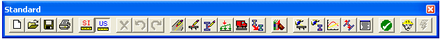
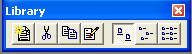

Toolbars {#chapter1_toolbars}
==============================================
PGSuper has three toolbars to provide quick access to frequently used commands. The toolbars are typically located at the top of the main window, however, they can be positioned on any side of the main window by simply dragging and dropping them. Toolbars can even "float" anywhere on your computer screen

Standard Toolbar
The Standard toolbar provides access to commonly used commands for files, units, editing, view analysis results, and printing.

Library Toolbar
The Library toolbar provides access to library editing commands.

Help Toolbar
The Help toolbar provides access to the help system and on-line information, including Internet resources

