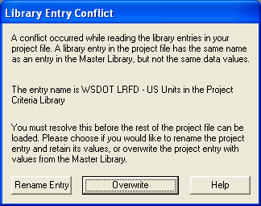

Opening Projects {#chapter2_opening_projects}
==============================================
You can open an existing PGSuper project using several techniques.

> TIP: PGSuper can only have one project open at a time. However, you can run multiple instances of PGSuper.

In this section you will learn the various techniques for opening PGSuper Projects and how to deal with library entry conflicts.

Techniques for Opening PGSuper Projects
---------------------------------------

### Most Recent Project ###
The most common method of opening a PGSuper project is to select a project from the list of Most Recent Projects, located on the File Menu.

### Standard File Open ###
The standard method of open files in any Windows program is to use the *File > Open* command. This command displays the standard File Open dialog. Using this dialog, you search your computer for your project file.

### Drag and Drop ###
If you locate your PGSuper Project file using the Windows Explorer or My Computer, you can drag and drop it onto a running instance of PGSuper. This will cause the current project to be closed and the dropped project to be opened.

### Associated Files ###
If you locate your PGSuper Project file using the Windows Explorer or My Computer, you can double click it to start PGSuper and open your project.

Resolving Library Entry Conflicts
---------------------------------
At times, especially when you are first using PGSuper with shared libraries, you will have to resolve library entry conflicts when opening PGSuper Projects.

Before discussing conflict resolution options, let's take a few moments to understand what a Library Entry Conflict is. Every library entry used in a PGSuper Project is copied into the project file. This way, if you send your file to a colleague on the other side of the world who doesn't have a copy of your library, they can still use your project. But what happens if your colleague has an entry in his library that has the exact same name as, but different attributes than, one of the entries in your project's library? Or, in a more common scenario, what happens if the attributes of the entries in your PGSuper Master Library have changed?

> TIP: PGSuper will not allow two library entries with the same name to have different attributes.

> NOTE: See Chapter 8 for more information on the Library Entries and the PGSuper Master Library.

You will know when a library entry conflict occurs because you will be presented with the following dialog.

To resolve the conflict, Rename the local library entry in your project, or Overwrite the library entry in your project with the attributes of the entry in the Master Library.

> TIP: If you are reading an old project file and want to evaluate the structure with the original data, renaming the conflicting library entry is the correct choice. If you are working on a current project and your PGSuper Administrator has updated the Master Library for some reason (presumably to fix an error), you will want to Overwrite the entry in your project file with the new entry.

