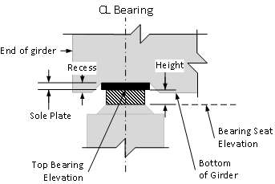
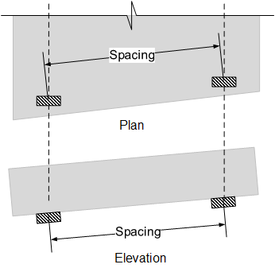

Bearing Description {#ug_dialogs_bearings}
==============================================
Bearing information can be described uniformly or uniquely for different locations on the bridge. The following options are available:
* Same for the entire bridge
* Uniquely for each bearing line (in Pier or Span Description dialogs)
* Uniquely at the each end of every girder 

Bearing Data
------------

Item | Description
-----|----------
Bearing Shape | Select the shape of the bearing. Bearings can be rectangular or round. At this time, this setting is for graphical presentation purposes only
Number of Bearings per Girder | Enter the number of bearings at each end of a girder. Some girder types, such as U-Beams might have two bearings at one end and one bearing at the other. Enter 2 for one end of the girder and 1 for the other. Don't enter 3 bearings for the girder.
Spacing | If the number of bearings is more than one, enter the spacing between bearings. Spacing is measured at the bottom of girder (top of bearings) along the centerline bearing as shown above. The bearing layout is assumed to be symmetric about the centerline of the girder. Note that a Status Center Warning will be issued if the bearing layout is wider than the bottom width of the section.
Length or Diameter | For rectangular bearings, enter the length of the bearing measured along the girder CL. For round bearings, enter the diameter.
Width | Enter the width (measured transversly to girder) of the rectangular bearing.
Height | Enter the vertical height of the bearing
Recess Height | Enter the vertical distance that the bearing is cut into the girder. This is measured at the CL of bearing
Recess Length | Enter the length of the recess cut into the girder as measured along the girder C.L.
Sole Plate | Enter the vertical height of the sole plate attached to the bottom of the girder. The sole plate will be recessed into the girder if a recess is specified.

> NOTE: The face of support for simple span (hinge or roller) abutments and piers is one-half the bearing length from the face of support. More information about the face of support location can be found in @ref tg_face_of_support.

> TIP: Use the bearing dimensions to define the temporary supports (often oak blocks) during construction for continuous and integral piers. The girder setting elevation will be computed and reported as the bearing seat elevation.

> TIP: AASHTO LRFD BDS Article 14.8.2 requires a tapered plate when the inclination of teh underside of the girder to the horizontal exceeds 0.01 radian. Enter the sum of average depth of the tapered plate and the sole plate height in the Sole Plate Height field.