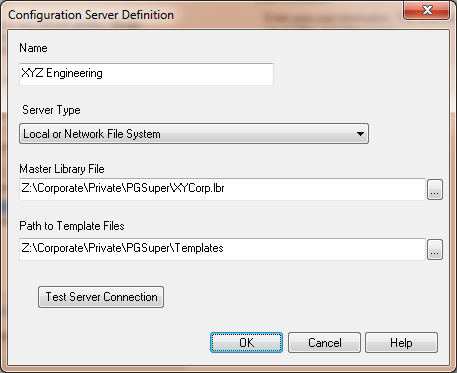
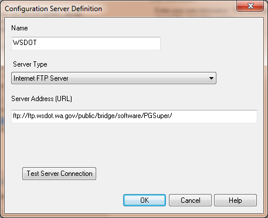

Configuration Server Definition {#ug_dialogs_configuration_server_definition}
==============================================
Define a Configuration Server. 

Item | Description
-----|------------
Name | Enter a name for the server definition
Server Type | Select the server type
Server Address (URL) | Enter the address of the server (see examples below)
Master Library File | Enter the location of the master library file (see examples below)
Path to Template Files | Enter the path to the template files (see examples below)
[Test Server Connection] | Press to test the connection with the server

Examples Configurations
---------------

### Local or Network File System ###
This type of server is typically used on a computer that is not on a network or for a group of users who want to keep their configration private from the rest of the world.

### FTP Server ###
This type of server is typically used to share a configuration across the internet. 

### HTTP Server ###
This type of server is typically used to share a configuration across the internet. 

### Local or Network File System Using a .ini File ###
This type of server uses a network file system and has the ability to use a .ini file and (*.pgz) files. This has advantages over the normal file system server by allowing multiple configurations at one network location, and versioning of the .pgz configurations. Refer to @ref configuration_server_files for information about how to create .ini and .pgz files.

