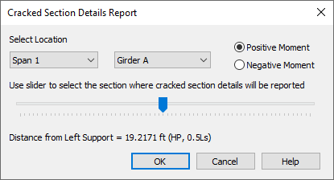

Cracked Section Details Report {#ug_dialogs_cracked_section_details_report}
=====================
A cracked section modulus, Icr, is used for a permit load rating analysis to evaluate yielding of flexural reinforcement at the Service I limit sate. See MBE 6A.5.4.2.2b for more information.

Use the drop down lists and slider to select the location where the cracked section details will be reported. Cracked section details can be reported for either positive or negative moments.

