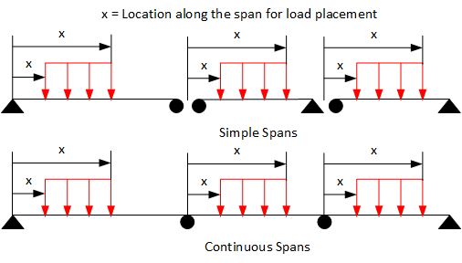

Distributed Load {#ug_dialogs_distributed_load}
==============================================
Add or edit a user defined distributed load. Distributed loads can be uniform over the full length of a span or trapezoidal over a portion of the span.

Item | Description
-----|--------------------
Load Case | Select the Load Case that the load is to be applied in. The available options are DC, DW and LL+IM as defined in the LRFD Specifications. LL+IM can only be applied in Event 5: Final with Live Load (Bridge Site 3).
Event | Select the construction event when the load is first applied. In PGSuper all user-defined loads are permanent and their results are accumulated through all subsequent stages.
Span/Girder | Select the span and girder that the load is to be applied to. You can select "All Spans" or "All girders" to apply the load to more than one girder.
Load Type | Select Trapezoidal or "Uniform along entire Span"
Magnitude | Enter the magnitude of the distributed load at the start and end location of the load. Positive loads are applied in the direction of gravity.
Location | Only used for Trapezoidal loads. Enter the location along the girder, measured from the left support, to the left and right ends of the load. The left end location must be smaller than the right end location. The entire load must be applied within the flexible span length of the girder. If it is not, the load will be ignored in the analysis and a message stating so will be placed in the Status Center. If the Fractional Measure option is checked, the load will be located from the left support using a fraction of the span length.
Description | Enter a description for this load

