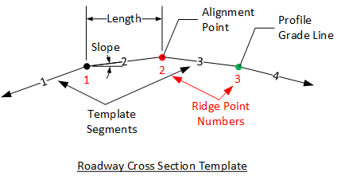

Roadway Cross Sections {#ug_dialogs_superelevations}
==============================================
The roadway surface is described using a series of Roadway Cross Section Templates. A roadway cross section template defines the roadway surface cross sectional shape normal to the horizontal alignment at a given station. If more than one cross section template is defined, slopes and widths of like-numbered segments are linearly interpolated between the specified stations defining the roadway surface.

Each roadway cross section template is described by a series of Template Segments as shown in the figure below. Exterior-most Template Segments at the left and right ends are defined by a slope only. Their lengths extend on to infinity in each outward direction (In the figure, Segments 1 and 4 are external segments). Internal Template Segments are defined by a slope and horizontal length (In the figure, Segments 2 and 3 are internal segments). Extension of the length of the exterior segments guarantees compatibility between the roadway and varying bridge widths.

> NOTE: When roadway cross section templates are not defined the roadway surface is assumed to be flat.

> NOTE: The roadway cross section template at the back-most station defines the cross section along all stations back of its station. Likewise, the template at the ahead-most station defines the cross section at all stations going ahead. If only one template is defined, it is used along the entire alignment. 

The points joining the template segments are called Ridge Points. The roadway cross section template is located horizontally be assigning the alignment to one of the ridge points. Likewise, the roadway cross section template is located vertically be assigning the profile grade line to one of the ridge points. The alignment and profile grade line may be assigned to the same ridge point.

##Slope Sign Convention##
There are two options for defining the cross section slopes. Slopes may be defined relative to the alignment point or left to right across the section. Defining slopes relative to the alignment point is convienent for typical crown cross sections but can be more challenging for cross sections with multiple grade breaks.

###Slopes relative to the alignment###
Segment slopes are based on the segment’s location relative to the alignment point. Slopes downward and away are negative, upwards and away are positive. Slopes are defined as rise over run (e.g., 0.02 ft/ft or 0.02 m/m). 

The figure below shows the same template defined with different controlling ridge points (shown in red).

For a typical cross section with a 2% crown, the slope on either side of the alignment point would be entered as -0.02 and -0.02 left and right, respectively.

###Slopes defined left to right###
Slopes defined left to right across the section have positive values when increasing in elevation otherwise negative values.

FOr a typical cross section with a 2% crown, the slope on either side of the alignment point would be entered as 0.02 and -0.02 left and right, respectively.

##Section View##

The section view provides a live view of input data for the selected Template.
