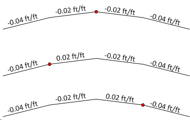

Roadway Cross Sections {#ug_dialogs_superelevations}
==============================================
The roadway surface is described using a series of “Roadway Cross Section Templates”. A roadway cross section template defines the roadway surface cross sectional shape normal to the horizontal alignment at a given station. If more than one cross section template is defined, slopes and widths of like-numbered segments are linearly interpolated between the specified stations, thus defining the roadway surface.

Each roadway Cross Section Template is described by a series of Template Segments as shown in the figure below. Exterior-most Template Segments at the left and right ends are defined by a slope only: Their lengths extend on to infinity in each outward direction (In the figure, Segments 1 and 4 are external segments). Internal Template Segments are defined by a slope and horizontal length (In the figure, Segments 2 and 3 are internal segments). Extension of the length of the exterior segments guarantees compatibility between the roadway and varying bridge widths.

The endpoints of template segments are called Ridge Points. Hence, the number of ridge points = total number of template segments – 1 (recall that exterior segments are infinitely long, and thus have no outboard endpoints)

The Controlling ridge point is user-selected and coincides with the horizontal alignment, profile grade, and left and right pivot points. The controlling ridge point also defines the slope sign convention.

**Rules:** 

* All Templates must have the same number of segments (and ridge points).

* Input having no defined templates describes a flat level roadway cross section.

* Input Roadway templates must contain at least two segments (i.e., at least the two exterior infinite length segments with a single ridge point between). 

* The template at the back-most station defines the cross section along all stations back of its station. Likewise, the template at the ahead-most station defines the cross section at all stations going ahead. If only one template is input, it is used along the entire alignment. 

**Slope Sign Convention:** 

Segment slopes are based on the segment’s location relative to the controlling ridge point. Slopes downward and away are negative, upwards and away are positive. Slopes are defined as rise over run (e.g., 0.02 ft/ft or 0.02 m/m). 

The figure below shows the same template defined with different controlling ridge points (shown in red).

**Section View**

The section view provides a live view of input data for the selected Template.
