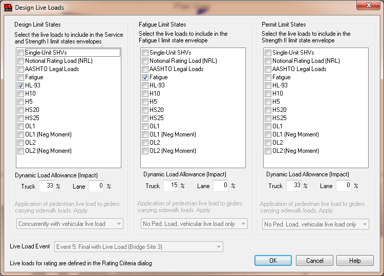

Loading {#ug_loading}
==============================================
In this section you will about standard loads, user defined loads, and vehicular live loads.

Standard Loading
----------------
Standard loading conditions are automatically generated. These loading conditions include:
* Self-weight dead load of the girders, deck, diaphragms, and bridge railings, overlays, and other permanent elements of the structure.
* HL93 Live Load
* Fatigue Live Load (AASHTO LRFD 2009 and later)
* Pedestrian live load on Sidewalk

Dead loads are based on cross sectional area of the members and the material unit weight. See the @ref tg_structural_analysis_models section of the @ref technical_guide for a detailed explanation of how loads are generated and applied to the structural analysis models.

A construction load allowance carried by the non-composite girder section can also be defined. This allowance covers additional loads incurred by the use of stay-in-place metal forms or other permanent construction materials and tolerances. This loading is applied to the entire bridge deck and is distributed to each girder based on its tributary area. This loading is applied to the DC load case.

### Distribution of Loads ###
Certain permanent loads are applied to the composite bridge section. These loads must be distributed to the individual girders for analysis.

The dead load of the railing system (barriers and sidewalks) are distributed to the "N nearest Girders, Mating Surfaces, or Webs as defined in the Project Criteria.

The magnitude of the overlay load is computed using the overlay width, thickness, and density of the overlay material. The load is distributed as specified in the Project Criteria.

Vehicular live load is distributed to the girders in the bridge using live load distribution factors.

Pedestrian live load is distributed in the same manner as sidewalk dead load.

User Defined Loads
------------------
In addition to the standard loading, ad-hoc user defined loads can be modeled. These loads can represent anything, such as the dead load of a bridge mounted sign or other such appurtenances. Three different types of user-defined loads can be modeled: Point (concentrated), Linearly Distributed, and Moment. Loads are applied to individual girders and are not distributed to other elements of the structure.

### Modeling User Defined Loads ###
User defined loads can be modeled by selecting *Loads > Add Point Load*, *Loads > Add Distributed Load*, or *Loads > Add Moment Load*. These loads can also be created and managed in the Loads view. Select *Loads > Edit User Defined Loads* to open the Loads view.

User defined loads can also be created and edited in the Girder View.

### Other information about user defined loads ###
* Loads can be applied in any bridge construction event
* Loads are never removed from the model. To simulate load removal, add a load of equal and opposite magnitude during the construction event when the load is removed
* Loads are assigned to either the DC or DW dead load cases or can be added to the HL-93 live load response for the LL+IM load case.
* Loads that are assigned to the LL+IM load case are static loads. For moving loads, see the discussion below for user defined vehicular loads.
* Loads that are assigned to the LL+IM load case are not distributed with live load distribution factors
* Loads that are assigned to the LL+IM load case are not included in the live load deflection analysis.
* Positive load are applied in the direction of gravity. Positive moments are counter clockwise, following the right hand rule.
* If any part of the load is placed outside of the flexible span length of the girder, the entire load will be ignored. A message will be posted to the Status Center to inform you of this.
* Moment loads can only be applied at the start and end of the span. These loads are usefully for modeling restraint moments as defined by LRFD 5.12.3.3.2 (*pre-2017: 5.14.1.4.2*).

Live Loads for Design
----------------------
The standard HL93 design live load is automatically defined. You can define additional vehicular live load models in the Vehicular Live Load library. For design and specification compliance checking live loads are selected for the following limit state categories:

1. Design Limit States
   * Service I
   * Service IA (Not applicable for LRFD 4th Edition with 2009 interim provisions and later)
   * Service III
   * Strength I 
2. Fatigue Limit States
   * Fatigue I (Added in LRFD 4th Edition with 2009 interim provisions)
3. Permit Limit States
   * Strength II

Select *Loads > Design Live Loads* to open the Design Live Loads window. In this window, select the live loads that will be used for design and specification compliance checking. When more than one live load model is selected in a limit state category, the live load responses for each model are enveloped and the controlling values are used for analysis.

Pedestrian loads on sidewalks are automatically generated if the loading is enabled in the Design Live Loads window. Pedestrian live loads may be applied concurrently with or enveloped with vehicular live load.

> NOTE: Live loads for load rating are defined in the @ref ug_dialogs_load_rating_options window.
