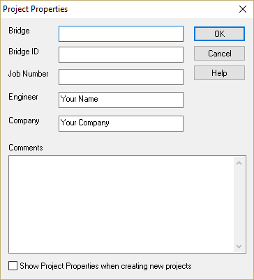

Project Properties {#ug_projects_project_properties}
==============================================
Project Properties define basic information about your project. Accessed from *File > Properties*, you can record information about your project such as the Bridge Name, Bridge ID, Job Number, Your Name, and Your Company. You can also enter some comments about your project.

This window can be shown every time you create a new project by checking the box at the bottom.

> NOTE: This information is only used to customize output reports and graphics. This information is never transmitted to WSDOT or anyone else.
