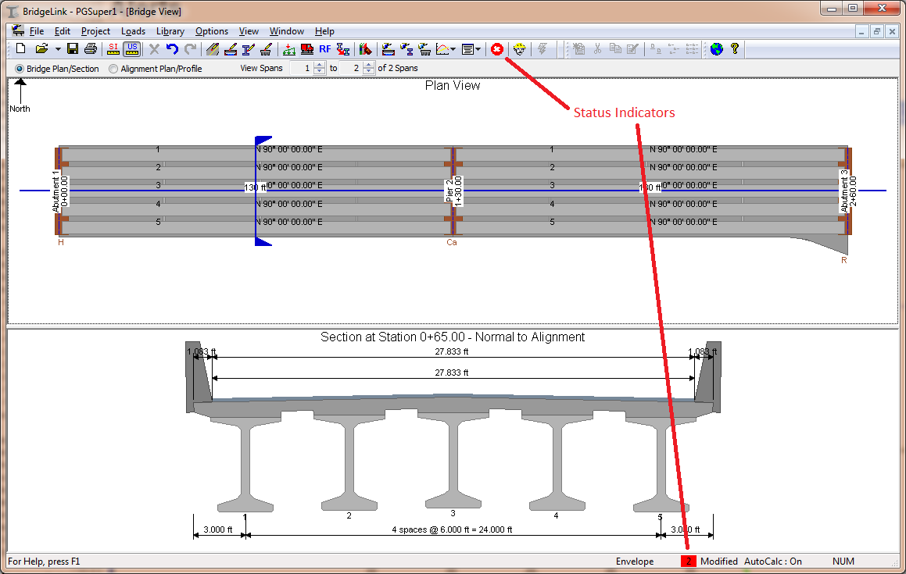
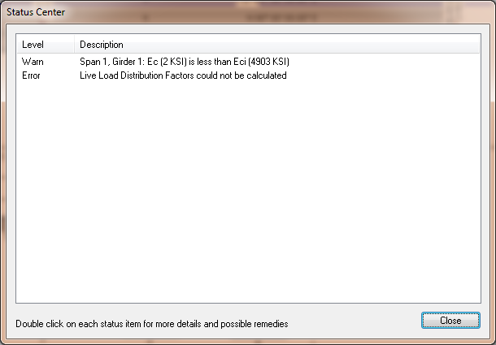

Status Center {#ug_status_center}
==============================================
The Status Center provides feedback about possible problems with the current state of your bridge model and analysis results. When errors occur or questionable input exists, items are posted to the status center for your review. For example, if your bridge configuration is such that it does not conform to the LRFD simplified method of analysis, an error occurs and detailed information is posted to the status center. You can open the status center to read the details and you will be offered suggestions on how to resolve the issue.

Another reason a status item might be posted to the status center is for a user defined load that has "fallen" off the bridge. Let's say you put a concentrated load 125 ft from the left end of a girder. Then you change the pier stations such that the girder is now only 120 ft long. The load has fallen off the girder and will not be used in analysis. A warning will be posted to the status center to alert you to this situation. You can choose to ignore the problem, fix it using one of the suggested remedies, or fix it using your own method.

Understanding Status Items
--------------------------
Status items can be informational messages, warnings, or can alert you to errors. 

Informational messages provide you with non-critical information about your model.

Warnings are also informational however they are more critical and should be reviewed. Warnings can indicate that your model had to be altered, such as a load omitted from the analysis as described above. Warnings can also indicate that even though your model is correct, some of the input parameters may be questionable. For example, if your model as a concrete release strength of 10 ksi, a warning will be posted to the status center. This release strength is a perfectly valid input, however it is not likely the intended input. 

Errors are posted when the analysis cannot be performed until the bridge description or other input parameters are fixed. A common error is that the range of applicability requirements for computing the LRFD live load distribution factors has been violated. Since the bridge does not conform to the requirements for simplified analysis it cannot be analyzed. You, the engineer, will have to make a decision how best to remedy this situation. The status item for this particular case provides you with options.

Status Indicators
----------------------
Visual cues in the user interface alert you to the status of your bridge model. The two status indicators as shown here:

The status indicator in the toolbar represents the worst severity of the all the items in the status center.

[status_ok]: StatusOK.bmp
[status_warning]: StatusWarning.bmp
[status_error]: StatusError.bmp
[status_ok_color]: StatusOKColor.bmp
[status_warning_color]: StatusWarningColor.bmp
[status_error_color]: StatusErrorColor.bmp

<table>
<tr><th>Cue</th><th>Description</th></tr>
<tr>
<td>![status_ok]</td>
<td>No status items or status items are informational only</td>
</tr>
<tr>
<td>![status_warning]</td>
<td>At least one status item contains a warning</td>
</tr>
<tr>
<td>![status_error]</td>
<td>At least one status item contains an error.</td>
</tr>
</table>

The status indicator in the status bar represent the worst severity and lists the number of items posted to the status center.

<table>
<tr><th>Cue</th><th>Description</th></tr>
<tr>
<td>![status_ok_color]</td>
<td>No status items or status items are informational only</td>
</tr>
<tr>
<td>![status_warning_color]</td>
<td>At least one status item contains a warning</td>
</tr>
<tr>
<td>![status_error_color]</td>
<td>At least one status item contains an error.</td>
</tr>
</table>

Viewing the Status Center
---------------------------
Select *View > Show Status Center* to open the Status Center window.

> TIP: The Status Center can also be opened by pressing the status indicator on the toolbar or double clicking on the status indicator on the status bar.

The Status Center window lists all the posted status items. Double click on a status item to get more information and possible remedies.
