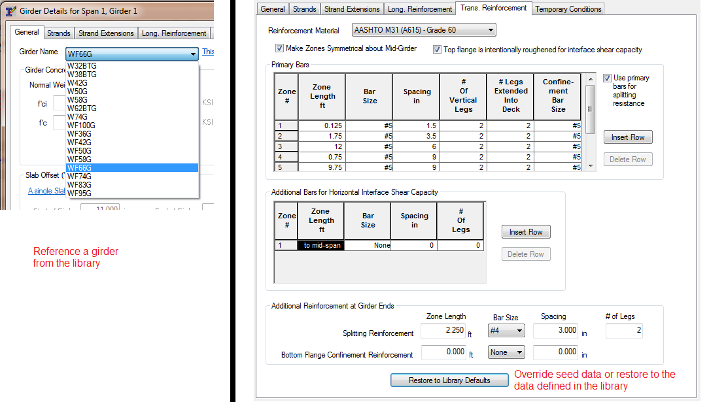
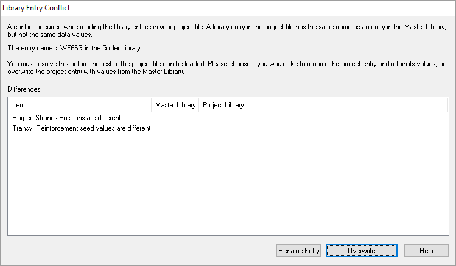

Working with Libraries {#ug_working_with_libraries}
==============================================
A lot of detailed information is required to model real bridge structures and to perform thorough specification compliance checking. Libraries allow you to catalog and share commonly-used information. A great deal of bridge information, such as Girders, Traffic Barriers, Concrete, and Project Criteria are standardized. Significant efficiency can be gained by defining standardized items in a computer program once and then reusing them in many different projects.

The libraries, when coupled with project templates, are known as a Configuration (See @ref ug_configurations for more information about configurations). Libraries are a key component that allows bridge owners and transportation agencies to standardize their operations with PGSuper and PGSplice. 

The available libraries are:

Library | Description | Entry Type
--------|-------------|---------
Concrete | Standard definition of concrete materials | Seed
Connections | Connections describe the end regions of a precast girder, the end diaphragm, and how the dead load of the end diaphragm is applied to the system. | Seed
Girders | Entries in this library describe standard precast girders. Precast-Prestress Girders are described by not only their cross sectional dimensions, but by strand patterns, longitudinal mild steel, transverse mild steel, harping point locations, and girder-specific design requirements. Precast-Prestressed Spliced Girder Segments are defined by their cross section dimensions and girder-specific design requirements. Depending on how you are accessing the Girder library, it will contain Precast-Prestressed Girders, Precast-Prestressed Spliced Girder Segments, or both. | Referenced with Seed Data
Traffic Barriers | Entries in this library describe the cross sectional dimensions of standard traffic barriers. | Referenced
Project Criteria | Entries in this library describe project criteria such as: the version of the LRFD Specifications, allowable stress overrides, choices of computations methods for prestress loss, creep, live load distribution factors, and parameters for long girder stability analysis. | Referenced
Vehicular Live Load | Entries in this library describe user defined live loads | Referenced
Load Rating Criteria | Entries in this library describe the criteria for load rating including the version of the AASHTO MBE and live load factors | Referenced
Ducts | Entries in this library define standard ducts for spliced girder bridges. | Referenced

Library Types
-------------
There are three general types of libraries; Referenced, Seed, and Referenced with Seed Data.

Referenced libraries contain entries that are added to your project by reference. If the library entry changes, so does your project. You will know you are using a referenced library entry in your project because you will select the name of a library entry from a list. The figure below shows the selection of a Project Criteria. The WSDOT LRFD - US Units entry is selected and all of the information that defines that entry is referenced into the project. If WSDOT changes the criteria, your project will be automatically updated.

Seed libraries contain entries that are copied into your project. If the library entry changes, your project does not. You will know you are using a seed library entry in your project because there will be a button to copy the library entry. The figure below shows a [Copy Connection Geometry from Library] button. When this button is pressed and a library entry selected, the data from that library entry is copied into your project.

The Girder library is a little bit different. The Girder entries are included into your project by reference; however there are some parameters that you will want to override for your project. The Girder library is said to be Referenced with Seed Data. The definition of a girder includes standardized information for transverse (shear) and longitudinal reinforcement. By including this in the library, you can easily model standard reinforcement arrangements in your project. However, if the standard arrangement doesn't work for your particular bridge, you'll have to enter a different arrangement. If the Girder library did not allow for seed data, you would have to copy the girder, change the reinforcement details, and reference the new girder entry. This is tedious. For this reason, the Girder library has seed data for the reinforcement details. Your project references a girder and then you can override the reinforcement as needed. You can restore your input to the library defaults at any time by pressing [Restore to Library Defaults] in the Girder Details window.

Library Scope
---------------
Libraries greatly simply your project. Referencing standardized information defined by bridge owners and agencies provides designers with consistent and accurate input for their bridge models. Designers can be confident that their designs conform to an owner's standards. However, there may be times when the standard isn't going to work for your project. When this is the case, you will need to create your own library entries.

The library provided by the [Configuration](@ref ug_configurations) is known as the Master Library. The Master Library is referenced into your project from the current [Configuration](@ref ug_configurations) and it cannot be changed within your project. 

> NOTE: The Master Library is shared over the Internet by engineers all around the world. If anyone could change it, then every project that referenced the Master Library would change too. The Master Library cannot be changed within a project. Imagine the chaos if an engineer in Mexico City could change the definition of a girder used in a project in Seattle.

Project-specific library entries can be created in the Project Library. Project Library Entries are specific to your project and are stored in your Project File. They cannot be accessed by any other projects. You can create your own Project Library Entries by copying and modifying the Master Library Entries or by creating them from scratch.

> TIP: You can import your Project Library Entries into other projects. See discussion below.

Library Editor View
-------------------
The Library Editor View is your window into the library system. Select *Library > Edit Libraries* to open the Library Editor view. 

In the left pane you see a list of the libraries. Select one of the folder icons to see the contents of the library (the library entries) in the right pane.

The library entries are annotated with icons to indicate their status. The lock icon indicates the library entry is in the Master Library and cannot be changed. If there is not a lock icon, the entry is in the Project Library. The red check icon indicates that the library entry is referenced into your project.

> TIP: Library entries that are referenced into your project cannot be deleted.

Managing Library Entries
-------------------------
The Library Editor View is used to manage the library entries. 

### Creating New Entries ###
To create a new library entry:
1. Select *Library > Add New Entry*. This will create a new entry and place an icon in the library view.
2. See Renaming Entries to give the entry a meaningful name
3. See Editing Entries to edit the library entry parameters.

### Copying Entries ###
It is generally easier to copy an existing entry that it is to create a new one. To copy a library entry:
1. Select the library entry you wish to copy
2. Select *Library > Duplicate Entry*. A copy of the entry will be made and an icon placed in the library view.
3. See Renaming Entries to give the entry a meaningful name
4. See Editing Entries to edit the library entry parameters.

### Renaming Entries ###
New library entries and copies of existing entries are given names that aren't very meaningful. To rename a library entry:
1. Select the library entry you wish to rename
2. Select *Library > Rename Entry*
3. An editing field will activate next to the entry's icon. Type in the new entry name

### Editing Entries ###
Once you have created or copied an entry, and given it a meaningful name, it is time to edit the input parameters. To edit a library entry:
1. Select the library entry you wish to edit
2. Select *Library > Edit Entry*. This will display the entry's editing window. Edit the desired information for the library entry. For specific information about an entry's parameters, press [Help].
3. Press [OK] to commit your changes, or [Cancel] to close the editing window making any changes.

> TIP: You can edit an entry by double clicking on it.

> TIP: You can view entries from the Master Library by following the Editing Entries procedure. Use the [Close] button to close the editing window.

### Deleting Entries ###
Every now and then, you may want to delete a library entry you no longer need. You cannot delete Master Library Entries or Project Library Entries that are in use. The lock icon indicates the library entry is a member of the Master Library. The check icon indicates that the library entry is currently in use.

To delete a library entry:
1. Select the entry you wish to delete
2. Select *Library > Delete Entry*

### Importing Entries ###
You've taken a lot of time to set up library entries in one of your projects, and now similar project has come across your desk. How do you get the Project Entries from one project into another? You import them.

To import Project Entries into your current project:
1. Select *File > Import Library Entries*.
2. Using the Open dialog, find the project file that contains the entries you wish to import
2. Select the file and press [Open]. The entries will be imported into your project.

> NOTE: When importing library entries from an existing file, you might get a message stating that an imported entry conflicts with an existing entry in your project file. This means that an entry exists in the import file that has the same name, but not the same data values, as an entry in your current project. At this point, you have two options: You can elect to import the entry and give it a new name so you can use it later in your project, or you can elect not to import the entry at all.

Library Entry Conflicts
-----------------------
We said earlier that when your project uses a referenced library entry from the Master Library, it is referencing the entry from the current Configuration. If you change the configuration or if you share your project file with someone that is using a different configuration, your project files can still be opened as if the original configuration was available. Your project file contains copies of all the referenced Master Library entries. This makes your project file self-contained and it does not depend on the existence of a particular configuration.

There is a downside to retaining copies of referenced library entries. Consider the following scenario. Your project file is referencing an entry called "Type V Girder". The "Type V Girder" has a particular set of associated information. You send this file to your colleague and he opens it. Your colleague is using a different configuration than you but it also contains an entry called "Type V Girder" and his "Type V Girder" has different attributes than yours. This is known as a Library Entry Conflict.

When a Library Entry Conflict occurs, you are presented with the Library Entry Conflict window and you must decide how to resolve the conflict.

You have two choices for resolving the conflict. Rename the "Type V Girder" in the project file else and keep using the associated data or overwrite the data with the data from the Master Library. If you rename the entry, all references throughout your project are changed to the new name so your project renames unchanged (except for the name of the renamed entry).

Another common scenario is the case when you are opening a project file that was created quite some time ago. You are using the same configuration as when the project was originally created, however when you open the project a library entry conflict occurs. This typically happens when the configuration is updated. For example, there is a policy change and the owner agency now requires that the Service III tension stress be limited to 0.0 KSI instead of the limit permitted by AASHTO. The configuration publisher updated their Project Criteria to reflect this policy change. Your project file was created before this policy change and your copy of the Project Criteria no longer matches the current standard. You can rename the project criteria and continue using the old standard or you can overwrite the project criteria so it matches the current standard.

* Press [Rename Entry] to resolve the library conflict by renaming the entry
* Press [Overwrite] to resolve the library conflict by overwriting the library entry data with that from the Master Library.
